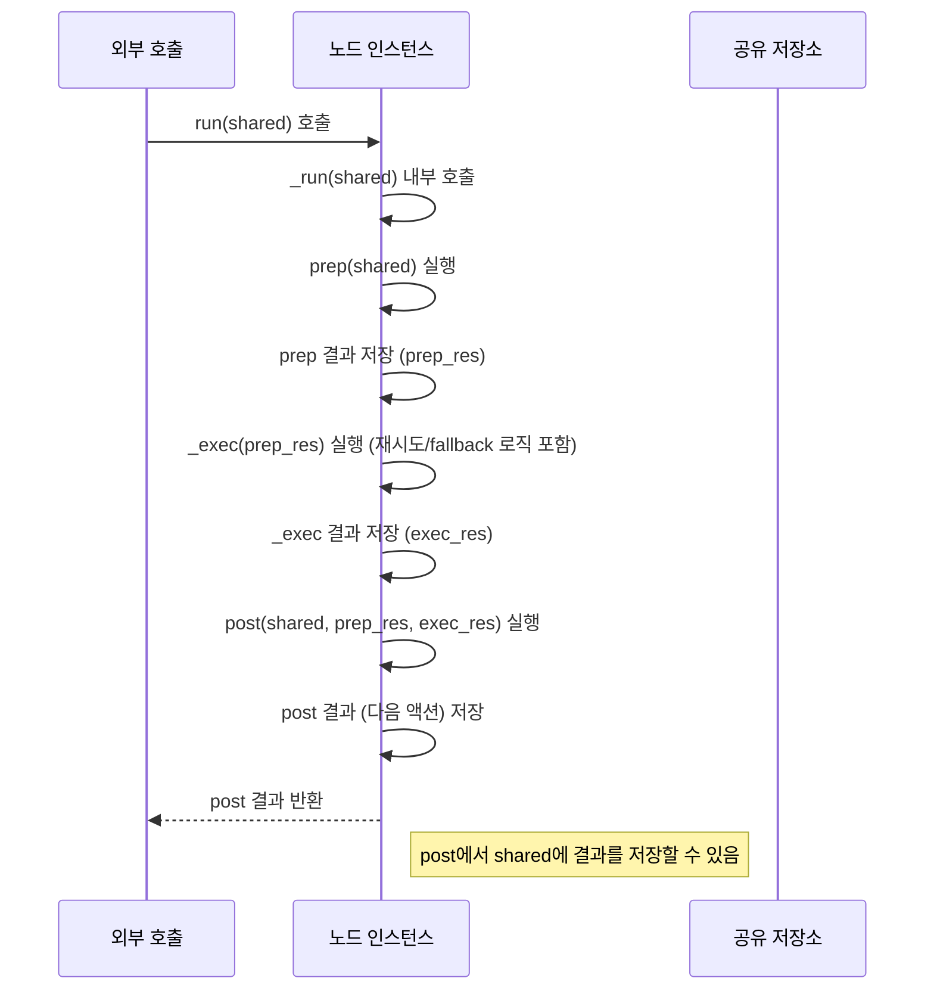

# Chapter 2: 노드 (Node)

이전 챕터인 [그래프 (Graph)](01_그래프__graph__.md)에서는 PocketFlow의 가장 기본적인 구성 방식인 그래프에 대해 배웠습니다. 그래프는 여러 **[노드 (Node)](02_노드__node__.md)** 들이 **[액션 (Action)](03_액션__action__.md)** 이라는 선으로 연결된 작업의 흐름을 나타낸다고 했습니다.

이번 챕터에서는 그래프의 가장 작은 작업 단위인 **[노드 (Node)](02_노드__node__.md)** 에 대해 자세히 알아보겠습니다. [노드 (Node)](02_노드__node__.md)는 PocketFlow 애플리케이션에서 실제 작업을 수행하는 핵심 요소입니다.

## 노드란 무엇일까요?

다시 공장 비유를 떠올려 봅시다. [그래프 (Graph)](01_그래프__graph__.md)가 공장 전체의 작업 흐름 지도라면, **[노드 (Node)](02_노드__node__.md)** 는 그 공장에서 **하나의 특정 작업만을 전문적으로 처리하는 기계**와 같습니다.

이 기계([노드 (Node)](02_노드__node__.md))는 다음과 같은 세 가지 단계를 거쳐 일을 처리합니다.

1.  **준비 (Prep):** 작업에 필요한 재료나 도구를 준비합니다. (데이터를 받아옵니다.)
2.  **실행 (Exec):** 준비된 재료를 가지고 실제 작업을 수행합니다. (정해진 작업을 수행합니다.)
3.  **후처리 (Post):** 작업 결과를 정리하고 다음 단계로 보낼 준비를 합니다. (결과를 다음 [노드 (Node)](02_노드__node__.md)로 전달하거나 저장합니다.)

PocketFlow에서 각 [노드 (Node)](02_노드__node__.md)는 완전히 독립적인 기능을 수행합니다. LLM 호출, 데이터베이스 조회, 이미지 처리, 텍스트 변환 등 어떤 종류의 작업이든 하나의 [노드 (Node)](02_노드__node__.md)로 만들 수 있습니다.

## 노드의 세 가지 핵심 메서드: `prep`, `exec`, `post`

[노드 (Node)](02_노드__node__.md) 클래스를 만들 때는 일반적으로 세 가지 메서드를 구현합니다. 이 메서드들이 바로 위에서 설명한 세 단계를 나타냅니다.

*   `prep(self, shared)`:
    *   **역할:** 다음 `exec` 메서드 실행에 필요한 데이터를 준비합니다. 주로 **[공유 저장소 (Shared Store)](05_공유_저장소__shared_store__.md)** 에 저장된 데이터를 읽어오거나, [노드 (Node)](02_노드__node__.md)의 설정값(parameters)을 사용하는 등 `exec`가 바로 작업을 시작할 수 있도록 준비합니다.
    *   **입력:** `shared` ([공유 저장소 (Shared Store)](05_공유_저장소__shared_store__.md)).
    *   **반환:** `exec` 메서드의 첫 번째 인자로 전달될 값입니다. `exec`에 아무것도 전달할 필요가 없다면 `None`을 반환하거나 비워둘 수 있습니다.

*   `exec(self, prep_res)`:
    *   **역할:** [노드 (Node)](02_노드__node__.md)의 **핵심 로직**을 실행합니다. 이 메서드 안에서 LLM 호출, 데이터 처리 등 실제 작업이 이루어집니다.
    *   **입력:** `prep` 메서드가 반환한 값 (`prep_res`).
    *   **반환:** 작업 결과 값입니다. 이 값은 `post` 메서드의 세 번째 인자(`exec_res`)로 전달됩니다.

*   `post(self, shared, prep_res, exec_res)`:
    *   **역할:** `exec` 실행 후 결과를 처리하고, 다음에 어떤 [노드 (Node)](02_노드__node__.md)로 이동할지를 결정합니다. 결과를 **[공유 저장소 (Shared Store)](05_공유_저장소__shared_store__.md)** 에 저장하거나, 사용자에게 출력하는 등의 작업을 할 수 있습니다.
    *   **입력:** `shared` ([공유 저장소 (Shared Store)](05_공유_저장소__shared_store__.md)), `prep` 결과 (`prep_res`), `exec` 결과 (`exec_res`).
    *   **반환:** 다음 [노드 (Node)](02_노드__node__.md)로 이동할 **[액션 (Action)](03_액션__action__.md)** 이름(문자열)을 반환합니다. 만약 현재 [노드 (Node)](02_노드__node__.md)가 마지막이라면 `None`을 반환합니다.

## 간단한 노드 만들어 보기

사용자에게 텍스트를 입력받아 소문자로 변환하는 간단한 작업을 수행하는 [노드 (Node)](02_노드__node__.md)를 만들어 봅시다.

```python
from pocketflow import Node

# 텍스트를 소문자로 변환하는 노드
class LowercaseNode(Node):
    def prep(self, shared):
        # shared 저장소에서 'text' 키의 값을 가져옵니다.
        # 만약 'text'가 없으면 기본값인 빈 문자열("")을 사용합니다.
        input_text = shared.get("text", "")
        print(f"[LowercaseNode] prep: '{input_text}' 받음")
        # exec 메서드로 전달할 값을 반환합니다.
        return input_text

    def exec(self, input_text):
        print(f"[LowercaseNode] exec: '{input_text}' 소문자 변환 중...")
        # 입력받은 텍스트를 소문자로 변환합니다.
        lower_text = input_text.lower()
        # 변환된 결과를 반환합니다. 이 값은 post 메서드로 전달됩니다.
        return lower_text

    def post(self, shared, prep_res, exec_res):
        print(f"[LowercaseNode] post: 변환 결과 '{exec_res}'")
        # 변환된 결과(exec_res)를 shared 저장소에 'lower_text' 키로 저장합니다.
        shared["lower_text"] = exec_res
        # 이 노드가 마지막이라고 가정하고 다음 액션을 반환하지 않습니다.
        # 또는 기본 액션("default") 등을 반환하여 다음 노드로 연결할 수 있습니다.
        return None # 다음 노드로 이동할 액션 (없음)

```

위 코드에서 `LowercaseNode`는 `Node` 클래스를 상속받아 정의되었습니다. `prep`에서는 [공유 저장소 (Shared Store)](05_공유_저장소__shared_store__.md)에서 입력 텍스트를 가져오고, `exec`에서는 실제 소문자 변환을 수행하며, `post`에서는 변환 결과를 다시 [공유 저장소 (Shared Store)](05_공유_저장소__shared_store__.md)에 저장합니다.

이제 이 노드를 직접 실행해 볼 수 있습니다. 일반적으로는 [플로우 (Flow)](04_플로우__flow__.md)의 일부로 실행되지만, 개별 노드의 기능을 테스트할 때는 `.run()` 메서드를 사용할 수 있습니다.

```python
# 노드 인스턴스를 생성합니다.
lowercase_node = LowercaseNode()

# shared 저장소를 준비합니다.
# 이 저장소는 딕셔너리 형태로 노드들 간에 공유됩니다.
shared_data = {"text": "Hello PocketFlow Node!"}

# 노드를 실행합니다.
print("--- 노드 실행 시작 ---")
lowercase_node.run(shared_data)
print("--- 노드 실행 종료 ---")

# 실행 후 shared 저장소에 결과가 저장되었는지 확인합니다.
print(f"최종 shared 저장소: {shared_data}")

```

위 코드를 실행하면 다음과 같은 결과가 출력됩니다.

```bash
--- 노드 실행 시작 ---
[LowercaseNode] prep: 'Hello PocketFlow Node!' 받음
[LowercaseNode] exec: 'Hello PocketFlow Node!' 소문자 변환 중...
[LowercaseNode] post: 변환 결과 'hello pocketflow node!'
--- 노드 실행 종료 ---
최종 shared 저장소: {'text': 'Hello PocketFlow Node!', 'lower_text': 'hello pocketflow node!'}
```

보시다시피, `prep`, `exec`, `post` 메서드가 순서대로 호출되며 작업이 수행되고, `post` 메서드에서 [공유 저장소 (Shared Store)](05_공유_저장소__shared_store__.md)에 최종 결과가 저장된 것을 확인할 수 있습니다.

## 에러 처리 및 재시도 (`exec_fallback`, `max_retries`, `wait`)

[노드 (Node)](02_노드__node__.md)에서 작업을 실행하다 보면 에러가 발생할 수 있습니다. 예를 들어, LLM API 호출 노드에서 네트워크 오류가 발생하거나, 데이터 처리 노드에서 예상치 못한 데이터 형식을 만날 수 있습니다. PocketFlow의 `Node` 클래스는 이러한 상황에 대처하기 위한 메커니즘을 제공합니다.

*   `exec_fallback(self, prep_res, exc)`:
    *   **역할:** `exec` 메서드 실행 중 예외(`Exception`)가 발생하고 설정된 재시도 횟수를 모두 소진했을 때 호출되는 **대체 로직**입니다. 여기서 에러를 처리하고, 기본값(fallback)을 반환하거나 다른 방식으로 후속 처리를 할 수 있습니다.
    *   **입력:** `exec` 메서드의 입력 (`prep_res`), 발생한 예외 객체 (`exc`).
    *   **반환:** `post` 메서드의 세 번째 인자(`exec_res`)로 전달될 값입니다.

*   `max_retries` (초기화 매개변수):
    *   **역할:** `exec` 메서드 실행 중 예외 발생 시 **최대 몇 번까지 재시도**할지 설정합니다. 기본값은 1 (재시도 없음)입니다.
    *   **사용법:** 노드 객체 생성 시 `Summarize(max_retries=3)` 와 같이 설정합니다.

*   `wait` (초기화 매개변수):
    *   **역할:** `exec` 메서드 재시도 간 **대기 시간(초)**을 설정합니다. 에러 발생 후 바로 재시도하기보다는 잠시 기다린 후 시도하는 것이 유용할 때 사용합니다. 기본값은 0입니다.
    *   **사용법:** 노드 객체 생성 시 `Summarize(wait=1)` 와 같이 설정합니다.

예를 들어, LLM API를 호출하는 `Summarize` 노드에서 API 호출이 실패했을 때, 최대 3번까지 재시도하고 그래도 실패하면 미리 정해진 대체 메시지를 반환하도록 구현할 수 있습니다. (이 예시는 제공된 `cookbook/pocketflow-node/flow.py`의 `Summarize` 노드를 참고했습니다.)

```python
from pocketflow import Node

# LLM 호출을 가정하고, 실패할 수 있는 노드
class Summarize(Node):
    def prep(self, shared):
        return shared.get("text", "")

    def exec(self, text):
        print(f"[Summarize] exec: '{text[:20]}...' 요약 시도")
        # 여기에 실제 LLM 호출 코드가 들어갑니다.
        # 예시를 위해 50% 확률로 에러를 발생시킵니다.
        import random
        if random.random() < 0.5:
             raise RuntimeError("LLM API 호출 실패!")
        return f"요약: {text[:15]}..." # 성공 시 가짜 요약 반환

    def exec_fallback(self, prep_res, exc):
        print(f"[Summarize] exec_fallback: 에러 발생 - {exc}")
        # 재시도 후에도 실패하면 이 메서드가 호출됩니다.
        # 에러 메시지 대신 기본값을 반환합니다.
        return "요약에 실패했습니다."

    def post(self, shared, prep_res, exec_res):
        print(f"[Summarize] post: 결과 '{exec_res}' 저장")
        shared["summary"] = exec_res
        # 다음 노드로 이동할 액션 (없음 또는 "default")
        return None

```

이제 이 노드를 `max_retries`를 설정하여 실행해 봅시다.

```python
# 재시도 횟수를 3번으로 설정한 노드 인스턴스 생성
summarize_node = Summarize(max_retries=3, wait=0.1) # 에러 발생 시 0.1초 대기

shared_data = {"text": "이것은 PocketFlow 노드의 에러 처리 기능을 테스트하기 위한 긴 텍스트입니다."}

print("--- Summarize 노드 실행 시작 ---")
summarize_node.run(shared_data)
print("--- Summarize 노드 실행 종료 ---")

print(f"최종 shared 저장소: {shared_data}")

```

이 코드를 여러 번 실행해 보면, `exec`에서 에러가 발생했을 때 최대 3번까지 재시도하는 것을 볼 수 있습니다. 3번 모두 실패하면 `exec_fallback`이 호출되어 미리 정의된 "요약에 실패했습니다." 메시지가 `shared` 저장소에 저장됩니다. 성공하면 정상적인 가짜 요약 결과가 저장됩니다.

## 노드의 내부 동작 방식 살펴보기 (`_run` 메서드)

우리가 정의한 [노드 (Node)](02_노드__node__.md) 클래스의 인스턴스에서 `.run()` 메서드를 호출하면 내부적으로 어떤 일이 일어날까요?

`.run()` 메서드는 결국 `_run()`이라는 내부 메서드를 호출합니다. 이 `_run()` 메서드가 바로 [노드 (Node)](02_노드__node__.md)의 세 단계를 순서대로 실행하고 결과를 처리하는 오케스트레이션 역할을 합니다.

간단한 순서도로 표현하면 다음과 같습니다.



실제 PocketFlow 코드(`pocketflow/__init__.py`)에서 `BaseNode` 클래스의 `_run` 메서드를 보면 이 흐름을 확인할 수 있습니다. (대부분의 노드 클래스는 `BaseNode` 또는 이를 상속받는 `Node`를 상속합니다.)

```python
class BaseNode:
    # ... (다른 메서드 생략)

    def _run(self, shared):
        # 1. prep 메서드 실행 및 결과 저장
        prep_res = self.prep(shared)
        
        # 2. _exec 메서드 실행 및 결과 저장
        # Node 클래스는 이 _exec 메서드를 오버라이드하여 재시도/fallback 로직 추가
        exec_res = self._exec(prep_res)
        
        # 3. post 메서드 실행 및 결과 반환 (다음 액션)
        return self.post(shared, prep_res, exec_res)

```

그리고 `Node` 클래스는 `BaseNode`를 상속받아 `_exec` 메서드를 오버라이드하여 재시도(`max_retries`, `wait`) 및 대체 로직(`exec_fallback`)을 추가합니다.

```python
class Node(BaseNode):
    def __init__(self,max_retries=1,wait=0):
        super().__init__()
        self.max_retries,self.wait=max_retries,wait
        self.cur_retry = 0 # 현재 재시도 횟수 추적용 (내부 사용)

    def exec_fallback(self,prep_res,exc):
        # 재정의되지 않으면 기본적으로 예외를 다시 발생시킵니다.
        raise exc

    def _exec(self,prep_res):
        # 설정된 재시도 횟수만큼 반복 시도
        for self.cur_retry in range(self.max_retries):
            try:
                # 핵심 exec 메서드 실행
                return self.exec(prep_res)
            except Exception as e:
                # 에러 발생 시
                if self.cur_retry==self.max_retries-1:
                    # 마지막 재시도에서도 실패하면 exec_fallback 호출
                    return self.exec_fallback(prep_res,e)
                # 재시도 대기 시간이 설정되어 있으면 대기
                if self.wait>0:
                    import time
                    time.sleep(self.wait)

```

이 코드를 통해 `Node`가 `prep`, `exec`, `post` 메서드를 어떻게 호출하고, `exec`에서 발생한 에러를 `max_retries`, `wait`, `exec_fallback`을 이용하여 어떻게 처리하는지 이해할 수 있습니다.

## 요약

이번 챕터에서는 PocketFlow의 가장 기본적인 구성 요소인 **[노드 (Node)](02_노드__node__.md)** 에 대해 자세히 알아보았습니다.

*   **[노드 (Node)](02_노드__node__.md)** 는 그래프의 가장 작은 작업 단위이며, 공장의 특정 작업을 처리하는 기계에 비유할 수 있습니다.
*   [노드 (Node)](02_노드__node__.md)는 **`prep` (준비), `exec` (실행), `post` (후처리)**의 세 단계를 거쳐 작업을 수행합니다.
*   `prep`은 `exec` 실행 전 준비 작업을 하고, `exec`은 실제 핵심 로직을 수행하며, `post`는 `exec` 결과를 처리하고 다음 **[액션 (Action)](03_액션__action__.md)** 을 반환하여 다음 [노드 (Node)](02_노드__node__.md)로의 연결을 결정합니다.
*   `Node` 클래스는 에러 발생 시 **`max_retries`** 와 **`wait`** 를 사용하여 재시도하고, 모든 재시도가 실패하면 **`exec_fallback`** 메서드를 호출하여 대체 처리를 할 수 있도록 지원합니다.
*   [노드 (Node)](02_노드__node__.md)의 `_run` 메서드가 이 모든 단계를 순서대로 오케스트레이션 합니다.

[노드 (Node)](02_노드__node__.md)는 PocketFlow에서 수행 가능한 모든 작업의 기본 단위입니다. 다음 챕터에서는 [노드 (Node)](02_노드__node__.md)들을 서로 연결하는 **[액션 (Action)](03_액션__action__.md)** 에 대해 알아보겠습니다.

[Next Chapter: 액션 (Action)](03_액션__action__.md)

---

Generated by [AI Codebase Knowledge Builder](https://github.com/The-Pocket/Tutorial-Codebase-Knowledge)