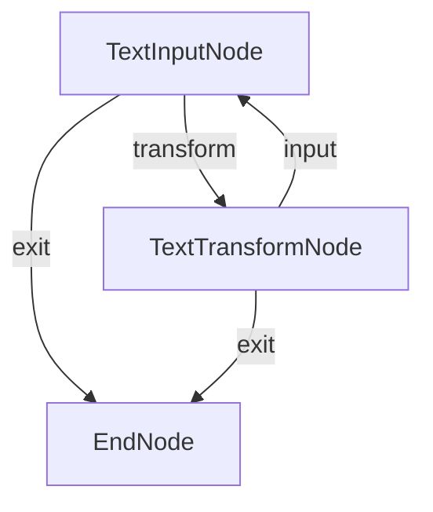
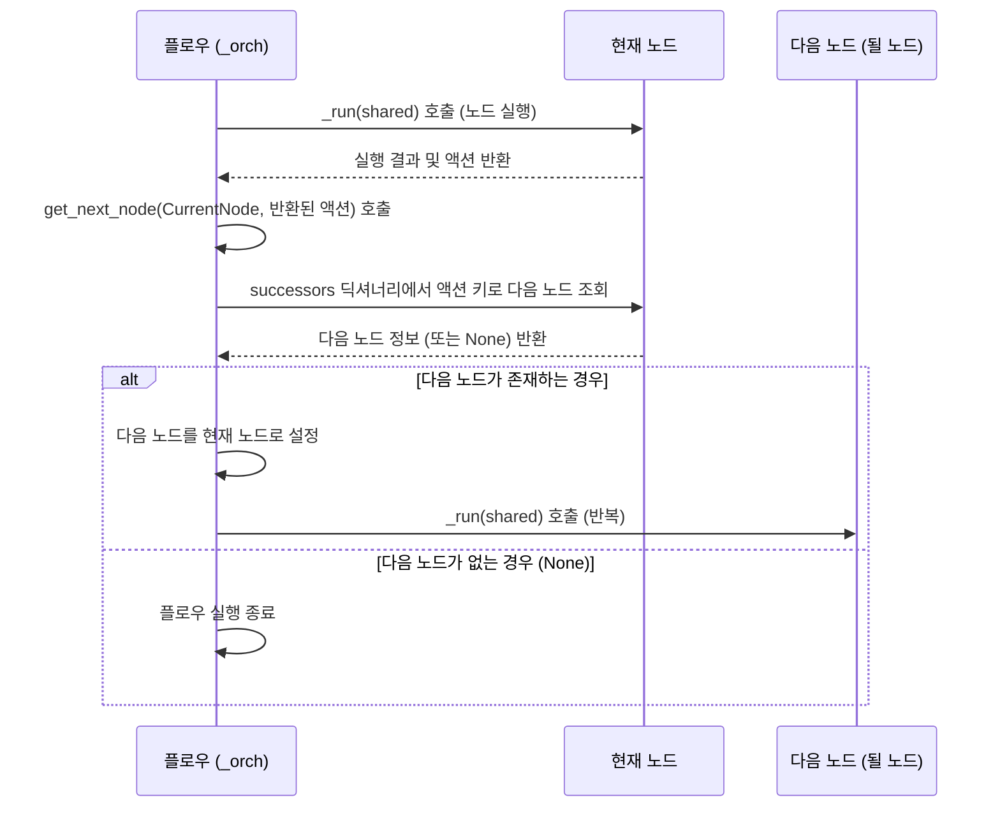

# Chapter 3: 액션 (Action)

이전 챕터인 [노드 (Node)](02_노드__node__.md)에서는 PocketFlow 그래프의 기본 작업 단위인 **[노드 (Node)](02_노드__node__.md)** 에 대해 자세히 배웠습니다. 각 [노드 (Node)](02_노드__node__.md)는 `prep`, `exec`, `post` 세 단계를 거쳐 특정 작업을 수행합니다.

이제 이 [노드 (Node)](02_노드__node__.md)들을 서로 연결하여 작업의 흐름을 만드는 방법에 대해 알아볼 차례입니다. [그래프 (Graph)](01_그래프__graph__.md) 챕터에서 잠시 언급했듯이, [노드 (Node)](02_노드__node__.md)와 [노드 (Node)](02_노드__node__.md)를 연결하는 '선' 또는 '화살표' 역할을 하는 것이 바로 **액션 (Action)** 입니다.

## 액션이란 무엇일까요?

**액션 (Action)** 은 한 [노드 (Node)](02_노드__node__.md)의 작업이 끝난 후, PocketFlow가 **다음 어떤 [노드 (Node)](02_노드__node__.md)를 실행해야 할지를 결정하는 신호**와 같습니다. 마치 지도에서 한 지점(노드)에서 다른 지점(노드)으로 가는 '경로'를 알려주는 '표지판'이나 '방향'과 같습니다.

[노드 (Node)](02_노드__node__.md)는 작업이 끝나면 `post` 메서드의 반환값으로 이 액션을 전달합니다. PocketFlow 엔진([플로우 (Flow)](04_플로우__flow__.md))은 이 액션 값을 보고, 현재 [노드 (Node)](02_노드__node__.md)와 해당 액션에 연결된 다음 [노드 (Node)](02_노드__node__.md)를 찾아 실행합니다.

액션은 단순히 '다음'으로 이동하는 것 외에, 작업 결과에 따라 **조건부 분기(conditional branching)**를 만들 수 있게 해줍니다. 예를 들어, 어떤 [노드 (Node)](02_노드__node__.md)가 작업을 성공적으로 마쳤다면 `"success"` 액션을 반환하고, 실패했다면 `"error"` 액션을 반환하여 각각 다른 후처리 [노드 (Node)](02_노드__node__.md)로 이동하게 만들 수 있습니다.

## 액션 연결하기: `>>`와 `- "" >>`

PocketFlow에서는 액션을 사용하여 [노드 (Node)](02_노드__node__.md)를 연결하는 두 가지 주요 방법이 있습니다.

1.  **기본 액션 (Default Action): `>>` 연산자**

    가장 간단한 연결 방법입니다. `노드A >> 노드B` 와 같이 사용하면, `노드A`가 어떤 액션을 반환하든 **"default"** 라는 이름의 기본 액션으로 `노드B`에 연결됩니다. [노드 (Node)](02_노드__node__.md)의 `post` 메서드가 아무것도 반환하지 않거나 `None`을 반환하면, PocketFlow는 이를 "default" 액션으로 간주합니다.

    ```python
    from pocketflow import Node, Flow

    class StartNode(Node):
        def post(self, shared, prep_res, exec_res):
            print("[StartNode] 작업 완료, 기본 액션 반환")
            return None # 또는 return "default"

    class MiddleNode(Node):
        def post(self, shared, prep_res, exec_res):
            print("[MiddleNode] 작업 완료, 기본 액션 반환")
            return "default"

    class EndNode(Node):
         def post(self, shared, prep_res, exec_res):
            print("[EndNode] 작업 완료")
            return None

    # 노드 인스턴스 생성
    start_node = StartNode()
    middle_node = MiddleNode()
    end_node = EndNode()

    # 기본 액션으로 연결
    start_node >> middle_node
    middle_node >> end_node

    # 플로우 생성 및 실행 (생략 가능, 연결 구조만 보여줌)
    # flow = Flow(start=start_node)
    # flow.run({})
    ```

    위 코드처럼 `>>` 연산자를 사용하면 `StartNode` 다음에 `MiddleNode`, `MiddleNode` 다음에 `EndNode`가 순차적으로 실행되는 간단한 흐름을 만들 수 있습니다. `StartNode`와 `MiddleNode`의 `post` 메서드는 각각 `None` 또는 `"default"`를 반환하여 다음 노드로 이동하라는 신호를 보냅니다.

2.  **조건부 액션 (Conditional Action): `- "" >>` 연산자**

    특정 액션 이름에 따라 다른 [노드 (Node)](02_노드__node__.md)로 이동하고 싶을 때 사용합니다. `- "액션이름" >>` 형태로 사용합니다. `노드A - "액션1" >> 노드B`, `노드A - "액션2" >> 노드C` 와 같이 연결하면, `노드A`의 `post` 메서드가 `"액션1"`을 반환하면 `노드B`가 실행되고, `"액션2"`를 반환하면 `노드C`가 실행됩니다.

    ```python
    from pocketflow import Node, Flow

    class DecideNode(Node):
        def post(self, shared, prep_res, exec_res):
            # 어떤 조건을 확인하고 결과에 따라 다른 액션을 반환한다고 가정
            result = shared.get("condition_result")
            if result == "positive":
                print("[DecideNode] 결과 'positive', 액션 'positive' 반환")
                return "positive"
            else:
                print("[DecideNode] 결과 'negative', 액션 'negative' 반환")
                return "negative"

    class PositiveNode(Node):
        def post(self, shared, prep_res, exec_res):
             print("[PositiveNode] 긍정 처리 완료")
             return None # 다음 노드 없음 (여기서 종료)

    class NegativeNode(Node):
         def post(self, shared, prep_res, exec_res):
             print("[NegativeNode] 부정 처리 완료")
             return None # 다음 노드 없음 (여기서 종료)

    # 노드 인스턴스 생성
    decide_node = DecideNode()
    positive_node = PositiveNode()
    negative_node = NegativeNode()

    # 조건부 액션으로 연결
    decide_node - "positive" >> positive_node # decide_node가 "positive" 반환 시 positive_node로 이동
    decide_node - "negative" >> negative_node # decide_node가 "negative" 반환 시 negative_node로 이동

    # 플로우 생성 및 실행 (shared에 condition_result 값 설정)
    print("--- 결과가 'positive'일 때 ---")
    flow_positive = Flow(start=decide_node)
    flow_positive.run(shared={"condition_result": "positive"})

    print("\n--- 결과가 'negative'일 때 ---")
    flow_negative = Flow(start=decide_node)
    flow_negative.run(shared={"condition_result": "negative"})
    ```

    이 예시에서는 `DecideNode`가 [공유 저장소 (Shared Store)](05_공유_저장소__shared_store__.md)의 `"condition_result"` 값을 보고 `"positive"` 또는 `"negative"` 액션을 반환합니다. PocketFlow [플로우 (Flow)](04_플로우__flow__.md)는 이 액션 값을 보고 `PositiveNode` 또는 `NegativeNode` 중 하나를 선택하여 실행합니다. 이것이 바로 액션을 사용한 조건부 분기입니다.

## 액션의 활용 예시: 텍스트 변환기 개선

이전 챕터들에서 간단한 텍스트 변환기 예시를 보았습니다. 이번에는 이 변환기를 액션을 사용하여 사용자의 선택에 따라 다른 변환([노드 (Node)](02_노드__node__.md))을 수행하도록 개선해 봅시다. (cookbook/pocketflow-flow/flow.py 예시 참고)

우리는 사용자 입력에 따라 "transform", "input", "exit" 액션을 반환하는 `TextInput` 노드와, 실제 변환을 수행하는 `TextTransform` 노드를 만들었습니다.

```python
# cookbook/pocketflow-flow/flow.py 파일 일부 발췌 및 한국어 주석 추가

from pocketflow import Node, Flow

class TextInput(Node):
    def prep(self, shared):
        # shared 저장소에서 텍스트 가져오기, 없으면 새로 입력받기
        if "text" not in shared:
            text = input("\n변환할 텍스트를 입력하세요: ") # 사용자 입력 받기
            shared["text"] = text
        return shared["text"] # 입력받은 텍스트 반환 (exec으로 전달될 수 있음)

    def post(self, shared, prep_res, exec_res):
        # 작업 완료 후 사용자에게 다음 액션을 선택하게 함
        print("\n변환 종류를 선택하세요:")
        print("1. 대문자로 변환")
        print("2. 소문자로 변환")
        print("3. 텍스트 뒤집기")
        print("4. 여분의 공백 제거")
        print("5. 종료")
        
        choice = input("\n선택 (1-5): ")
        
        if choice == "5":
            return "exit" # 'exit' 액션을 반환하여 종료 노드로 이동
        
        shared["choice"] = choice # 사용자의 선택을 shared에 저장
        return "transform" # 'transform' 액션을 반환하여 변환 노드로 이동

class TextTransform(Node):
    def prep(self, shared):
        # shared에서 텍스트와 선택 정보 가져오기
        return shared["text"], shared["choice"]
    
    def exec(self, inputs):
        # 입력받은 텍스트와 선택에 따라 실제 변환 수행
        text, choice = inputs
        
        if choice == "1":
            return text.upper()
        elif choice == "2":
            return text.lower()
        elif choice == "3":
            return text[::-1]
        elif choice == "4":
            return " ".join(text.split())
        else:
            return "유효하지 않은 옵션입니다!" # 잘못된 선택 시 결과
    
    def post(self, shared, prep_res, exec_res):
        # 변환 결과 출력
        print("\n결과:", exec_res)
        
        # 사용자에게 다음 작업 물어보기
        if input("\n다른 텍스트를 변환하시겠습니까? (y/n): ").lower() == 'y':
            shared.pop("text", None)  # 이전 텍스트 삭제
            return "input" # 'input' 액션을 반환하여 다시 입력 노드로 이동
        return "exit" # 'exit' 액션을 반환하여 종료 노드로 이동

class EndNode(Node):
     def post(self, shared, prep_res, exec_res):
        print("[EndNode] 플로우 종료")
        return None

# 노드 인스턴스 생성
text_input_node = TextInput()
text_transform_node = TextTransform()
end_node = EndNode()

# 노드 연결 (액션 사용)
text_input_node - "transform" >> text_transform_node # TextInput이 "transform" 반환 시 TextTransform으로
text_input_node - "exit" >> end_node             # TextInput이 "exit" 반환 시 EndNode로

text_transform_node - "input" >> text_input_node  # TextTransform이 "input" 반환 시 TextInput으로 (반복)
text_transform_node - "exit" >> end_node          # TextTransform이 "exit" 반환 시 EndNode로

# 플로우 생성 (시작 노드는 TextInput)
flow = Flow(start=text_input_node)

# 플로우 실행 (shared 저장소는 처음에는 비어있음)
print("--- 텍스트 변환 플로우 시작 ---")
flow.run(shared={})
print("--- 텍스트 변환 플로우 종료 ---")

```

이 예시에서 액션이 어떻게 사용되는지 살펴봅시다:

1.  `TextInput` 노드는 사용자의 선택에 따라 `"transform"` 또는 `"exit"` 액션을 반환합니다.
2.  `TextTransform` 노드는 변환 작업 후, 사용자가 계속 진행하고 싶으면 `"input"` 액션을 반환하여 다시 `TextInput` 노드로 돌아가도록 하고, 종료하고 싶으면 `"exit"` 액션을 반환하여 `EndNode`로 이동하도록 합니다.
3.  이 액션들을 `- "" >>` 연산자를 사용하여 [플로우 (Flow)](04_플로우__flow__.md) 상에서 명확하게 연결했습니다.

이렇게 액션을 사용하면 복잡한 사용자 상호작용이나 조건에 따른 다양한 작업 흐름을 명확하게 표현하고 구축할 수 있습니다.

이 [플로우 (Flow)](04_플로우__flow__.md)의 구조를 그림으로 표현하면 다음과 같습니다.



## 액션은 어떻게 사용될까요? (내부 동작)

PocketFlow [플로우 (Flow)](04_플로우__flow__.md)가 그래프를 실행할 때, 각 [노드 (Node)](02_노드__node__.md)의 실행이 끝나면 반환된 액션을 확인하고 다음 [노드 (Node)](02_노드__node__.md)를 찾는 과정을 거칩니다. 이 과정은 [그래프 (Graph)](01_그래프__graph__.md) 챕터에서 잠시 보았던 `Flow` 클래스의 내부 `_orch` 메서드와 `get_next_node` 메서드에서 이루어집니다.

`_orch` 메서드는 현재 실행 중인 [노드 (Node)](02_노드__node__.md)(`curr`)의 `_run` 메서드를 호출하여 실행을 마칩니다. `_run` 메서드는 결국 해당 [노드 (Node)](02_노드__node__.md)의 `post` 메서드가 반환한 액션 값을 `_orch` 메서드로 전달합니다.

```python
# pocketflow/__init__.py 파일 일부 발췌 (Flow 클래스의 _orch 메서드)
class Flow(BaseNode):
    # ... (다른 메서드 생략)

    def _orch(self, shared, params=None):
        # 시작 노드부터 시작
        curr = copy.copy(self.start_node) # 현재 노드
        last_action = None # 이전 노드가 반환한 액션

        # 현재 노드가 있는 동안 반복
        while curr:
            curr.set_params(params or {**self.params})
            
            # 현재 노드 실행 및 반환된 액션 저장!
            last_action = curr._run(shared) 
            
            # 현재 노드와 반환된 액션에 따라 다음 노드를 찾음!
            next_node = self.get_next_node(curr, last_action)
            
            # 다음 노드로 이동 (다음 반복에서 실행될 노드)
            curr = copy.copy(next_node)
            
        # 마지막 노드가 반환한 액션 반환
        return last_action

    # ... (나머지 메서드 생략)
```

`_orch` 메서드는 이렇게 [노드 (Node)](02_노드__node__.md) 실행 후 반환된 `last_action` 값을 가지고 `get_next_node` 메서드를 호출합니다.

`get_next_node` 메서드는 현재 [노드 (Node)](02_노드__node__.md)(`curr`)의 연결 정보(`successors` 딕셔너리)에서 전달받은 `action` 값과 일치하는 다음 [노드 (Node)](02_노드__node__.md)를 찾아 반환하는 역할을 합니다. 만약 특정 액션에 연결된 [노드 (Node)](02_노드__node__.md)가 없으면 `None`을 반환하여 [플로우 (Flow)](04_플로우__flow__.md) 실행을 종료합니다.

```python
# pocketflow/__init__.py 파일 일부 발췌 (Flow 클래스의 get_next_node 메서드)
class Flow(BaseNode):
    # ... (다른 메서드 생략)

    def get_next_node(self, curr, action):
        # 현재 노드(curr)의 successors 딕셔너리에서 반환된 action 키에 해당하는 노드를 찾음
        # action이 None이거나 successors에 해당 action이 없으면 "default" 키를 사용
        nxt = curr.successors.get(action or "default")
        
        # 만약 successors 딕셔너리는 존재하는데 해당 action (또는 default) 키가 없으면 경고
        if not nxt and curr.successors: warnings.warn(f"Flow ends: '{action}' not found in {list(curr.successors.keys())}")
        
        return nxt # 찾은 다음 노드를 반환 (없으면 None 반환)

    # ... (나머지 메서드 생략)
```

이 두 메서드의 상호작용을 간단한 순서도로 표현하면 다음과 같습니다.



결론적으로, [노드 (Node)](02_노드__node__.md)의 `post` 메서드가 **어떤 액션 문자열을 반환하느냐**에 따라 [플로우 (Flow)](04_플로우__flow__.md)는 정의된 연결(`- "" >>`)에 따라 **다음 어떤 [노드 (Node)](02_노드__node__.md)로 이동할지**를 결정하게 됩니다. 액션은 PocketFlow 그래프에서 작업 흐름을 제어하는 핵심적인 연결 고리입니다.

## 요약

이번 챕터에서는 PocketFlow 그래프의 중요한 구성 요소인 **액션 (Action)** 에 대해 알아보았습니다.

*   **액션**은 [노드 (Node)](02_노드__node__.md)와 [노드 (Node)](02_노드__node__.md)를 연결하는 **신호** 또는 **방향**입니다.
*   [노드 (Node)](02_노드__node__.md)는 `post` 메서드에서 다음 단계로 이동할 **액션 이름(문자열)**을 반환합니다.
*   PocketFlow [플로우 (Flow)](04_플로우__flow__.md)는 이 액션 값을 보고 어떤 [노드 (Node)](02_노드__node__.md)를 다음에 실행할지 결정합니다.
*   **`>>` 연산자**는 기본 액션인 `"default"`로 연결하며, [노드 (Node)](02_노드__node__.md)의 `post`가 `None`이나 아무것도 반환하지 않을 때 사용됩니다.
*   **`- "" >>` 연산자**는 특정 액션 이름에 따라 다른 [노드 (Node)](02_노드__node__.md)로 연결하여 **조건부 분기**를 구현할 수 있게 해줍니다.

액션은 [노드 (Node)](02_노드__node__.md)들이 서로 유기적으로 연결되어 복잡한 작업 흐름을 만들 수 있도록 하는 핵심 메커니즘입니다. 이제 우리는 [그래프 (Graph)](01_그래프__graph__.md), [노드 (Node)](02_노드__node__.md), 그리고 액션까지 PocketFlow의 기본적인 구성 요소들을 모두 살펴보았습니다.

다음 챕터에서는 이 모든 것을 조합하여 실제 작업의 전체 흐름을 정의하고 실행하는 **[플로우 (Flow)](04_플로우__flow__.md)** 에 대해 더 자세히 알아보겠습니다.

[Next Chapter: 플로우 (Flow)](04_플로우__flow__.md)

---

Generated by [AI Codebase Knowledge Builder](https://github.com/The-Pocket/Tutorial-Codebase-Knowledge)