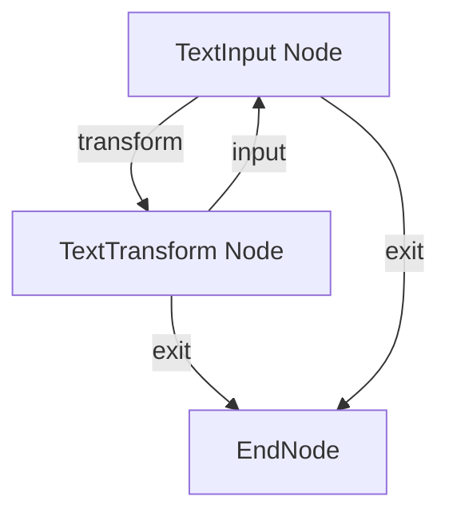
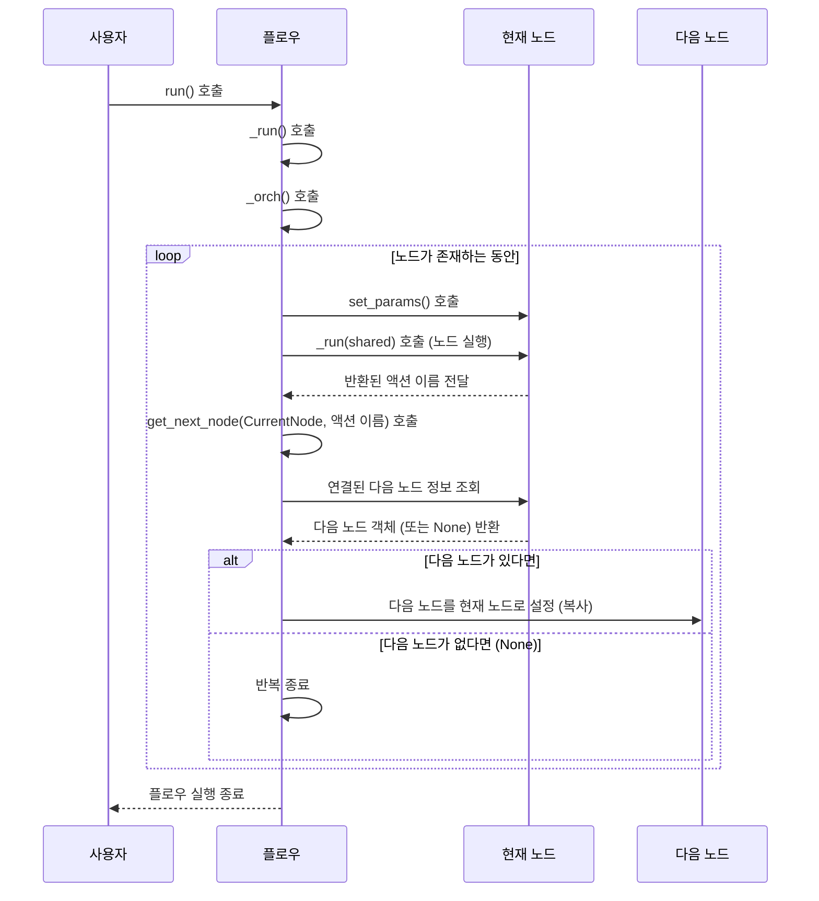

# Chapter 4: 플로우 (Flow)

이전 챕터인 [액션 (Action)](03_액션__action__.md)에서는 [노드 (Node)](02_노드__node__.md)와 [노드 (Node)](02_노드__node__.md) 사이를 연결하고 작업 흐름의 방향을 결정하는 신호인 **액션 (Action)** 에 대해 배웠습니다. 우리는 이제 개별 작업 단위인 [노드 (Node)](02_노드__node__.md)와 이 노드들을 연결하는 [액션 (Action)](03_액션__action__.md)을 이해하게 되었습니다.

하지만 이 모든 요소들을 실제로 작동시키고 하나의 완성된 작업 흐름으로 만들어내는 것은 무엇일까요? 바로 이번 챕터에서 다룰 **플로우 (Flow)** 입니다.

## 플로우(Flow)란 무엇일까요?

PocketFlow에서 **플로우 (Flow)** 는 여러 개의 [노드 (Node)](02_노드__node__.md)와 그 [노드 (Node)](02_노드__node__.md)들을 연결하는 [액션 (Action)](03_액션__action__.md)들을 모아서 **하나의 완전한 작업 과정(워크플로우)**을 정의하고 실행하는 역할을 합니다. 마치 공장에서 여러 생산 기계([노드 (Node)](02_노드__node__.md))들을 컨베이어 벨트([액션 (Action)](03_액션__action__.md))로 연결하여 전체 생산 라인([플로우 (Flow)](04_플로우__flow__.md))을 만들고 가동시키는 것과 같습니다.

[플로우 (Flow)](04_플로우__flow__.md)는 단순히 [노드 (Node)](02_노드__node__.md)와 [액션 (Action)](03_액션__action__.md)의 집합이 아니라, **어떤 [노드 (Node)](02_노드__node__.md)부터 시작할지 정하고**, 각 [노드 (Node)](02_노드__node__.md)가 실행된 후 **어떤 [액션 (Action)](03_액션__action__.md) 결과에 따라 다음 [노드 (Node)](02_노드__node__.md)로 이동할지**를 관리하며, 전체 작업 흐름을 처음부터 끝까지 **실행**하는 역할을 합니다.

복잡한 애플리케이션은 여러 개의 작업 단계로 이루어집니다. 예를 들어, 사용자의 질문을 받아 답변을 생성하는 LLM 애플리케이션은 다음과 같은 단계로 구성될 수 있습니다.

1.  사용자 질문 입력받기
2.  질문 분석하기 ([노드 (Node)](02_노드__node__.md))
3.  필요한 데이터 검색하기 ([노드 (Node)](02_노드__node__.md))
4.  검색된 데이터와 질문을 조합하여 LLM에 전달할 프롬프트 만들기 ([노드 (Node)](02_노드__node__.md))
5.  LLM API 호출하기 ([노드 (Node)](02_노드__node__.md))
6.  LLM 응답 후처리하기 ([노드 (Node)](02_노드__node__.md))
7.  결과를 사용자에게 보여주기 ([노드 (Node)](02_노드__node__.md))

이 각 단계를 [노드 (Node)](02_노드__node__.md)로 만들고, 각 단계가 끝난 후 다음 단계로 자연스럽게 이어지도록 [액션 (Action)](03_액션__action__.md)으로 연결하면 하나의 거대한 [플로우 (Flow)](04_플로우__flow__.md)가 완성됩니다. [플로우 (Flow)](04_플로우__flow__.md)는 이렇게 정의된 복잡한 파이프라인을 쉽게 구성하고 실행할 수 있도록 돕는 PocketFlow의 핵심 요소입니다.

## 플로우(Flow) 정의하고 실행하기

PocketFlow에서 [플로우 (Flow)](04_플로우__flow__.md)를 정의하는 것은 매우 간단합니다. 먼저 필요한 [노드 (Node)](02_노드__node__.md) 인스턴스들을 생성하고, 앞에서 배운 `>>` 또는 `- "" >>` 연산자를 사용하여 [액션 (Action)](03_액션__action__.md)으로 연결합니다. 마지막으로, **`Flow` 클래스의 인스턴스를 생성할 때 `start` 매개변수에 시작 [노드 (Node)](02_노드__node__.md)를 지정**해주면 됩니다.

[플로우 (Flow)](04_플로우__flow__.md)는 이렇게 정의된 연결 정보와 시작 [노드 (Node)](02_노드__node__.md)를 바탕으로 실행됩니다. [플로우 (Flow)](04_플로우__flow__.md)를 실행하려면 `Flow` 객체의 `.run()` 메서드를 호출합니다.

```python
from pocketflow import Node, Flow

# 간단한 예시 노드들 (실제 기능은 중요하지 않음)
class StartNode(Node):
    def post(self, shared, prep_res, exec_res):
        print("[StartNode] 시작 -> 중간1")
        return "go_to_middle1" # 특정 액션 반환

class MiddleNode1(Node):
    def post(self, shared, prep_res, exec_res):
        print("[MiddleNode1] 중간1 -> 중간2")
        return "default" # 기본 액션 반환

class MiddleNode2(Node):
    def post(self, shared, prep_res, exec_res):
        print("[MiddleNode2] 중간2 -> 끝")
        return None # None 반환 시 기본 액션 처리

class EndNode(Node):
     def post(self, shared, prep_res, exec_res):
        print("[EndNode] 플로우 종료 지점")
        return None

# 1. 노드 인스턴스 생성
start = StartNode()
middle1 = MiddleNode1()
middle2 = MiddleNode2()
end = EndNode()

# 2. 노드 연결 (액션 사용)
start - "go_to_middle1" >> middle1 # StartNode가 "go_to_middle1" 반환 시 MiddleNode1로
middle1 >> middle2                 # MiddleNode1이 "default" 또는 None 반환 시 MiddleNode2로
middle2 >> end                     # MiddleNode2가 "default" 또는 None 반환 시 EndNode로

# 3. Flow 객체 생성 및 시작 노드 지정
my_simple_flow = Flow(start=start)

# 4. 플로우 실행
print("--- 플로우 실행 시작 ---")
my_simple_flow.run(shared={}) # shared={}는 다음 챕터에서 자세히 설명
print("--- 플로우 실행 종료 ---")
```

위 코드를 실행하면 다음과 같은 결과가 출력됩니다.

```bash
--- 플로우 실행 시작 ---
[StartNode] 시작 -> 중간1
[MiddleNode1] 중간1 -> 중간2
[MiddleNode2] 중간2 -> 끝
[EndNode] 플로우 종료 지점
--- 플로우 실행 종료 ---
```

결과에서 볼 수 있듯이, `Flow` 객체가 `start`로 지정된 `StartNode`부터 시작하여 [액션 (Action)](03_액션__action__.md) 연결에 따라 `MiddleNode1`, `MiddleNode2`를 거쳐 `EndNode`까지 순서대로 실행되는 것을 확인할 수 있습니다. `.run()` 메서드가 바로 이 실행 과정을 시작시키는 역할을 합니다.

`.run()` 메서드에 전달된 `shared={}`는 [공유 저장소 (Shared Store)](05_공유_저장소__shared_store__.md)로, [플로우 (Flow)](04_플로우__flow__.md) 내의 모든 [노드 (Node)](02_노드__node__.md)들이 데이터를 주고받고 상태를 공유하는 데 사용됩니다. [공유 저장소 (Shared Store)](05_공유_저장소__shared_store__.md)에 대해서는 다음 챕터에서 더 자세히 배우겠습니다.

## 실제 플로우 예시: 텍스트 변환기 플로우

Chapter 3에서 액션의 활용 예시로 보았던 텍스트 변환기 코드를 다시 가져와봅시다. 이 코드는 [플로우 (Flow)](04_플로우__flow__.md)를 사용하여 사용자 입력([TextInput 노드](02_노드__node__.md)), 텍스트 변환([TextTransform 노드](02_노드__node__.md)), 그리고 종료([EndNode](02_노드__node__.md))라는 일련의 작업들을 정의하고 연결합니다.

아래 코드는 `cookbook/pocketflow-flow/flow.py` 파일의 일부입니다.

```python
# cookbook/pocketflow-flow/flow.py 파일 일부 발췌

from pocketflow import Node, Flow

# 사용자 입력을 받는 노드 (Chapter 3에서 설명)
class TextInput(Node):
    # ... (prep, post 메서드 생략 - 사용자 입력 및 액션 반환 로직 포함)
    def prep(self, shared):
        if "text" not in shared:
            text = input("\n변환할 텍스트를 입력하세요: ")
            shared["text"] = text
        return shared["text"]

    def post(self, shared, prep_res, exec_res):
        print("\n변환 종류를 선택하세요:")
        print("1. 대문자로 변환\n2. 소문자로 변환\n3. 텍스트 뒤집기\n4. 여분의 공백 제거\n5. 종료")
        choice = input("\n선택 (1-5): ")
        if choice == "5": return "exit"
        shared["choice"] = choice
        return "transform" # 'transform' 또는 'exit' 액션 반환

# 텍스트 변환을 수행하는 노드 (Chapter 3에서 설명)
class TextTransform(Node):
    # ... (prep, exec, post 메서드 생략 - 변환 로직 및 다음 액션 반환 포함)
    def prep(self, shared): return shared["text"], shared["choice"]
    
    def exec(self, inputs):
        text, choice = inputs
        # ... (변환 로직 생략)
        if choice == "1": return text.upper()
        elif choice == "2": return text.lower()
        elif choice == "3": return text[::-1]
        elif choice == "4": return " ".join(text.split())
        else: return "유효하지 않은 옵션입니다!"
    
    def post(self, shared, prep_res, exec_res):
        print("\n결과:", exec_res)
        if input("\n다른 텍스트를 변환하시겠습니까? (y/n): ").lower() == 'y':
            shared.pop("text", None)
            return "input" # 'input' 또는 'exit' 액션 반환
        return "exit"

class EndNode(Node):
     # 이 노드는 실행되면 단순히 종료 신호를 보냅니다.
     def post(self, shared, prep_res, exec_res):
        print("[EndNode] 플로우 종료")
        return None # None 반환은 다음 노드가 없음을 의미

# 노드 인스턴스 생성
text_input = TextInput()
text_transform = TextTransform()
end_node = EndNode()

# 노드 연결 정의 (이것이 플로우의 구조를 만듭니다!)
text_input - "transform" >> text_transform # TextInput에서 'transform' 액션 시 TextTransform으로
text_transform - "input" >> text_input    # TextTransform에서 'input' 액션 시 TextInput으로 (다시 입력받기)
text_transform - "exit" >> end_node       # TextTransform에서 'exit' 액션 시 EndNode로
text_input - "exit" >> end_node         # TextInput에서 'exit' 액션 시 EndNode로

# Flow 객체 생성: 시작 노드를 TextInput으로 지정
flow = Flow(start=text_input)

# Flow 실행
# main.py 파일 등에서 이 flow 객체를 가져와 .run({}) 형태로 실행합니다.
# 예:
# from flow import flow # 위 코드의 flow 객체를 import
# flow.run(shared={}) # 여기서 실행

```

위 코드는 먼저 세 개의 [노드 (Node)](02_노드__node__.md) 클래스(TextInput, TextTransform, EndNode)의 인스턴스를 생성합니다. 그런 다음, `text_input - "transform" >> text_transform` 와 같이 [액션 (Action)](03_액션__action__.md) 이름을 사용하여 각 [노드 (Node)](02_노드__node__.md)의 `post` 메서드가 반환하는 특정 [액션 (Action)](03_액션__action__.md)에 따라 다음 실행될 [노드 (Node)](02_노드__node__.md)를 지정합니다. 마지막으로 `Flow(start=text_input)`를 통해 `text_input` [노드 (Node)](02_노드__node__.md)부터 이 [플로우 (Flow)](04_플로우__flow__.md)의 실행이 시작됨을 알립니다.

이 [플로우 (Flow)](04_플로우__flow__.md) 구조를 다시 그림으로 보면 다음과 같습니다.



`.run()` 메서드가 호출되면, [플로우 (Flow)](04_플로우__flow__.md)는 이 그림의 화살표를 따라가며 [노드 (Node)](02_노드__node__.md)들을 실행합니다. 각 [노드 (Node)](02_노드__node__.md)의 `post` 메서드에서 반환되는 [액션 (Action)](03_액션__action__.md)에 따라 다음 경로를 선택하게 됩니다.

## 플로우(Flow)는 어떻게 실행될까요? (내부 동작)

[플로우 (Flow)](04_플로우__flow__.md) 객체의 `.run()` 메서드를 호출하면, 내부적으로 `_run()` 메서드가 호출되고, 이 메서드가 다시 `_orch()` (orchestrate, 오케스트레이션) 메서드를 호출합니다. `_orch()` 메서드가 바로 [플로우 (Flow)](04_플로우__flow__.md)의 핵심 실행 루프를 담당합니다.

`_orch()` 메서드는 다음과 같은 과정을 반복하며 [플로우 (Flow)](04_플로우__flow__.md)를 실행합니다.

1.  시작 [노드 (Node)](02_노드__node__.md)를 현재 실행할 [노드 (Node)](02_노드__node__.md)로 설정합니다.
2.  현재 [노드 (Node)](02_노드__node__.md)의 `_run()` 메서드를 호출하여 [노드 (Node)](02_노드__node__.md) 작업을 실행합니다. ([노드 (Node)](02_노드__node__.md)의 `prep`, `exec`, `post`가 차례로 실행됩니다.)
3.  현재 [노드 (Node)](02_노드__node__.md)의 `_run()` 메서드가 반환한 값 (결국 `post` 메서드가 반환한 **[액션 (Action)](03_액션__action__.md) 이름**)을 가져옵니다.
4.  현재 [노드 (Node)](02_노드__node__.md)와 반환된 **[액션 (Action)](03_액션__action__.md)** 을 사용하여 다음에 실행할 [노드 (Node)](02_노드__node__.md)를 찾습니다 (`get_next_node` 메서드 사용).
5.  찾은 다음 [노드 (Node)](02_노드__node__.md)를 현재 실행할 [노드 (Node)](02_노드__node__.md)로 설정하고 2번 과정으로 돌아가 반복합니다.
6.  만약 찾은 다음 [노드 (Node)](02_노드__node__.md)가 없으면 (예: `post` 메서드가 반환한 [액션 (Action)](03_액션__action__.md) 이름에 연결된 [노드 (Node)](02_노드__node__.md)가 정의되지 않았거나, [노드 (Node)](02_노드__node__.md)가 `None`을 반환하고 연결된 다음 [노드 (Node)](02_노드__node__.md)가 없는 경우), 반복을 중단하고 [플로우 (Flow)](04_플로우__flow__.md) 실행을 종료합니다.

이 과정을 간단한 순서도로 표현하면 다음과 같습니다.



실제 PocketFlow 코드(`pocketflow/__init__.py`)에서 `Flow` 클래스의 `_orch` 메서드를 보면 이 핵심 로직을 확인할 수 있습니다.

```python
# pocketflow/__init__.py 파일 일부 발췌 (Flow 클래스의 _orch 메서드)
class Flow(BaseNode):
    # ... (초기화 및 유틸리티 메서드 생략)

    def _orch(self, shared, params=None):
        # 시작 노드부터 시작
        # copy.copy()는 노드 상태가 플로우 실행마다 독립적이도록 함
        curr = copy.copy(self.start_node) 
        last_action = None # 이전 노드가 반환한 액션

        # 현재 실행할 노드가 있는 동안 반복
        while curr: 
            # 노드의 매개변수 설정 (prep에서 사용될 수 있음)
            curr.set_params(params or {**self.params})
            
            # 현재 노드 실행 및 반환된 액션 저장
            # _run() 내부에서 노드의 prep, exec, post가 순서대로 호출됨
            last_action = curr._run(shared) 
            
            # 현재 노드와 반환된 액션에 따라 다음 노드를 찾음
            next_node = self.get_next_node(curr, last_action)
            
            # 다음 노드로 이동 (다음 반복에서 실행될 노드)
            # 찾은 next_node가 다음 curr이 됨
            curr = copy.copy(next_node) 
            
        # 마지막 노드가 반환한 액션 반환 (Flow.run의 최종 반환값)
        return last_action

    # ... (get_next_node, _run 등 다른 메서드 생략)
```

이 `_orch` 메서드가 바로 PocketFlow [플로우 (Flow)](04_플로우__flow__.md)가 [노드 (Node)](02_노드__node__.md)와 [액션 (Action)](03_액션__action__.md)으로 정의된 그래프를 따라가며 작업을 실행하는 핵심 엔진입니다. `get_next_node` 메서드는 전달받은 액션 이름에 해당하는 다음 [노드 (Node)](02_노드__node__.md)를 현재 [노드 (Node)](02_노드__node__.md)의 연결 정보(`successors` 딕셔너리)에서 찾아 반환합니다.

```python
# pocketflow/__init__.py 파일 일부 발췌 (Flow 클래스의 get_next_node 메서드)
class Flow(BaseNode):
    # ... (다른 메서드 생략)

    def get_next_node(self, curr, action):
        # 현재 노드(curr)의 successors 딕셔너리에서 반환된 action 키에 해당하는 노드를 찾음
        # action이 None이거나 successors에 해당 action이 없으면 "default" 키를 사용
        nxt = curr.successors.get(action or "default")
        
        # 만약 successors 딕셔너리는 존재하는데 해당 action (또는 default) 키가 없으면 경고
        if not nxt and curr.successors: warnings.warn(f"Flow ends: '{action}' not found in {list(curr.successors.keys())}")
        
        return nxt # 찾은 다음 노드를 반환 (없으면 None 반환)

    # ... (나머지 메서드 생략)
```

이러한 내부 동작 방식을 이해하면, [플로우 (Flow)](04_플로우__flow__.md)가 어떻게 정의된 그래프 구조를 해석하고 순차적으로 또는 조건에 따라 [노드 (Node)](02_노드__node__.md)들을 실행하는지 명확하게 알 수 있습니다.

## 요약

이번 챕터에서는 PocketFlow에서 작업의 전체 흐름을 정의하고 실행하는 **플로우 (Flow)** 에 대해 자세히 알아보았습니다.

*   **플로우 (Flow)** 는 여러 [노드 (Node)](02_노드__node__.md)와 [액션 (Action)](03_액션__action__.md) 연결을 모아 하나의 완성된 작업 과정([그래프 (Graph)](01_그래프__graph__.md))을 만들고 실행하는 역할을 합니다.
*   [플로우 (Flow)](04_플로우__flow__.md)는 `Flow` 클래스의 인스턴스로 생성하며, 이때 `start` 매개변수로 **시작 [노드 (Node)](02_노드__node__.md)** 를 지정합니다.
*   정의된 [플로우 (Flow)](04_플로우__flow__.md)는 `.run()` 메서드를 호출하여 실행하며, 이때 [공유 저장소 (Shared Store)](05_공유_저장소__shared_store__.md)를 함께 전달합니다.
*   [플로우 (Flow)](04_플로우__flow__.md)의 내부 `_orch()` 메서드는 시작 [노드 (Node)](02_노드__node__.md)부터 시작하여 각 [노드 (Node)](02_노드__node__.md)의 `post` 메서드가 반환하는 [액션 (Action)](03_액션__action__.md)에 따라 다음에 실행할 [노드 (Node)](02_노드__node__.md)를 찾아 반복 실행하며 전체 흐름을 제어합니다.

이제 우리는 PocketFlow의 기본적인 구성 요소인 [그래프 (Graph)](01_그래프__graph__.md), [노드 (Node)](02_노드__node__.md), [액션 (Action)](03_액션__action__.md), 그리고 이 모든 것을 통합하여 실행하는 [플로우 (Flow)](04_플로우__flow__.md)까지 모두 살펴보았습니다.

다음 챕터에서는 [플로우 (Flow)](04_플로우__flow__.md) 내의 여러 [노드 (Node)](02_노드__node__.md)들이 데이터를 효율적으로 주고받고 상태를 공유하는 방법인 **[공유 저장소 (Shared Store)](05_공유_저장소__shared_store__.md)** 에 대해 알아보겠습니다.

[Next Chapter: 공유 저장소 (Shared Store)](05_공유_저장소__shared_store__.md)

---

Generated by [AI Codebase Knowledge Builder](https://github.com/The-Pocket/Tutorial-Codebase-Knowledge)