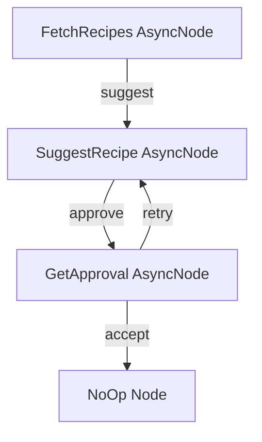
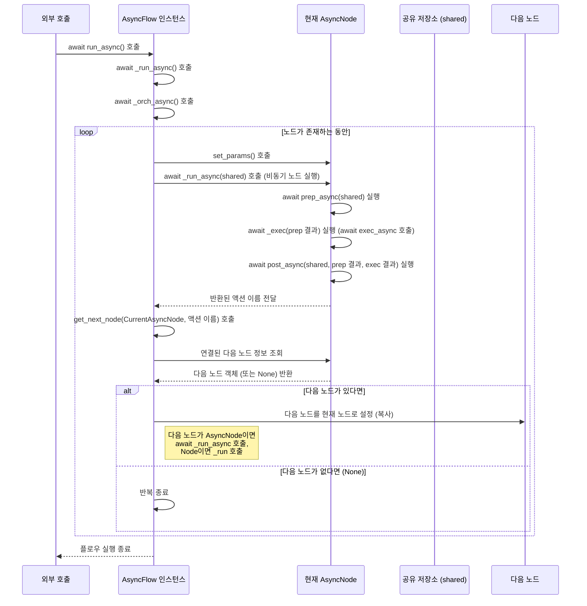

# Chapter 7: 비동기 처리 (Async Processing)

이전 챕터인 [배치 처리 (Batch Processing)](06_배치_처리__batch_processing__.md)에서는 PocketFlow를 사용하여 여러 개의 유사한 작업을 하나로 묶어 효율적으로 처리하는 방법을 배웠습니다. 배치 처리는 많은 양의 데이터를 처리할 때 유용하지만, 여전히 각 작업은 순차적으로 또는 개별적으로 실행되는 경우가 많습니다.

이번 챕터에서는 PocketFlow의 또 다른 중요한 개념인 **비동기 처리(Async Processing)** 에 대해 알아봅니다. 비동기 처리는 특히 네트워크 통신(API 호출), 파일 입출력(I/O) 등 **오래 기다려야 하는 작업**을 효율적으로 처리할 때 필수적입니다.

## 왜 비동기 처리가 필요할까요?

여러분이 LLM(대규모 언어 모델) API를 호출하거나, 웹에서 정보를 가져오거나, 데이터베이스에서 데이터를 조회하는 작업을 [노드 (Node)](02_노드__node__.md)로 만들어서 [플로우 (Flow)](04_플로우__flow__.md)를 실행한다고 상상해 보세요. 이러한 작업들은 대부분 **네트워크 응답이 올 때까지 기다리는 시간**이 상당합니다.

만약 이러한 기다림이 필요한 작업이 [플로우 (Flow)](04_플로우__flow__.md) 내에서 순차적으로 일어난다면, 프로그램은 응답이 올 때까지 아무것도 하지 않고 멈춰 있게 됩니다. 마치 식당 서버가 한 손님의 주문을 받고 주방에 전달한 후, 요리가 완성될 때까지 그 앞에 서서 기다리는 것과 같습니다. 그 서버는 다른 손님을 받거나 다른 테이블을 정리하는 등의 다른 유용한 일을 할 수 있음에도 불구하고 말이죠.

**비동기 처리**는 이러한 기다리는 시간을 효율적으로 활용할 수 있게 해줍니다. 작업이 시작된 후 완료될 때까지 멈춰 기다리는 대신, **'잠시 기다려야 하니, 나는 다른 할 일을 할게. 네가 끝나면 알려줘.'** 와 같이 다른 작업으로 전환하는 방식입니다. 식당 서버가 여러 손님의 주문을 동시에 받고 주방에 맡겨둔 후, 음식이 준비되는 동안 다른 테이블을 서빙하는 것과 같습니다.

PocketFlow는 파이썬의 `asyncio` 라이브러리를 기반으로 이러한 비동기 처리를 지원하며, 이를 위해 **`AsyncNode`** 와 **`AsyncFlow`** 라는 특별한 클래스를 제공합니다. 이들을 사용하면 LLM API 호출, 웹 요청 등 시간이 오래 걸리는 입출력(I/O) 작업 중에 프로그램이 멈추지 않고 다른 작업을 수행할 수 있어 **전체 실행 속도를 크게 높일 수 있습니다.**

## AsyncNode: 비동기 작업을 수행하는 노드

**`AsyncNode`** 는 이름에서 알 수 있듯이 비동기 작업을 수행할 수 있는 [노드 (Node)](02_노드__node__.md)입니다. 일반 `Node`와 거의 동일하지만, 핵심 메서드들이 `async def`로 정의되고 필요에 따라 `await` 키워드를 사용하여 비동기 작업을 기다린다는 점이 다릅니다.

`AsyncNode`는 다음과 같은 비동기 메서드를 가집니다.

*   `prep_async(self, shared)`:
    *   **역할:** 비동기적으로 다음 `exec_async` 실행에 필요한 데이터를 준비합니다. 이 메서드 자체도 비동기 작업(예: 비동기 DB 조회)을 포함할 수 있습니다.
    *   **입력:** `shared` ([공유 저장소 (Shared Store)](05_공유_저장소__shared_store__.md)).
    *   **반환:** `exec_async` 메서드의 첫 번째 인자로 전달될 값입니다.

*   `exec_async(self, prep_res)`:
    *   **역할:** [노드 (Node)](02_노드__node__.md)의 핵심 비동기 로직을 실행합니다. 여기서 LLM API 비동기 호출, 비동기 웹 요청 등 **`await` 키워드를 사용하여 다른 비동기 작업의 완료를 기다릴 수 있습니다.**
    *   **입력:** `prep_async` 메서드가 반환한 값 (`prep_res`).
    *   **반환:** 비동기 작업 결과 값입니다. 이 값은 `post_async` 메서드의 세 번째 인자(`exec_res`)로 전달됩니다.

*   `exec_fallback_async(self, prep_res, exc)`:
    *   **역할:** `exec_async` 실행 중 예외 발생 시 호출되는 비동기 대체 로직입니다. 이 메서드 자체도 비동기 작업(예: 비동기 로깅)을 포함할 수 있습니다.
    *   **입력:** `exec_async` 메서드의 입력 (`prep_res`), 발생한 예외 객체 (`exc`).
    *   **반환:** `post_async` 메서드의 세 번째 인자(`exec_res`)로 전달될 값입니다.

*   `post_async(self, shared, prep_res, exec_res)`:
    *   **역할:** `exec_async` 실행 후 비동기적으로 결과를 처리하고, 다음에 어떤 [노드 (Node)](02_노드__node__.md)로 이동할지를 결정합니다. 이 메서드 자체도 비동기 작업(예: 비동기 메시지 큐에 결과 발행)을 포함할 수 있습니다.
    *   **입력:** `shared` ([공유 저장소 (Shared Store)](05_공유_저장소__shared_store__.md)), `prep_async` 결과 (`prep_res`), `exec_async` 결과 (`exec_res`).
    *   **반환:** 다음 [노드 (Node)](02_노드__node__.md)로 이동할 [액션 (Action)](03_액션__action__.md) 이름(문자열)을 반환합니다.

일반 `Node`의 `prep`, `exec`, `post`, `exec_fallback` 메서드는 동기적으로 실행되지만, `AsyncNode`는 이러한 비동기 메서드들을 사용하여 비동기 작업의 유연성을 확보합니다. (AsyncNode는 일반 Node의 동기 메서드도 가질 수 있지만, 비동기 플로우(`AsyncFlow`)에서는 `_run_async`만 호출되므로 비동기 메서드를 사용하는 것이 일반적입니다.)

### AsyncNode 예시: 비동기 레시피 가져오기

`cookbook/pocketflow-async-basic` 예시는 비동기 노드를 사용하여 레시피를 찾는 플로우를 보여줍니다. 여기서 `FetchRecipes` 노드는 사용자의 재료 입력을 받고, 비동기 함수를 호출하여 레시피를 가져옵니다.

```python
# cookbook/pocketflow-async-basic/nodes.py 일부 발췌 및 한국어 주석 추가

from pocketflow import AsyncNode
# 예시를 위한 비동기 유틸리티 함수 import
from utils import fetch_recipes, get_user_input # 이 함수들은 내부적으로 await이 사용될 수 있음

class FetchRecipes(AsyncNode):
    """레시피를 비동기적으로 가져오는 AsyncNode."""
    
    async def prep_async(self, shared):
        """사용자로부터 재료를 비동기적으로 입력받습니다."""
        # await을 사용하여 get_user_input 비동기 함수의 완료를 기다립니다.
        ingredient = await get_user_input("Enter ingredient: ") 
        return ingredient
    
    async def exec_async(self, ingredient):
        """레시피를 비동기적으로 가져옵니다."""
        print(f"[FetchRecipes] exec_async: '{ingredient}' 재료로 레시피 검색 중...")
        # await을 사용하여 fetch_recipes 비동기 함수의 완료를 기다립니다.
        recipes = await fetch_recipes(ingredient) 
        print(f"[FetchRecipes] exec_async: 레시피 검색 완료. {len(recipes)}개 찾음.")
        return recipes # 찾은 레시피 리스트 반환
    
    async def post_async(self, shared, prep_res, recipes):
        """레시피를 shared에 저장하고 다음 단계로 이동합니다."""
        print(f"[FetchRecipes] post_async: shared에 레시피 저장 및 'suggest' 액션 반환.")
        # shared 저장소에 레시피와 재료를 저장합니다.
        shared["recipes"] = recipes 
        shared["ingredient"] = prep_res
        # 'suggest' 액션을 반환하여 다음 노드로 이동합니다.
        return "suggest"

```

이 `FetchRecipes` 노드는 일반 `Node`의 `prep`, `exec`, `post` 대신 `prep_async`, `exec_async`, `post_async` 메서드를 사용합니다. `prep_async`와 `exec_async` 내에서는 `await` 키워드를 사용하여 비동기 I/O 작업(`get_user_input`, `fetch_recipes`)의 완료를 기다립니다. 작업이 기다리는 동안 다른 비동기 작업이 실행될 수 있으므로 프로그램이 멈추지 않습니다.

## AsyncFlow: 비동기 노드를 실행하는 플로우

**`AsyncFlow`** 는 `AsyncNode`를 포함하는 [플로우 (Flow)](04_플로우__flow__.md)를 실행할 때 사용합니다. 일반 `Flow`는 동기적으로 [노드 (Node)](02_노드__node__.md)를 실행하기 때문에 `AsyncNode`의 비동기 기능을 제대로 활용할 수 없습니다. `AsyncFlow`는 `asyncio` 이벤트 루프 내에서 실행되며, `await` 키워드를 사용하여 `AsyncNode`의 비동기 메서드 호출을 기다리고 관리합니다.

`AsyncFlow`는 일반 `Flow`와 비슷하게 정의하고 연결하지만, 실행할 때는 `.run()` 대신 **`.run_async()`** 메서드를 사용하고, 이 메서드 호출 역시 `await` 키워드를 사용해야 합니다.

### AsyncFlow 예시: 비동기 레시피 찾기 플로우

`cookbook/pocketflow-async-basic` 예시에서 정의된 `AsyncNode`들(`FetchRecipes`, `SuggestRecipe`, `GetApproval`)을 `AsyncFlow`로 연결하여 사용하는 방법을 보겠습니다.

```python
# cookbook/pocketflow-async-basic/flow.py 일부 발췌 및 한국어 주석 추가

from pocketflow import AsyncFlow, Node
# AsyncNode들 import
from nodes import FetchRecipes, SuggestRecipe, GetApproval

class NoOp(Node):
    """아무것도 하지 않는 노드, 플로우를 제대로 끝내기 위해 사용."""
    pass

def create_flow():
    """비동기 노드들을 연결하여 AsyncFlow를 생성합니다."""
    
    # AsyncNode 인스턴스 생성
    fetch = FetchRecipes()
    suggest = SuggestRecipe()
    approve = GetApproval()
    end = NoOp() # 종료 노드는 꼭 AsyncNode일 필요는 없습니다.
    
    # 노드 연결 (액션 사용)
    # AsyncFlow에서도 일반 Flow와 동일한 액션 연결 문법을 사용합니다.
    fetch - "suggest" >> suggest      # FetchRecipes 완료 후 'suggest' 액션 시 SuggestRecipe로
    suggest - "approve" >> approve    # SuggestRecipe 완료 후 'approve' 액션 시 GetApproval로
    approve - "retry" >> suggest      # GetApproval 완료 후 'retry' 액션 시 SuggestRecipe로 (다른 레시피 제안)
    approve - "accept" >> end         # GetApproval 완료 후 'accept' 액션 시 EndNode로 (플로우 종료)
    
    # AsyncFlow 객체 생성 및 시작 노드 지정
    flow = AsyncFlow(start=fetch)
    return flow # 생성된 AsyncFlow 객체 반환

# 이 AsyncFlow를 실행하려면 asyncio 이벤트 루프 내에서 await을 사용해야 합니다.
# main.py 등에서 다음과 같이 실행할 수 있습니다.

# import asyncio
# from flow import create_flow
#
# async def main():
#     # Flow 객체 생성
#     recipe_flow = create_flow()
#     # shared 저장소 초기화
#     shared_data = {}
#     # AsyncFlow를 await을 사용하여 실행합니다.
#     print("--- 레시피 찾기 플로우 시작 ---")
#     await recipe_flow.run_async(shared_data) 
#     print("--- 레시피 찾기 플로우 종료 ---")
#     # print(f"최종 shared 상태: {shared_data}")
#
# if __name__ == "__main__":
#     asyncio.run(main()) # asyncio.run()으로 비동기 메인 함수 실행
```

`AsyncFlow`는 `Flow`와 동일하게 `start` 매개변수로 시작 [노드 (Node)](02_노드__node__.md)를 지정하고, `>>` 또는 `- "" >>` 연산자로 [노드 (Node)](02_노드__node__.md)를 연결합니다. 하지만 실행할 때는 `asyncio.run(main_async_function())`와 같이 `asyncio` 이벤트 루프 내에서 `await flow.run_async(shared)` 형태로 호출해야 합니다. 이렇게 하면 `AsyncFlow`가 `AsyncNode`의 비동기 메서드들을 기다리면서도 다른 비동기 작업이 동시에 진행될 수 있도록 관리합니다.

이 플로우의 구조를 그림으로 표현하면 다음과 같습니다. 비동기 노드들도 일반 노드와 동일한 방식으로 연결됩니다.



이 예시에서는 사용자가 재료를 입력하면(`FetchRecipes`), LLM이 레시피를 제안하고(`SuggestRecipe`), 사용자가 승인하거나 다른 제안을 요청하는(`GetApproval`) 과정이 비동기적으로 진행됩니다. 사용자의 입력을 기다리거나 LLM API 응답을 기다리는 동안에도 프로그램이 멈추지 않고 다른 비동기 작업을 처리할 준비가 됩니다.

## AsyncNode와 AsyncFlow의 관계

`AsyncNode`는 **하나의 비동기 작업 단위**를 정의하고, `AsyncFlow`는 이러한 `AsyncNode`들을 연결하여 **전체 비동기 작업 흐름**을 정의하고 실행합니다. `AsyncNode`만으로는 비동기 작업을 직접 실행할 수 없으며 (엄밀히 말하면 `await node.run_async()`로 개별 노드 실행은 가능하나 플로우 구성 목적에는 맞지 않음), 반드시 `AsyncFlow` 내에서 실행되어야 합니다. `AsyncFlow`는 `asyncio`의 이벤트 루프를 관리하며 `AsyncNode`들의 비동기 메서드 호출을 스케줄링합니다.

## 더 복잡한 비동기 예시: 멀티 에이전트 게임

`cookbook/pocketflow-multi-agent` 예시는 PocketFlow의 비동기 기능을 활용하여 두 개의 `AsyncNode` (힌트 제공자 Hinter와 단어 맞추는 Guesser)가 서로 통신하며 게임을 진행하는 복잡한 시나리오를 보여줍니다.

```python
# cookbook/pocketflow-multi-agent/main.py 일부 발췌 및 한국어 주석 추가

import asyncio
from pocketflow import AsyncNode, AsyncFlow

# (utils.py에 정의된 call_llm 함수 사용 - 실제 LLM 호출 가정)

class AsyncHinter(AsyncNode):
    # ... (prep_async, exec_async, post_async 메서드 정의 - Chapter 7 설명 참고)
    async def post_async(self, shared, prep_res, exec_res):
        if exec_res is None: return "end"
        # Guesser에게 힌트를 비동기적으로 전달
        await shared["guesser_queue"].put(exec_res) 
        return "continue" # Hinter 자신의 플로우를 다시 시작

class AsyncGuesser(AsyncNode):
    # ... (prep_async, exec_async, post_async 메서드 정의 - Chapter 7 설명 참고)
    async def post_async(self, shared, prep_res, exec_res):
        # 맞췄는지 확인...
        if exec_res.lower() == shared["target_word"].lower():
            print("Game Over - Correct guess!")
            # Hinter에게 게임 종료 신호 비동기적으로 전달
            await shared["hinter_queue"].put("GAME_OVER") 
            return "end" # Guesser 플로우 종료
        
        # ... 맞추지 못했으면 shared에 추가하고 Hinter에게 비동기적으로 전달
        # await shared["hinter_queue"].put(exec_res)
        return "continue" # Guesser 자신의 플로우를 다시 시작

async def main():
    # 게임 설정 및 shared 저장소 준비
    shared = {
        "target_word": "nostalgic",
        # ... (queue 객체 초기화 - asyncio.Queue())
        "hinter_queue": asyncio.Queue(), # AsyncNode 간 비동기 통신을 위한 큐
        "guesser_queue": asyncio.Queue()
    }
    
    # ... (게임 시작 메시지 출력 및 초기 신호 전달)
    await shared["hinter_queue"].put("") # Hinter가 시작할 수 있도록 초기 빈 guess 전달

    # AsyncNode 인스턴스 생성
    hinter = AsyncHinter()
    guesser = AsyncGuesser()

    # AsyncFlow 생성 (각 에이전트별 플로우)
    hinter_flow = AsyncFlow(start=hinter)
    guesser_flow = AsyncFlow(start=guesser)

    # 각 노드를 자신의 플로우로 순환 연결 (게임이 계속 진행되도록)
    hinter - "continue" >> hinter
    guesser - "continue" >> guesser
    
    # 중요: asyncio.gather를 사용하여 두 AsyncFlow를 동시에 실행!
    print("=========== 게임 시작! (Ctrl+C로 종료) ===========")
    await asyncio.gather(
        hinter_flow.run_async(shared),
        guesser_flow.run_async(shared)
    )
    
    print("=========== 게임 완료! ===========")

if __name__ == "__main__":
    asyncio.run(main()) # asyncio 메인 함수 실행
```

이 예시에서는 `AsyncHinter`와 `AsyncGuesser`가 각각의 `AsyncFlow`를 가지지만, `asyncio.gather`를 사용하여 이 두 [플로우 (Flow)](04_플로우__flow__.md)를 **동시에(concurrently)** 실행합니다. 각 노드는 `asyncio.Queue`를 사용하여 서로에게 메시지를 비동기적으로 보내고 받습니다 (`await queue.put()`, `await queue.get()`). 이러한 복잡한 상호작용과 동시 실행이 `AsyncNode`와 `AsyncFlow`를 통해 `asyncio` 환경에서 가능해집니다.

## 비동기 처리는 어떻게 실행될까요? (내부 동작)

`AsyncFlow`가 비동기 노드를 실행하는 방식은 일반 `Flow`가 동기 노드를 실행하는 방식과 유사하지만, `async`/`await` 키워드를 사용하여 비동기 작업의 완료를 기다린다는 점이 다릅니다.

`AsyncFlow` 객체의 `.run_async()` 메서드를 호출하면, 내부적으로 `_run_async()` 메서드가 실행되고, 이 메서드가 다시 비동기 오케스트레이션 로직인 `_orch_async()` 메서드를 호출합니다.

`_orch_async()` 메서드는 다음과 같은 비동기 과정을 반복하며 [플로우 (Flow)](04_플로우__flow__.md)를 실행합니다.

1.  시작 [노드 (Node)](02_노드__node__.md)를 현재 실행할 [노드 (Node)](02_노드__node__.md)로 설정합니다.
2.  현재 [노드 (Node)](02_노드__node__.md)가 `AsyncNode`이면 `await curr._run_async(shared)`를 호출하여 **비동기적으로** [노드 (Node)](02_노드__node__.md) 작업을 실행합니다. (`AsyncNode`의 `prep_async`, `_exec`(내부에서 `exec_async` 호출), `post_async`가 차례로 **await되어** 실행됩니다.) 만약 현재 노드가 일반 `Node`라면 `curr._run(shared)`를 호출합니다.
3.  [노드 (Node)](02_노드__node__.md) 실행이 완료되면 반환된 값 (결국 `post_async` 또는 `post` 메서드가 반환한 **[액션 (Action)](03_액션__action__.md) 이름**)을 가져옵니다.
4.  현재 [노드 (Node)](02_노드__node__.md)와 반환된 **[액션 (Action)](03_액션__action__.md)** 을 사용하여 다음에 실행할 [노드 (Node)](02_노드__node__.md)를 찾습니다 (`get_next_node` 메서드 사용).
5.  찾은 다음 [노드 (Node)](02_노드__node__.md)를 현재 실행할 [노드 (Node)](02_노드__node__.md)로 설정하고 2번 과정으로 돌아가 반복합니다.
6.  만약 찾은 다음 [노드 (Node)](02_노드__node__.md)가 없으면 반복을 중단하고 [플로우 (Flow)](04_플로우__flow__.md) 실행을 종료합니다.

이 과정을 간단한 비동기 순서도로 표현하면 다음과 같습니다.



실제 PocketFlow 코드(`pocketflow/__init__.py`)에서 `AsyncNode`와 `AsyncFlow` 클래스의 비동기 메서드를 보면 이 핵심 로직을 확인할 수 있습니다.

```python
# pocketflow/__init__.py 파일 일부 발췌

class AsyncNode(Node):
    # ... (초기화 및 동기 메서드 생략)

    # AsyncNode는 비동기 메서드를 사용합니다.
    async def prep_async(self,shared): pass
    async def exec_async(self,prep_res): pass
    async def exec_fallback_async(self,prep_res,exc): raise exc
    async def post_async(self,shared,prep_res,exec_res): pass

    # _exec 메서드를 재정의하여 비동기 exec_async를 await 호출합니다.
    async def _exec(self,prep_res): 
        for i in range(self.max_retries):
            try: 
                # !!! exec_async 호출 시 await 사용 !!!
                return await self.exec_async(prep_res) 
            except Exception as e:
                if i==self.max_retries-1: 
                    # !!! exec_fallback_async 호출 시 await 사용 !!!
                    return await self.exec_fallback_async(prep_res,e)
                if self.wait>0: 
                    # !!! 비동기 대기 시 asyncio.sleep 사용 !!!
                    await asyncio.sleep(self.wait) 

    # 노드의 실행 진입점 (await 사용)
    async def run_async(self,shared): 
        if self.successors: warnings.warn("Node won't run successors. Use AsyncFlow.")  
        # !!! 비동기 run 메서드 _run_async 호출 !!!
        return await self._run_async(shared)

    # 비동기 노드의 내부 실행 로직
    async def _run_async(self,shared): 
        # !!! prep_async, _exec, post_async 호출 시 await 사용 !!!
        p = await self.prep_async(shared) 
        e = await self._exec(p) 
        return await self.post_async(shared,p,e)

    # 일반 run 메서드는 비동기 노드에서는 사용할 수 없도록 오류 발생
    def _run(self,shared): raise RuntimeError("Use run_async.")


class AsyncFlow(Flow,AsyncNode):
    # Flow 클래스를 상속하고 AsyncNode의 비동기 기능을 추가합니다.
    # AsyncFlow는 자체적으로 비동기 메서드(prep_async, post_async)를 가질 수 있습니다.

    # 핵심 오케스트레이션 루프 (비동기 버전)
    async def _orch_async(self,shared,params=None):
        curr = copy.copy(self.start_node) # 시작 노드
        # ... (params 설정 및 last_action 초기화 생략)
        last_action = None 
        params_dict = (params or {**self.params})

        # 현재 노드가 있는 동안 비동기 반복
        while curr: 
            curr.set_params(params_dict)
            
            # !!! 현재 노드가 AsyncNode면 _run_async 호출, 아니면 _run 호출 !!!
            # 결과 기다릴 때 await 사용
            last_action = await curr._run_async(shared) if isinstance(curr,AsyncNode) else curr._run(shared) 
            
            # 다음 노드 찾기는 동기적으로 수행
            next_node = self.get_next_node(curr,last_action)
            
            # 다음 노드로 이동
            curr = copy.copy(next_node)
            
        return last_action

    # AsyncFlow의 실행 진입점 (비동기 버전)
    async def _run_async(self,shared): 
        # !!! prep_async, _orch_async, post_async 호출 시 await 사용 !!!
        p = await self.prep_async(shared) 
        o = await self._orch_async(shared) 
        return await self.post_async(shared,p,o)

    # AsyncFlow는 BatchFlow처럼 post_async 결과로 exec_res를 반환하는 것이 기본입니다.
    async def post_async(self,shared,prep_res,exec_res): return exec_res
    
    # 일반 run 메서드는 AsyncFlow에서는 사용할 수 없도록 오류 발생
    def _run(self,shared): raise RuntimeError("Use run_async.")

```

`AsyncNode._run_async`는 `prep_async`, `_exec` (내부에서 `exec_async` 호출), `post_async`를 순서대로 `await`하여 실행합니다. 특히 `_exec` 메서드는 재정의되어 `exec_async`와 `exec_fallback_async` 호출에 `await`을 붙입니다. `AsyncFlow._orch_async`는 `while curr:` 루프 안에서 현재 노드의 `_run_async` (AsyncNode인 경우) 또는 `_run` (Node인 경우) 메서드를 호출할 때 `await`을 사용하여 해당 노드의 실행 완료를 기다립니다. 이렇게 `async`와 `await`을 통해 PocketFlow는 여러 비동기 작업이 동시에 수행될 수 있도록 `asyncio` 이벤트 루프에 제어권을 넘겨주면서 효율적인 비동기 처리를 구현합니다.

## 요약

이번 챕터에서는 PocketFlow에서 시간이 오래 걸리는 입출력(I/O) 작업을 효율적으로 처리하는 **비동기 처리 (Async Processing)** 에 대해 알아보았습니다.

*   **비동기 처리**는 작업 완료를 기다리는 동안 다른 작업을 수행하여 전체 실행 효율을 높이는 방식입니다.
*   **`AsyncNode`** 는 비동기 작업을 수행하는 [노드 (Node)](02_노드__node__.md)이며, `async def`로 정의된 `prep_async`, `exec_async`, `post_async`, `exec_fallback_async` 메서드를 가집니다. 이 메서드 내에서는 `await` 키워드를 사용하여 다른 비동기 작업의 완료를 기다릴 수 있습니다.
*   **`AsyncFlow`** 는 `AsyncNode`를 포함하는 [플로우 (Flow)](04_플로우__flow__.md)를 실행할 때 사용하며, `asyncio` 이벤트 루프 내에서 `await .run_async()` 형태로 실행해야 합니다. `AsyncFlow`는 내부적으로 `AsyncNode`의 비동기 메서드 호출을 관리합니다.
*   `AsyncNode`와 `AsyncFlow`를 사용하면 LLM API 호출, 웹 요청 등 기다림이 필요한 작업 중에도 프로그램이 멈추지 않고 효율적으로 동작하게 됩니다.

이제 우리는 단일 작업, 순차적 흐름, 데이터 공유, 배치 처리, 그리고 비동기 처리까지 PocketFlow의 다양한 실행 방식을 이해하게 되었습니다. 다음 챕터에서는 비동기 처리와 배치 처리를 결합하여 여러 배치 작업을 **동시에 병렬적으로** 실행할 수 있는 **[병렬 배치 처리 (Parallel Batch Processing)](08_병렬_배치_처리__parallel_batch_processing__.md)** 에 대해 알아보겠습니다.

[Next Chapter: 병렬 배치 처리 (Parallel Batch Processing)](08_병렬_배치_처리__parallel_batch_processing__.md)

---

Generated by [AI Codebase Knowledge Builder](https://github.com/The-Pocket/Tutorial-Codebase-Knowledge)