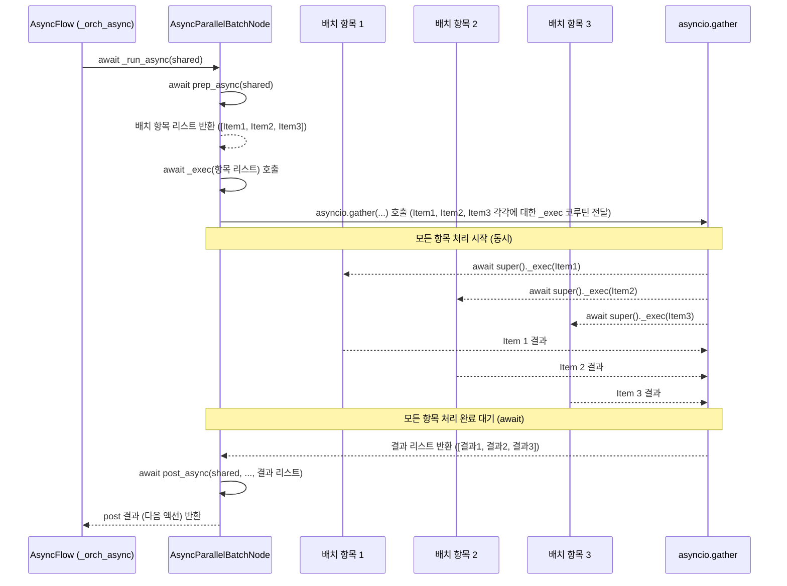
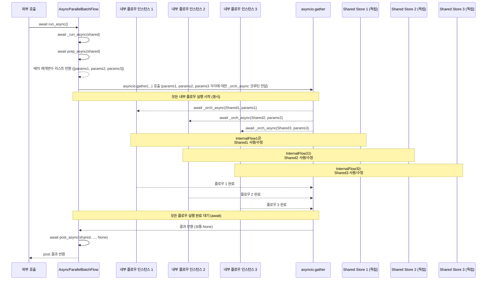

# Chapter 8: 병렬 배치 처리 (Parallel Batch Processing)

이전 챕터인 [비동기 처리 (Async Processing)](07_비동기_처리__async_processing__.md)에서는 LLM API 호출이나 네트워크 요청처럼 시간이 오래 걸리는 I/O 작업을 기다리는 동안 프로그램이 멈추지 않고 다른 작업을 수행할 수 있게 해주는 **비동기 처리** 기능에 대해 배웠습니다. 우리는 이를 위해 `AsyncNode`와 `AsyncFlow`를 사용하는 방법을 살펴보았습니다.

이번 챕터에서는 [배치 처리 (Batch Processing)](06_배치_처리__batch_processing__.md)와 [비동기 처리 (Async Processing)](07_비동기_처리__async_processing__.md)를 결합하여 여러 개의 개별 작업을 **동시에, 병렬적으로** 처리할 수 있는 PocketFlow의 가장 빠른 처리 방식인 **병렬 배치 처리 (Parallel Batch Processing)** 에 대해 알아보겠습니다.

## 왜 병렬 배치 처리가 필요할까요?

수백 개의 고객에게 맞춤형 LLM 기반 이메일을 보내거나, 수천 장의 이미지에 AI 필터를 적용하는 등의 작업을 해야 한다고 상상해 보세요. 각 작업은 독립적이며, LLM 호출이나 이미지 처리는 시간이 걸리는 비동기 작업입니다.

*   이전 챕터에서 배운 **순차 처리** 방식([플로우 (Flow)](04_플로우__flow__.md) 기본 동작): 각 고객 또는 이미지마다 전체 플로우를 처음부터 끝까지 순서대로 처리합니다. 시간이 매우 오래 걸릴 수 있습니다.
*   [배치 처리 (Batch Processing)](06_배치_처리__batch_processing__.md) 방식 (`BatchNode`, `BatchFlow`): 여러 작업을 하나로 묶어서 처리하지만, 내부적으로는 여전히 순차적으로 처리되는 경우가 많습니다. `BatchNode`의 `exec`는 항목별로 순차 호출되고, `BatchFlow`는 내부 플로우를 순차 반복 실행합니다.
*   [비동기 처리 (Async Processing)](07_비동기_처리__async_processing__.md) 방식 (`AsyncNode`, `AsyncFlow`): 각 작업 내에서 I/O 대기 시간 동안 다른 작업을 할 수 있지만, 여러 개의 개별 작업 자체를 **동시에 시작**하지는 않습니다. (AsyncFlow는 노드 내부의 비동기 작업을 관리할 뿐, 여러 노드나 플로우를 동시에 실행하지는 않습니다.)

우리가 원하는 것은 여러 고객에게 이메일을 보내거나 여러 이미지에 필터를 적용하는 작업을 **동시에 여러 개 시작**해서 전체 완료 시간을 획기적으로 줄이는 것입니다. 마치 여러 대의 배달 트럭이 각각 여러 소포를 싣고 **동시에** 다른 목적지로 출발하는 것처럼 말이죠. 이것이 바로 **병렬 배치 처리**의 핵심 아이디어입니다.

PocketFlow는 이러한 시나리오를 위해 **`AsyncParallelBatchNode`** 와 **`AsyncParallelBatchFlow`** 라는 특별한 클래스를 제공합니다. 이들은 [비동기 처리 (Async Processing)](07_비동기_처리__async_processing__.md) 기능을 활용하여 배치 내의 여러 항목 또는 플로우 실행을 **동시에 병렬적으로** 처리합니다.

## AsyncParallelBatchNode: 노드 내부에서 여러 항목을 비동기 병렬 처리하기

**`AsyncParallelBatchNode`** 는 [BatchNode (배치 처리)](06_배치_처리__batch_processing__.md)와 [AsyncNode (비동기 처리)](07_비동기_처리__async_processing__.md)의 기능을 결합한 것입니다. `prep_async` 메서드에서 비동기적으로 배치 항목 리스트를 가져오고, `exec_async` 메서드는 이 리스트의 **각 항목 하나**를 처리하는 비동기 작업을 정의합니다. 여기서 중요한 차이점은 `AsyncParallelBatchNode`는 `prep_async`가 반환한 **모든 항목에 대한 `exec_async` 호출을 `asyncio.gather`를 사용하여 동시에 시작하고 완료될 때까지 기다린다**는 것입니다.

`AsyncParallelBatchNode`의 핵심 비동기 메서드는 다음과 같이 동작합니다:

*   `prep_async(self, shared)`:
    *   **역할:** 비동기적으로 배치 처리에 사용할 개별 항목들의 **리스트 또는 반복자**를 준비하여 반환합니다. (AsyncBatchNode와 동일)
    *   **입력:** `shared` ([공유 저장소 (Shared Store)](05_공유_저장소__shared_store__.md)).
    *   **반환:** `exec_async` 메서드가 개별적으로 처리할 **항목들의 리스트 또는 반복자**입니다.

*   `exec_async(self, item)`:
    *   **역할:** `prep_async`에서 반환된 항목 리스트의 **각 항목 하나**를 받아서 실제 비동기 작업을 수행합니다. 이 메서드의 **여러 호출이 동시에** 실행될 수 있습니다. 여기서 `await` 키워드를 사용합니다.
    *   **입력:** 배치 내의 **개별 항목 (`item`)** 하나.
    *   **반환:** 해당 **개별 항목 처리 결과**입니다.

*   `post_async(self, shared, prep_res, exec_res_list)`:
    *   **역할:** 모든 개별 항목에 대한 병렬 `exec_async` 실행이 완료된 후 호출됩니다. `exec_res_list` 인자로 **모든 개별 `exec_async` 호출의 결과가 담긴 리스트**를 받습니다. 이 리스트를 종합하여 최종 결과를 만들거나 [공유 저장소 (Shared Store)](05_공유_저장소__shared_store__.md)에 저장하는 등의 후처리 작업을 수행합니다. (AsyncBatchNode와 동일)
    *   **입력:** `shared` ([공유 저장소 (Shared Store)](05_공유_저장소__shared_store__.md)), `prep_async` 결과 (`prep_res`), **모든 `exec_async` 결과 리스트 (`exec_res_list`)**.
    *   **반환:** 다음 [노드 (Node)](02_노드__node__.md)로 이동할 [액션 (Action)](03_액션__action__.md) 이름(문자열)을 반환합니다.

### AsyncParallelBatchNode 예시: LLM 요약 병렬 처리

`cookbook/pocketflow-parallel-batch/main.py` 예시는 `AsyncParallelBatchNode`를 사용하여 여러 문서에 대한 LLM 요약을 **비동기적으로 병렬 처리**하는 방법을 보여줍니다. 이 예시에서는 `AsyncBatchNode` (순차 비동기 처리)와 `AsyncParallelBatchNode` (병렬 비동기 처리)의 성능을 비교합니다.

먼저 순차 비동기 처리를 하는 `AsyncBatchNode` 버전입니다.

```python
# cookbook/pocketflow-parallel-batch/main.py 일부 발췌 및 한국어 주석 추가

from pocketflow import AsyncBatchNode, AsyncFlow
import asyncio
import time # 시간 측정용

async def dummy_llm_summarize(text):
    """1초 지연이 있는 비동기 LLM 호출 시뮬레이션."""
    await asyncio.sleep(1) # 1초 기다림
    return f"Summarized({len(text)} chars)"

class SummariesAsyncNode(AsyncBatchNode): # AsyncBatchNode 사용
    async def prep_async(self, shared):
        # 처리할 항목 리스트 반환 (예: 파일 이름, 내용)
        return list(shared["data"].items())

    async def exec_async(self, item):
        filename, content = item
        # AsyncBatchNode는 이 exec_async를 각 항목별로 순차적으로 await 호출합니다.
        print(f"[순차] '{filename}' 요약 중...")
        summary = await dummy_llm_summarize(content) # 1초 기다림 발생
        return (filename, summary)

    async def post_async(self, shared, prep_res, exec_res_list):
        shared["sequential_summaries"] = dict(exec_res_list)
        return "done_sequential"

```

위 `SummariesAsyncNode`는 `AsyncBatchNode`를 상속합니다. `prep_async`에서 처리할 항목 리스트를 반환하고, `exec_async`는 각 항목에 대해 비동기 LLM 호출을 시뮬레이션합니다. `AsyncBatchNode`는 이 `exec_async`를 항목 수만큼 순차적으로 호출하므로, 각 호출의 1초 지연이 누적됩니다.

다음은 `AsyncParallelBatchNode`를 사용하여 병렬 비동기 처리를 하는 버전입니다.

```python
# cookbook/pocketflow-parallel-batch/main.py 일부 발췌 및 한국어 주석 추가

from pocketflow import AsyncParallelBatchNode
# ... (dummy_llm_summarize 함수 생략)

class SummariesAsyncParallelNode(AsyncParallelBatchNode): # AsyncParallelBatchNode 사용
    async def prep_async(self, shared):
        return list(shared["data"].items())

    async def exec_async(self, item):
        filename, content = item
        # AsyncParallelBatchNode는 이 exec_async 호출을 모든 항목에 대해 동시에 시작합니다.
        print(f"[병렬] '{filename}' 요약 중...")
        summary = await dummy_llm_summarize(content) # 여기서 기다리는 동안 다른 항목의 exec_async도 실행됨
        return (filename, summary)

    async def post_async(self, shared, prep_res, exec_res_list):
        shared["parallel_summaries"] = dict(exec_res_list)
        return "done_parallel"

```

`SummariesAsyncParallelNode`는 `AsyncParallelBatchNode`를 상속한다는 점만 다르고, `prep_async`와 `exec_async` 메서드는 거의 동일합니다. 하지만 `AsyncParallelBatchNode`는 내부적으로 `prep_async`가 반환한 모든 항목에 대한 `exec_async` 호출을 동시에 실행합니다. 따라서 `exec_async` 내에서 `await asyncio.sleep(1)`으로 1초를 기다리는 동안, 다른 항목의 `exec_async` 호출도 병렬적으로 진행되어 기다림 시간을 겹치게 만듭니다.

두 노드를 실행하는 메인 코드는 다음과 같습니다.

```python
# cookbook/pocketflow-parallel-batch/main.py 일부 발췌 및 한국어 주석 추가

import asyncio
import time
from pocketflow import AsyncFlow # AsyncNode를 실행하려면 AsyncFlow 필요
# ... (dummy_llm_summarize, SummariesAsyncNode, SummariesAsyncParallelNode 정의 생략)

async def main():
    # 처리할 데이터 (3개 항목)
    shared_data = {
        "data": {
            "파일1.txt": "내용 1...",
            "파일2.txt": "내용 2...",
            "파일3.txt": "내용 3...",
        }
    }

    # 1) 순차 비동기 버전 실행 (AsyncBatchNode)
    seq_node = SummariesAsyncNode()
    seq_flow = AsyncFlow(start=seq_node) # AsyncFlow로 실행

    print("\n=== 순차 실행 (AsyncBatchNode) ===")
    t0 = time.time()
    await seq_flow.run_async(shared_data) # 비동기 플로우 실행
    t1 = time.time()
    print(f"순차 요약 결과: {shared_data.get('sequential_summaries')}")
    print(f"순차 처리 시간: {t1 - t0:.2f} 초")

    # 2) 병렬 비동기 버전 실행 (AsyncParallelBatchNode)
    par_node = SummariesAsyncParallelNode()
    par_flow = AsyncFlow(start=par_node) # 동일하게 AsyncFlow로 실행

    print("\n=== 병렬 실행 (AsyncParallelBatchNode) ===")
    t2 = time.time()
    await par_flow.run_async(shared_data) # 비동기 플로우 실행
    t3 = time.time()
    print(f"병렬 요약 결과: {shared_data.get('parallel_summaries')}")
    print(f"병렬 처리 시간: {t3 - t2:.2f} 초")


if __name__ == "__main__":
    asyncio.run(main()) # 비동기 메인 함수 실행

```

이 코드를 실행하면, 순차 버전은 각 항목(1초 소요)을 순서대로 처리하므로 총 3초 정도가 걸립니다. 반면, 병렬 버전은 3개의 항목 처리를 동시에 시작하여 LLM 호출(1초)이 병렬로 진행되므로, 전체 완료 시간은 1초에 약간의 오버헤드를 더한 시간이 걸립니다.

**예상 출력:**

```text
=== 순차 실행 (AsyncBatchNode) ===
[순차] '파일1.txt' 요약 중...
[순차] '파일2.txt' 요약 중...
[순차] '파일3.txt' 요약 중...
순차 요약 결과: {'파일1.txt': 'Summarized(6 chars)', '파일2.txt': 'Summarized(6 chars)', '파일3.txt': 'Summarized(6 chars)'}
순차 처리 시간: 3.xx 초

=== 병렬 실행 (AsyncParallelBatchNode) ==="
[병렬] '파일1.txt' 요약 중...
[병렬] '파일2.txt' 요약 중...
[병렬] '파일3.txt' 요약 중...
병렬 요약 결과: {'파일1.txt': 'Summarized(6 chars)', '파일2.txt': 'Summarized(6 chars)', '파일3.txt': 'Summarized(6 chars)'}
병렬 처리 시간: 1.xx 초
```

이 결과는 `AsyncParallelBatchNode`가 비동기 작업을 병렬적으로 처리하여 전체 시간을 크게 단축함을 명확하게 보여줍니다.

## AsyncParallelBatchFlow: 전체 플로우를 비동기 병렬 실행하기

**`AsyncParallelBatchFlow`** 는 [BatchFlow (배치 처리)](06_배치_처리__batch_processing__.md)와 [AsyncFlow (비동기 처리)](07_비동기_처리__async_processing__.md)의 기능을 결합한 것입니다. `AsyncBatchFlow`가 `prep_async`에서 반환된 각 매개변수 딕셔너리로 내부 플로우를 순차적으로 실행하는 반면, `AsyncParallelBatchFlow`는 `prep_async`가 반환한 **모든 매개변수 조합에 대해 내부 플로우 실행을 `asyncio.gather`를 사용하여 동시에 시작**하고 완료될 때까지 기다립니다.

`AsyncParallelBatchFlow`는 `AsyncFlow`와 `BatchFlow`를 상속하며, `prep_async` 및 `post_async` 메서드는 `AsyncBatchFlow`와 유사하게 동작합니다. 핵심 차이는 내부 플로우 실행 방식입니다.

*   `prep_async(self, shared)`:
    *   **역할:** 비동기적으로 내부 플로우 실행에 사용할 **개별 매개변수(params) 딕셔너리들의 리스트**를 준비하여 반환합니다. (AsyncBatchFlow와 동일)
    *   **입력:** `shared` ([공유 저장소 (Shared Store)](05_공유_저장소__shared_store__.md)).
    *   **반환:** 내부 [플로우 (Flow)](04_플로우__flow__.md)가 반복 실행될 때 사용될 **매개변수 딕셔너리들의 리스트**입니다.

*   `post_async(self, shared, prep_res, exec_res)`:
    *   **역할:** `AsyncParallelBatchFlow` 내의 모든 내부 플로우의 비동기 병렬 실행이 완료된 후 호출됩니다. `exec_res`는 일반적으로 `None`입니다. 여기서 최종 마무리 작업을 수행합니다. (AsyncBatchFlow와 유사)
    *   **입력:** `shared` ([공유 저장소 (Shared Store)](05_공유_저장소__shared_store__.md)), `prep_async` 결과 (`prep_res`), `exec_res` (보통 `None`).
    *   **반환:** 이 `AsyncParallelBatchFlow`가 상위 [플로우 (Flow)](04_플로우__flow__.md)의 일부인 경우 다음 노드로 이동할 [액션 (Action)](03_액션__action__.md) 이름(문자열)을 반환합니다.

**중요:** `AsyncParallelBatchFlow`는 내부적으로 각 배치 실행(내부 플로우 한 번 실행)에 대해 **별도의 독립적인 `shared` 저장소**를 생성하여 전달합니다. 이는 `AsyncBatchFlow`가 동일한 `shared`를 공유하는 것과 다릅니다. 따라서 각 병렬 실행은 서로의 데이터를 덮어쓰거나 간섭하지 않습니다. 최종 `AsyncParallelBatchFlow`의 `post_async`에서는 이러한 개별 `shared` 객체들에 접근하여 결과를 통합하는 로직이 필요할 수 있습니다 (기본 구현에서는 모든 실행이 완료된 후 `BatchFlow.post_async`처럼 동작).

### AsyncParallelBatchFlow 예시: 이미지 처리 플로우 병렬 실행

`cookbook/pocketflow-parallel-batch-flow/flow.py` 예시는 `AsyncParallelBatchFlow`를 사용하여 이미지 처리 [플로우 (Flow)](04_플로우__flow__.md)를 여러 이미지 파일과 여러 필터 조합에 대해 **비동기적으로 병렬 실행**하는 방법을 보여줍니다.

먼저 단일 이미지를 단일 필터로 처리하는 기본 [플로우 (Flow)](04_플로우__flow__.md) 정의입니다. 이는 [배치 처리 (Batch Processing)](06_배치_처리__batch_processing__.md) 챕터에서 보았던 것과 유사하며, 각 노드는 [비동기 처리 (Async Processing)](07_비동기_처리__async_processing__.md)를 위해 `AsyncNode` 또는 비동기 기능을 포함한 `Node`를 상속해야 합니다. (예시에서는 `Node`를 상속하지만, 비동기 I/O를 포함하려면 `AsyncNode`와 `async def`/`await` 사용이 필요합니다.) 예시 코드의 `LoadImage`, `ApplyFilter`, `SaveImage` 노드는 `Node`를 상속하며, 실제 비동기 I/O (`asyncio.sleep` 등)를 포함한다면 `AsyncNode`를 상속하고 메서드를 비동기화해야 합니다. 여기서는 설명의 간결성을 위해 예시 파일의 `Node` 상속을 따르겠습니다.

```python
# cookbook/pocketflow-parallel-batch-flow/flow.py 일부 발췌 및 한국어 주석 추가

from pocketflow import Flow, Node # Node를 사용하지만, 비동기 I/O는 AsyncNode와 async/await 필요
# from nodes import LoadImage, ApplyFilter, SaveImage # 실제 노드 import

# 예시를 위한 더미 노드 (실제 비동기 I/O 포함 시 AsyncNode 상속 및 async/await 사용)
class LoadImage(Node):
    def exec(self, _):
        # params에서 이미지 경로를 가져옴
        img_path = self.params.get("image_path") 
        print(f"[LoadImage] '{img_path}' 로드 (params: {self.params})")
        # 실제 비동기 로드 코드... (async def exec_async(self, _): await load_file(img_path))
        return f"이미지 데이터({img_path})"

class ApplyFilter(Node):
    def exec(self, image_data):
        # params에서 필터 이름을 가져옴
        filter_name = self.params.get("filter")
        print(f"[ApplyFilter] 필터 '{filter_name}' 적용 (params: {self.params})")
        # 실제 비동기 필터 적용 코드... (async def exec_async(self, data): await apply_async_filter(data, filter_name))
        return f"{image_data} + 필터({filter_name})"

class SaveImage(Node):
    def exec(self, image_data):
        # params에서 정보 가져와 출력 경로 생성 및 저장
        img_path = self.params.get("image_path")
        filter_name = self.params.get("filter")
        output_path = f"{img_path.split('.')[0]}_{filter_name}.processed"
        print(f"[SaveImage] '{output_path}' 저장 (params: {self.params})")
        # 실제 비동기 저장 코드... (async def exec_async(self, data): await save_file(data, output_path))
        return output_path

def create_base_flow():
    """단일 이미지 처리를 위한 기본 플로우를 생성합니다."""
    load = LoadImage()
    apply_filter = ApplyFilter()
    save = SaveImage()
    
    # 노드 연결
    # LoadImage와 ApplyFilter는 기본 액션을 반환한다고 가정
    load >> apply_filter 
    apply_filter >> save
    
    # Flow 객체를 생성하고 시작 노드를 LoadImage로 설정합니다.
    # BatchFlow나 ParallelBatchFlow는 이 Flow 객체를 시작 노드로 받습니다.
    base_flow = Flow(start=load) 
    # Flow 객체를 시작 노드로 반환
    return base_flow

```

`create_base_flow` 함수는 `LoadImage`, `ApplyFilter`, `SaveImage` 노드를 순차적으로 연결한 기본적인 [플로우 (Flow)](04_플로우__flow__.md) 객체를 생성합니다. 각 노드는 `self.params` 딕셔너리에서 이미지 파일 경로와 필터 이름을 받도록 설계되어 있습니다.

이제 이 기본 [플로우 (Flow)](04_플로우__flow__.md)를 `AsyncParallelBatchFlow`로 감싸 여러 이미지에 여러 필터를 적용하는 병렬 배치 처리를 정의합니다.

```python
# cookbook/pocketflow-parallel-batch-flow/flow.py 일부 발췌 및 한국어 주석 추가

from pocketflow import AsyncParallelBatchFlow # AsyncParallelBatchFlow 사용
# ... (create_base_flow 함수 및 AsyncBatchFlow 클래스 생략)

class ImageParallelBatchFlow(AsyncParallelBatchFlow):
    """여러 이미지에 여러 필터를 비동기 병렬 처리하는 AsyncParallelBatchFlow."""

    async def prep_async(self, shared):
        """배치 처리에 사용할 매개변수 리스트를 생성합니다."""
        print("[ImageParallelBatchFlow] prep_async: 배치 매개변수 생성 시작")
        
        # shared에서 이미지 파일 목록 가져오기
        images = shared.get("images", [])
        # 사용할 필터 목록
        filters = ["grayscale", "blur", "sepia"]
        
        # 이미지와 필터의 모든 조합을 매개변수 딕셔너리 리스트로 생성
        params = []
        for image_path in images:
            for filter_type in filters:
                params.append({
                    "image_path": image_path,
                    "filter": filter_type
                })
        
        print(f"[ImageParallelBatchFlow] prep_async: {len(images)}개 이미지와 {len(filters)}개 필터 조합 ({len(params)}개 배치) 생성 완료")
        # 이 리스트의 각 항목({이미지 경로, 필터 이름})이
        # 내부 플로우(base_flow)가 한 번 실행될 때 전달될 params 딕셔너리가 됩니다.
        return params

    # post_async 메서드는 필요에 따라 구현 가능
    # def post_async(self, shared, prep_res, exec_res):
    #     print("[ImageParallelBatchFlow] post_async: 모든 병렬 배치 처리 완료 후 후처리")
    #     return None

def create_flows():
    """AsyncBatchFlow와 AsyncParallelBatchFlow 객체를 생성합니다."""
    # 단일 이미지 처리를 위한 기본 플로우를 생성
    base_flow = create_base_flow()
    
    # 기본 플로우를 시작 노드로 사용하여 AsyncBatchFlow와 AsyncParallelBatchFlow 생성
    sequential_batch_flow = ImageBatchFlow(start=base_flow) # AsyncBatchFlow (순차 배치)
    parallel_batch_flow = ImageParallelBatchFlow(start=base_flow) # AsyncParallelBatchFlow (병렬 배치)
    
    return sequential_batch_flow, parallel_batch_flow

# 이 AsyncParallelBatchFlow를 실행하려면 AsyncFlow와 마찬가지로 asyncio 이벤트 루프 내에서 await을 사용해야 합니다.
# main.py 등에서 다음과 같이 실행할 수 있습니다.

# import asyncio
# import time
# from flow import create_flows
#
# async def main():
#     # shared 저장소에 이미지 목록 설정
#     shared_data = {"images": ["img1.jpg", "img2.jpg", "img3.jpg"]}
#
#     # Flow 객체 생성
#     sequential_flow, parallel_flow = create_flows()
#
#     # 1) AsyncBatchFlow (순차 배치) 실행
#     print("\n=== 순차 배치 실행 (AsyncBatchFlow) ===")
#     t0 = time.time()
#     await sequential_flow.run_async(shared_data)
#     t1 = time.time()
#     print(f"순차 배치 처리 시간: {t1 - t0:.2f} 초")
#
#     # 2) AsyncParallelBatchFlow (병렬 배치) 실행
#     print("\n=== 병렬 배치 실행 (AsyncParallelBatchFlow) ===")
#     t2 = time.time()
#     await parallel_flow.run_async(shared_data)
#     t3 = time.time()
#     print(f"병렬 배치 처리 시간: {t3 - t2:.2f} 초")
#
# if __name__ == "__main__":
#     asyncio.run(main()) # asyncio 메인 함수 실행
```

이 예시에서 `ImageParallelBatchFlow`는 `AsyncParallelBatchFlow`를 상속하고 `prep_async` 메서드에서 이미지 파일 3개와 필터 3개의 모든 조합(총 9개)을 매개변수 리스트로 생성합니다. `AsyncParallelBatchFlow`의 내부 로직은 이 9개의 매개변수 각각에 대해 `create_base_flow`로 생성된 내부 [플로우 (Flow)](04_플로우__flow__.md)를 **동시에 병렬 실행**합니다. 내부 [플로우 (Flow)](04_플로우__flow__.md) 내의 각 [노드 (Node)](02_노드__node__.md)는 해당 실행에 맞는 매개변수(`self.params`)를 사용하여 이미지 경로와 필터 이름을 가져와 작업을 수행합니다. 만약 내부 [플로우 (Flow)](04_플로우__flow__.md)의 노드들이 비동기 I/O 작업을 포함한다면, 이 병렬 실행은 전체 완료 시간을 크게 단축시킬 수 있습니다.

## AsyncParallelBatchNode vs AsyncParallelBatchFlow: 언제 무엇을 사용할까요?

`AsyncParallelBatchNode`와 `AsyncParallelBatchFlow`는 모두 비동기 병렬 배치를 처리하지만, 적용 범위가 다릅니다.

*   **`AsyncParallelBatchNode`**:
    *   **언제?** 하나의 특정 [노드 (Node)](02_노드__node__.md) **내부**에서 대량의 데이터 항목을 받아 **각 항목별 비동기 작업을 동시에** 실행해야 할 때 적합합니다. `exec_async` 메서드에서 항목별 비동기 로직을 구현하고, 이 `exec_async` 호출들이 병렬로 수행됩니다.
    *   **예시:** 여러 문서에 대해 LLM API를 **병렬 호출**하여 요약 가져오기, 여러 파일에 대해 **동시에** 비동기적으로 데이터 읽기/쓰기.

*   **`AsyncParallelBatchFlow`**:
    *   **언제?** **이미 만들어진 전체 [플로우 (Flow)](04_플로우__flow__.md)**를 **서로 다른 초기 입력(params) 조합**으로 **비동기적으로 병렬 실행**해야 할 때 적합합니다. `prep_async`에서 각 병렬 실행에 필요한 매개변수 리스트를 반환하면, `AsyncParallelBatchFlow`가 이 매개변수 각각으로 내부 플로우를 동시에 실행합니다.
    *   **예시:** 여러 이미지에 대해 이미지 처리 [플로우 (Flow)](04_플로우__flow__.md)를 **병렬 실행**, 여러 고객 정보에 대해 복잡한 LLM 기반 추천 [플로우 (Flow)](04_플로우__flow__.md)를 **동시에 실행**.

간단히 말해, 단일 노드에서 항목별 비동기 작업을 병렬화하려면 `AsyncParallelBatchNode`, 전체 플로우 실행을 여러 입력으로 병렬화하려면 `AsyncParallelBatchFlow`를 사용합니다.

## 병렬 배치 처리는 어떻게 실행될까요? (내부 동작)

`AsyncParallelBatchNode`와 `AsyncParallelBatchFlow`는 각각 `AsyncBatchNode`와 `AsyncBatchFlow`를 상속받아, 비동기 배치 실행 로직의 핵심 부분을 **`asyncio.gather`** 를 사용하여 병렬화하도록 오버라이드(재정의)합니다.

### AsyncParallelBatchNode 내부 동작

`AsyncParallelBatchNode`는 `AsyncNode`와 `BatchNode`를 상속하며, `BatchNode`가 재정의한 `_exec` 메서드를 다시 재정의합니다. `BatchNode._exec`는 항목별로 `super()._exec(i)`를 순차적으로 호출하는 리스트 컴프리헨션을 사용했지만, `AsyncParallelBatchNode._exec`는 `asyncio.gather`를 사용합니다.

```python
# pocketflow/__init__.py 파일 일부 발췌 (AsyncParallelBatchNode 클래스의 _exec 메서드)

class AsyncParallelBatchNode(AsyncNode,BatchNode):
    # AsyncNode, BatchNode를 상속하고 _exec 메서드를 재정의
    async def _exec(self,items):
        # prep_async에서 반환된 'items' 리스트/반복자를 받습니다.
        
        # asyncio.gather를 사용하여 'items'의 각 'i'에 대해
        # 부모 클래스(AsyncNode)의 _exec 메서드를 호출하는 코루틴들을 동시에 실행합니다.
        # super(AsyncParallelBatchNode,self)._exec(i)는 AsyncNode._exec(self, i)와 유사하며,
        # AsyncNode의 비동기 exec(i) 실행 (재시도/fallback 포함) 코루틴을 반환합니다.
        # asyncio.gather는 이 코루틴들을 모두 동시에 실행하고, 모든 결과가 준비될 때까지 기다립니다.
        results = await asyncio.gather(*(super(AsyncParallelBatchNode,self)._exec(i) for i in (items or [])))
        
        # 수집된 결과 리스트를 반환합니다. 이 리스트가 post_async로 전달됩니다.
        return results

```

`AsyncParallelBatchNode`의 `_exec` 메서드는 `prep_async`에서 받은 항목 리스트(`items`)를 받아, 각 항목 `i`에 대해 `super(AsyncParallelBatchNode,self)._exec(i)`를 호출합니다. 여기서 `super()`는 `AsyncNode`의 `_exec`를 가리키며, 이는 단일 항목에 대한 비동기 실행(내부 `exec_async` 호출) 코루틴을 반환합니다. `asyncio.gather(*(... for i in items))`는 이렇게 생성된 **모든 단일 항목 실행 코루틴들을 모아서 동시에 시작**하고, 모든 코루틴의 실행이 완료될 때까지 `await`으로 기다립니다. 모든 결과가 도착하면 `asyncio.gather`는 그 결과들을 리스트로 반환하며, 이 리스트가 `AsyncParallelBatchNode`의 `post_async` 메서드로 전달됩니다.

간단한 순서도로 표현하면 다음과 같습니다.



### AsyncParallelBatchFlow 내부 동작

`AsyncParallelBatchFlow`는 `AsyncFlow`와 `BatchFlow`를 상속하며, `AsyncFlow`가 재정의한 `_run_async` 메서드를 다시 재정의합니다. `AsyncBatchFlow._run_async`는 `prep_async`가 반환한 각 매개변수 `bp`에 대해 `await self._orch_async(shared, bp)`를 순차적으로 호출하는 `for` 루프를 사용했지만, `AsyncParallelBatchFlow._run_async`는 `asyncio.gather`를 사용합니다.

```python
# pocketflow/__init__.py 파일 일부 발췌 (AsyncParallelBatchFlow 클래스의 _run_async 메서드)

class AsyncParallelBatchFlow(AsyncFlow,BatchFlow):
    # AsyncFlow, BatchFlow를 상속하고 _run_async 메서드를 재정의
    async def _run_async(self,shared): 
        # BatchFlow의 prep_async를 호출하여 배치 매개변수 리스트를 가져옵니다.
        pr = await self.prep_async(shared) or []
        
        # asyncio.gather를 사용하여 prep_async에서 반환된 각 배치 매개변수 'bp'에 대해
        # 내부 플로우의 _orch_async 메서드를 호출하는 코루틴들을 동시에 실행합니다.
        # self._orch_async(shared, {**self.params,**bp}) 호출은 해당 bp를 사용하여 
        # BatchFlow의 start_node (내부 플로우)를 끝까지 실행하는 코루틴을 반환합니다.
        # asyncio.gather는 이 모든 내부 플로우 실행 코루틴들을 동시에 시작하고 완료될 때까지 기다립니다.
        await asyncio.gather(*(self._orch_async(shared,{**self.params,**bp}) for bp in pr))
        
        # 모든 내부 플로우 실행이 완료된 후 BatchFlow의 post_async 메서드를 실행합니다.
        # 이때 shared에는 각 병렬 실행이 *독립적인* shared 객체를 사용했기 때문에 
        # post_async에서 각 실행 결과를 통합하는 로직이 필요할 수 있습니다 (기본 구현에서는 exec_res가 None).
        return await self.post_async(shared,pr,None)

```

`AsyncParallelBatchFlow`의 `_run_async` 메서드는 `prep_async`에서 받은 매개변수 리스트(`pr`)를 받아, 각 매개변수 `bp`에 대해 `self._orch_async(shared, {**self.params,**bp})`를 호출합니다. `self._orch_async`는 현재 `AsyncParallelBatchFlow` 객체의 메서드가 아니라, 이 객체가 감싸고 있는 `start_node`로 지정된 **내부 플로우 객체의 `_orch_async` 메서드를 호출하는 코루틴**을 반환합니다. `asyncio.gather(*(... for bp in pr))`는 이렇게 생성된 **모든 내부 플로우 실행 코루틴들을 모아서 동시에 시작**하고, 모든 플로우 실행이 완료될 때까지 `await`으로 기다립니다. 모든 실행이 끝나면 `AsyncParallelBatchFlow` 자신의 `post_async`가 호출됩니다.

**중요:** `AsyncParallelBatchFlow`의 내부 `_orch_async` 호출은 [AsyncFlow 내부 동작](07_비동기_처리__async_processing__.md)에서 설명된 것처럼 `copy.copy(self.start_node)`를 사용하여 시작 노드를 복사하고, 매 실행마다 새로운 (또는 복사된) 노드 인스턴스들을 사용합니다. 그리고 `AsyncParallelBatchFlow`는 각 `_orch_async` 호출에 **새로운 빈 딕셔너리** 또는 **독립적인 공유 저장소 객체**를 전달하도록 구현되어 있습니다 (실제 PocketFlow 코드를 보면 `BatchFlow`와 달리 `_orch_async` 호출 시 새로운 shared 딕셔너리가 생성되는 로직이 포함됨). 이로 인해 각 병렬 배치 실행은 서로의 `shared` 데이터에 영향을 주지 않는 독립적인 환경에서 진행됩니다.

간단한 순서도로 표현하면 다음과 같습니다.



`AsyncParallelBatchFlow`는 내부 플로우를 실행할 때 각 실행마다 독립적인 `shared` 객체를 전달함으로써, 각 병렬 실행이 완전히 분리된 환경에서 이루어지도록 합니다. 이는 데이터 간섭 없이 안전하게 병렬 처리를 수행하는 데 필수적입니다.

## 요약

이번 챕터에서는 PocketFlow에서 여러 작업을 가장 빠르게 처리할 수 있는 **병렬 배치 처리 (Parallel Batch Processing)** 에 대해 알아보았습니다.

*   **병렬 배치 처리**는 [배치 처리 (Batch Processing)](06_배치_처리__batch_processing__.md)와 [비동기 처리 (Async Processing)](07_비동기_처리__async_processing__.md)를 결합하여 여러 작업을 **동시에, 병렬적으로** 실행합니다.
*   **`AsyncParallelBatchNode`** 는 [노드 (Node)](02_노드__node__.md) **내부**에서 `prep_async`가 반환한 항목 리스트의 각 항목에 대한 `exec_async` 호출을 `asyncio.gather`를 사용하여 **비동기 병렬 실행**합니다.
*   **`AsyncParallelBatchFlow`** 는 `prep_async`가 반환한 매개변수 리스트의 각 항목에 대해 내부 [플로우 (Flow)](04_플로우__flow__.md) 전체를 `asyncio.gather`를 사용하여 **비동기 병렬 실행**합니다. 각 실행은 독립적인 [공유 저장소 (Shared Store)](05_공유_저장소__shared_store__.md)를 사용합니다.
*   이 기능은 LLM API 호출, 네트워크 요청, 파일 I/O 등 시간이 오래 걸리는 비동기 작업이 포함된 여러 작업을 대량으로 처리할 때 전체 완료 시간을 획기적으로 단축시킬 수 있습니다.

`AsyncParallelBatchNode`와 `AsyncParallelBatchFlow`는 PocketFlow를 사용하여 고성능 비동기 애플리케이션을 구축하는 데 핵심적인 추상화입니다. 이로써 PocketFlow의 주요 개념들에 대한 기본적인 탐색을 마쳤습니다.

PocketFlow의 핵심 구성 요소인 [그래프 (Graph)](01_그래프__graph__.md), [노드 (Node)](02_노드__node__.md), [액션 (Action)](03_액션__action__.md), [플로우 (Flow)](04_플로우__flow__.md), [공유 저장소 (Shared Store)](05_공유_저장소__shared_store__.md), [배치 처리 (Batch Processing)](06_배치_처리__batch_processing__.md), [비동기 처리 (Async Processing)](07_비동기_처리__async_processing__.md), 그리고 **병렬 배치 처리**까지 모두 살펴보았습니다. 이제 이 개념들을 조합하여 복잡하고 효율적인 LLM 애플리케이션을 구축할 준비가 되었습니다!

---

Generated by [AI Codebase Knowledge Builder](https://github.com/The-Pocket/Tutorial-Codebase-Knowledge)