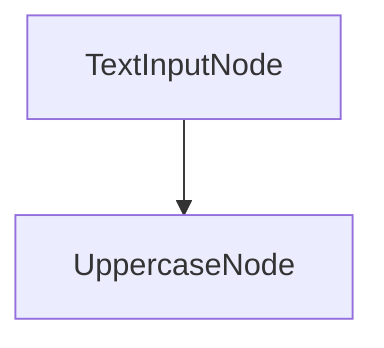
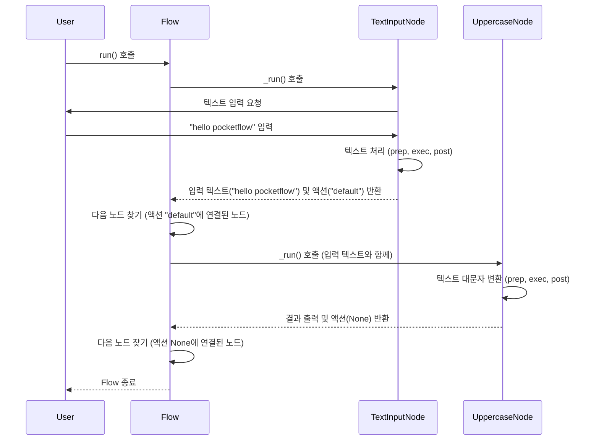

# Chapter 1: 그래프 (Graph)

PocketFlow에 오신 것을 환영합니다! 이 프레임워크는 복잡한 대규모 언어 모델(LLM) 애플리케이션을 쉽고 효율적으로 구축할 수 있도록 도와줍니다. 첫 번째 챕터에서는 PocketFlow의 가장 기본이 되는 생각 방식인 **그래프(Graph)** 에 대해 알아봅니다.

PocketFlow의 세계에서는 모든 작업이 마치 지도처럼 표현됩니다. 이 지도는 여러 장소들이 선으로 연결된 모습과 같습니다.

*   **장소:** 여기서 해야 할 작업이나 단계를 의미하며, 이를 **[노드 (Node)](02_노드__node__.md)** 라고 부릅니다.
*   **선:** 한 작업에서 다음 작업으로 넘어가는 길을 의미하며, 이를 **[액션 (Action)](03_액션__action__.md)** 이라고 부릅니다.

이렇게 [노드 (Node)](02_노드__node__.md)와 [액션 (Action)](03_액션__action__.md)으로 연결된 전체적인 작업의 흐름을 PocketFlow에서는 **[플로우 (Flow)](04_플로우__flow__.md)** 또는 **그래프(Graph)** 라고 합니다. 데이터는 이 지도(그래프)를 따라 흐르면서 각 장소([노드 (Node)](02_노드__node__.md))에서 정해진 작업을 수행하고, 선([액션 (Action)](03_액션__action__.md))을 통해 다음 장소로 이동합니다.

복잡한 LLM 애플리케이션을 만들 때, 이 그래프 방식은 마치 건축의 청사진과 같습니다. 전체 구조를 한눈에 파악하고, 각 부분이 어떤 역할을 하며 어떻게 연결되는지 명확하게 볼 수 있게 해줍니다.

## 그래프는 왜 필요할까요?

여러분이 사용자에게 텍스트를 입력받아 대문자로 변환하여 보여주는 간단한 애플리케이션을 만든다고 상상해 보세요. 이 작업은 다음과 같은 두 단계로 이루어집니다.

1.  사용자로부터 텍스트를 입력받습니다.
2.  입력받은 텍스트를 대문자로 변환합니다.
3.  변환된 텍스트를 사용자에게 보여줍니다.

이런 간단한 작업은 코드로 쉽게 작성할 수 있습니다. 하지만 만약 여기에 "특정 단어가 포함되면 다른 처리를 한다"거나, "여러 번 반복해서 작업을 수행한다"와 같은 조건이나 반복이 추가되면 코드는 점점 복잡해지고 이해하기 어려워집니다.

이럴 때 그래프를 사용하면 작업의 흐름을 시각적으로 명확하게 표현할 수 있습니다. 각 단계가 하나의 [노드 (Node)](02_노드__node__.md)가 되고, 각 단계를 이어주는 것이 [액션 (Action)](03_액션__action__.md)이 됩니다.

## 그래프의 핵심 요소: 노드와 액션

다시 한번 강조하지만, PocketFlow 그래프의 두 가지 핵심 요소는 [노드 (Node)](02_노드__node__.md)와 [액션 (Action)](03_액션__action__.md)입니다.

*   **[노드 (Node)](02_노드__node__.md)**: 작업을 수행하는 '주체' 또는 '단계'입니다. 예를 들어, '텍스트 입력받기', '텍스트 대문자로 변환하기', '결과 출력하기' 등이 각각 하나의 [노드 (Node)](02_노드__node__.md)가 될 수 있습니다.
*   **[액션 (Action)](03_액션__action__.md)**: 한 [노드 (Node)](02_노드__node__.md)의 작업이 끝난 후 다음에 어떤 [노드 (Node)](02_노드__node__.md)로 이동할지를 결정하는 '방향' 또는 '결과'입니다. 예를 들어, 텍스트 변환 [노드 (Node)](02_노드__node__.md)가 성공적으로 완료되면 '성공' [액션 (Action)](03_액션__action__.md)을 반환하고, 이 '성공' [액션 (Action)](03_액션__action__.md)은 '결과 출력' [노드 (Node)](02_노드__node__.md)로 연결될 수 있습니다. 특정 조건(예: 에러 발생)에서는 다른 [액션 (Action)](03_액션__action__.md)을 반환하여 다른 [노드 (Node)](02_노드__node__.md)(예: '에러 처리' [노드 (Node)](02_노드__node__.md))로 이동할 수도 있습니다.

## 간단한 텍스트 처리 그래프 만들기

앞서 설명한 '텍스트를 입력받아 대문자로 변환하여 보여주는' 작업을 PocketFlow 그래프로 만들어 봅시다. 이 그래프는 두 개의 [노드 (Node)](02_노드__node__.md)로 구성됩니다.

1.  사용자 입력 [노드 (Node)](02_노드__node__.md)
2.  대문자 변환 [노드 (Node)](02_노드__node__.md)

그리고 사용자 입력 [노드 (Node)](02_노드__node__.md)에서 대문자 변환 [노드 (Node)](02_노드__node__.md)로 이동하는 [액션 (Action)](03_액션__action__.md)이 필요합니다. 여기서는 기본 [액션 (Action)](03_액션__action__.md)인 `"default"`를 사용해 간단하게 연결해 보겠습니다.

다음은 이 작업을 수행하는 PocketFlow 코드의 아주 간단한 예시입니다.

먼저 필요한 [노드 (Node)](02_노드__node__.md)를 정의합니다.

```python
from pocketflow import Node, Flow

# 사용자 입력을 받는 노드
class TextInputNode(Node):
    def exec(self, _):
        # 사용자에게 텍스트를 입력받습니다.
        text = input("텍스트를 입력하세요: ")
        print(f"입력받은 텍스트: {text}")
        # 다음 노드로 입력받은 텍스트를 전달하기 위해 반환합니다.
        # 반환된 값은 다음 노드의 prep 메서드로 전달됩니다.
        return text

# 텍스트를 대문자로 변환하는 노드
class UppercaseNode(Node):
    def prep(self, shared):
        # 이전 노드(TextInputNode)에서 반환한 값을 받습니다.
        input_text = shared # 단순 예시에서는 shared에 직접 값이 들어있다고 가정
        print(f"대문자 변환 중: {input_text}")
        return input_text

    def exec(self, input_text):
        # 입력받은 텍스트를 대문자로 변환합니다.
        upper_text = input_text.upper()
        return upper_text # 변환된 텍스트 반환

    def post(self, shared, prep_res, exec_res):
        # 대문자로 변환된 결과(exec_res)를 출력합니다.
        print(f"변환 결과: {exec_res}")
        # 다음 액션을 반환할 수 있지만, 여기서는 마지막 노드이므로 None을 반환합니다.
        return None

```

위 코드는 두 개의 [노드 (Node)](02_노드__node__.md) 클래스를 정의합니다. `TextInputNode`는 사용자의 입력을 받고, `UppercaseNode`는 그 입력을 받아 대문자로 변환하고 출력합니다. 각 [노드 (Node)](02_노드__node__.md)에는 `prep`, `exec`, `post`와 같은 메서드가 있으며, 이 메서드들이 [노드 (Node)](02_노드__node__.md)의 실제 작업을 정의합니다. ([노드 (Node)](02_노드__node__.md)에 대한 자세한 내용은 다음 챕터에서 다룹니다!)

이제 이 [노드 (Node)](02_노드__node__.md)들을 연결하여 그래프([플로우 (Flow)](04_플로우__flow__.md))를 만듭니다.

```python
# 노드 인스턴스를 생성합니다.
text_input_node = TextInputNode()
uppercase_node = UppercaseNode()

# Flow 객체를 생성하고 시작 노드를 설정합니다.
text_process_flow = Flow(start=text_input_node)

# 두 노드를 연결합니다.
# '>>' 연산자는 기본 액션("default")으로 다음 노드를 연결합니다.
text_input_node >> uppercase_node

```

이 코드에서는 `Flow` 객체를 생성하고 `start` 매개변수로 시작 [노드 (Node)](02_노드__node__.md)를 지정합니다. 그리고 `>>` 연산자를 사용하여 `text_input_node`의 기본 [액션 (Action)](03_액션__action__.md)이 `uppercase_node`로 이어지도록 설정했습니다.

이렇게 구성된 그래프를 그림으로 표현하면 다음과 같습니다.



이제 이 그래프([플로우 (Flow)](04_플로우__flow__.md))를 실행해 봅시다.

```python
# Flow를 실행합니다.
print("=== Flow 시작 ===")
text_process_flow.run(shared={})
print("=== Flow 종료 ===")
```

`text_process_flow.run(shared={})` 메서드는 정의된 그래프를 따라 작업을 실행합니다. `shared={}`는 여러 [노드 (Node)](02_노드__node__.md) 간에 데이터를 공유할 수 있는 공간인데, 여기서는 간단한 예시이므로 비어있는 딕셔너리를 전달했습니다. ([공유 저장소 (Shared Store)](05_공유_저장소__shared_store__.md) 챕터에서 더 자세히 알아봅니다!)

이 코드를 실행하면 다음과 같이 동작합니다.

```bash
=== Flow 시작 ===
텍스트를 입력하세요: hello pocketflow
입력받은 텍스트: hello pocketflow
대문자 변환 중: hello pocketflow
변환 결과: HELLO POCKETFLOW
=== Flow 종료 ===
```

사용자가 입력한 텍스트가 `TextInputNode`를 거쳐 `UppercaseNode`로 전달되고, `UppercaseNode`에서 대문자로 변환된 후 최종 결과가 출력되는 것을 볼 수 있습니다. 이것이 바로 PocketFlow에서 그래프를 통해 작업을 정의하고 실행하는 기본적인 방식입니다.

## 그래프는 어떻게 실행될까요? (내부 동작)

PocketFlow의 핵심인 `Flow` 객체는 정의된 그래프를 따라가며 각 [노드 (Node)](02_노드__node__.md)를 순서대로 실행하는 역할을 합니다. 위 예시 코드를 실행했을 때 내부적으로 어떤 일이 일어나는지 간단하게 살펴봅시다.

1.  `text_process_flow.run(shared={})` 호출로 그래프 실행이 시작됩니다.
2.  `Flow`는 시작 [노드 (Node)](02_노드__node__.md)인 `text_input_node`를 찾아 실행합니다.
3.  `text_input_node`의 `_run` 메서드가 호출되고, 그 안에 정의된 `prep`, `_exec`(실제 `exec`), `post` 메서드가 순서대로 실행됩니다. 이 과정에서 사용자에게 입력을 받고, 입력받은 텍스트를 반환합니다.
4.  `text_input_node` 실행이 끝나면 `Flow`는 [노드 (Node)](02_노드__node__.md)가 반환한 값(여기서는 입력 텍스트)과 설정된 [액션 (Action)](03_액션__action__.md)(여기서는 `"default"`)에 따라 다음 [노드 (Node)](02_노드__node__.md)를 찾습니다. 우리는 `text_input_node >> uppercase_node`로 연결했으므로 다음 [노드 (Node)](02_노드__node__.md)는 `uppercase_node`가 됩니다.
5.  `Flow`는 이제 `uppercase_node`를 실행합니다.
6.  `uppercase_node`의 `_run` 메서드가 호출되고, `prep`, `_exec`, `post` 메서드가 순서대로 실행됩니다. `prep`에서는 이전 [노드 (Node)](02_노드__node__.md)에서 반환된 텍스트를 받고, `exec`에서 대문자로 변환하며, `post`에서 최종 결과를 출력합니다.
7.  `uppercase_node` 실행이 끝나면 `Flow`는 다음 [노드 (Node)](02_노드__node__.md)를 찾으려 하지만, `uppercase_node`는 연결된 다음 [노드 (Node)](02_노드__node__.md)가 없으므로 실행이 종료됩니다.

이 과정을 간단한 순서도로 표현하면 다음과 같습니다.



실제 PocketFlow 코드의 핵심 부분을 보면 이러한 오케스트레이션 로직을 엿볼 수 있습니다 (`pocketflow/__init__.py` 파일).

```python
class Flow(BaseNode):
    # ... (초기화 및 유틸리티 메서드 생략)

    def _orch(self, shared, params=None):
        # 시작 노드부터 시작
        curr = copy.copy(self.start_node) # 현재 노드
        last_action = None # 이전 노드가 반환한 액션

        # 현재 노드가 있는 동안 반복
        while curr:
            # 현재 노드의 매개변수 설정
            curr.set_params(params or {**self.params})
            
            # 현재 노드 실행 및 반환된 액션 저장
            # 실제 노드 실행은 _run() 메서드를 통해 이루어짐
            last_action = curr._run(shared) 
            
            # 현재 노드와 반환된 액션에 따라 다음 노드를 찾음
            next_node = self.get_next_node(curr, last_action)
            
            # 다음 노드로 이동 (다음 반복에서 실행될 노드)
            curr = copy.copy(next_node)
            
        # 마지막 노드가 반환한 액션 반환
        return last_action

    def _run(self, shared):
        # Flow의 prep 실행
        prep_res = self.prep(shared) or {}
        
        # 오케스트레이션(_orch) 실행
        orch_res = self._orch(shared, prep_res)
        
        # Flow의 post 실행 및 결과 반환
        return self.post(shared, prep_res, orch_res)

    # ... (post 메서드 생략)
```

위 `_orch` 메서드가 바로 PocketFlow 그래프의 핵심 실행 루프입니다. `start_node`부터 시작하여 현재 노드를 실행하고, 그 결과로 얻은 [액션 (Action)](03_액션__action__.md)에 따라 연결된 다음 [노드 (Node)](02_노드__node__.md)로 이동하는 과정을 반복합니다. 만약 현재 [노드 (Node)](02_노드__node__.md)가 반환한 [액션 (Action)](03_액션__action__.md)에 연결된 다음 [노드 (Node)](02_노드__node__.md)가 없으면 루프가 종료됩니다.

## 요약

이번 챕터에서는 PocketFlow의 가장 기본적인 개념인 **그래프(Graph)** 에 대해 알아보았습니다.

*   그래프는 복잡한 작업을 [노드 (Node)](02_노드__node__.md)와 [액션 (Action)](03_액션__action__.md)으로 연결하여 표현하는 방식입니다.
*   [노드 (Node)](02_노드__node__.md)는 수행할 작업 단계를, [액션 (Action)](03_액션__action__.md)은 단계 간의 연결 및 전환 방향을 나타냅니다.
*   이렇게 정의된 그래프는 [플로우 (Flow)](04_플로우__flow__.md) 객체를 통해 실행되며, PocketFlow 엔진은 그래프를 따라가며 순서대로 [노드 (Node)](02_노드__node__.md)를 실행합니다.

그래프는 PocketFlow에서 모든 것을 구축하는 기반이 됩니다. 다음 챕터에서는 그래프의 가장 기본적인 구성 요소인 [노드 (Node)](02_노드__node__.md)에 대해 더 자세히 살펴보겠습니다.

[Next Chapter: 노드 (Node)](02_노드__node__.md)

---

Generated by [AI Codebase Knowledge Builder](https://github.com/The-Pocket/Tutorial-Codebase-Knowledge)