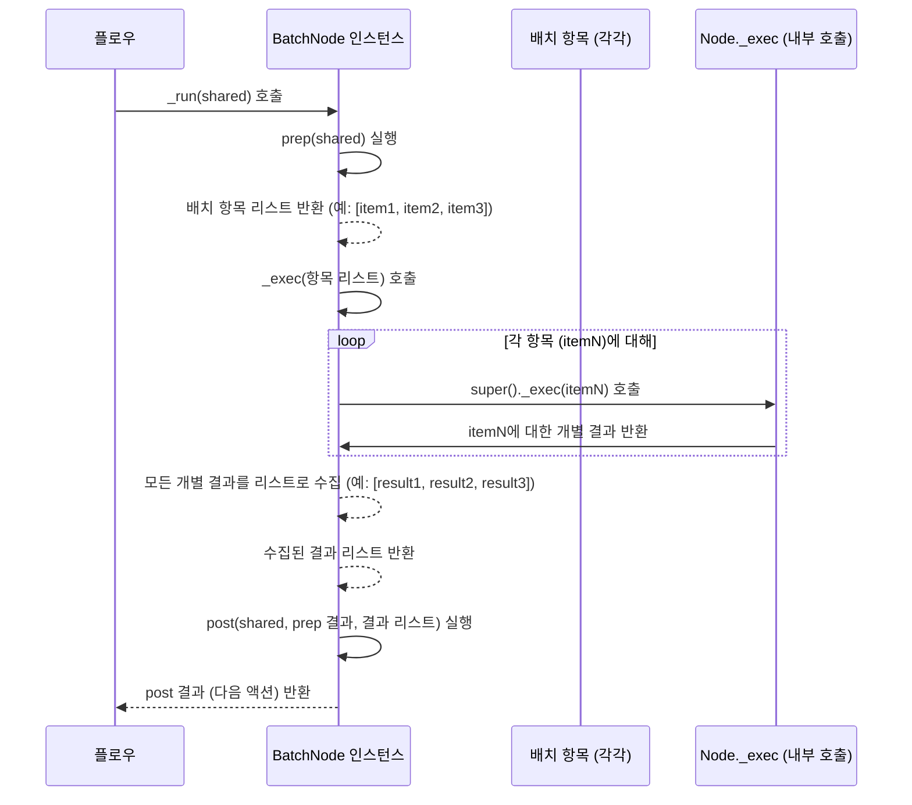
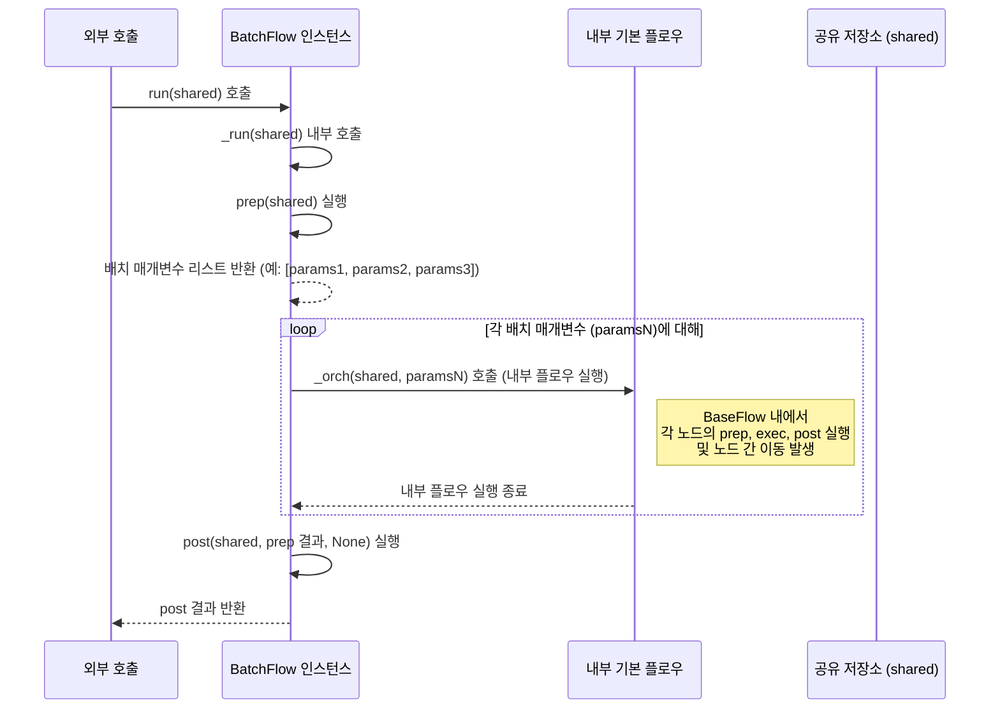

# Chapter 6: 배치 처리 (Batch Processing)

이전 챕터인 [공유 저장소 (Shared Store)](05_공유_저장소__shared_store__.md)에서는 PocketFlow [플로우 (Flow)](04_플로우__flow__.md) 내의 여러 [노드 (Node)](02_노드__node__.md)들이 데이터를 주고받고 상태를 공유하는 방법인 **공유 저장소**에 대해 배웠습니다.

이제 PocketFlow의 또 다른 강력한 기능인 **배치 처리(Batch Processing)** 에 대해 알아볼 차례입니다. 이것은 여러 개의 유사한 작업을 더 효율적으로 처리할 수 있게 해주는 기능입니다.

## 왜 배치 처리가 필요할까요?

여러분이 수백, 수천 장의 이미지를 똑같은 방식으로 처리해야 하거나 (예: 모든 이미지에 필터 적용), 수많은 문서 파일 각각에 대해 LLM(대규모 언어 모델)을 사용하여 요약을 생성해야 하는 상황을 상상해 보세요.

만약 이 작업을 이전 챕터들에서 배운 기본적인 [플로우 (Flow)](04_플로우__flow__.md) 방식으로 처리한다면, 각 이미지나 문서 파일마다 전체 [플로우 (Flow)](04_플로우__flow__.md)를 처음부터 끝까지 반복해서 실행해야 할 것입니다. 이는 비효율적일 수 있으며, 특히 네트워크 지연이 발생하는 LLM API 호출 같은 작업을 여러 번 반복할 때 성능 문제가 발생할 수 있습니다.

이럴 때 **배치 처리**가 유용합니다. 배치 처리는 **여러 개의 개별 작업을 하나로 묶어서 처리**하는 방식입니다. 마치 여러 개의 소포를 모아 한 번에 우체국으로 가져가서 배송하는 것과 같습니다. 이렇게 하면 각 소포마다 개별적으로 우체국에 가는 것보다 훨씬 효율적입니다.

PocketFlow에서는 이러한 배치 처리를 위해 **`BatchNode`** 와 **`BatchFlow`** 라는 특별한 클래스를 제공합니다. 이들을 사용하면 여러 데이터 항목에 대해 동일한 [노드 (Node)](02_노드__node__.md) 또는 [플로우 (Flow)](04_플로우__flow__.md)를 반복적으로 실행하여 전체 작업의 효율성을 크게 높일 수 있습니다. 특히 LLM API 호출처럼 여러 입력을 독립적으로 처리해야 할 때 매우 유용합니다.

## BatchNode: 노드 내부에서 여러 항목 처리하기

**`BatchNode`** 는 하나의 [노드 (Node)](02_노드__node__.md)가 여러 개의 데이터 항목을 **배치(batch)**로 받아서 처리하는 방식입니다. `BatchNode`는 일반 `Node`와 비슷하지만, `exec` 메서드가 한 번의 호출로 여러 항목을 처리하는 대신, `prep` 메서드에서 반환된 **항목 리스트(또는 반복자)**의 각 항목에 대해 `exec` 메서드가 **개별적으로 한 번씩 호출**된다는 점이 다릅니다. 그리고 `post` 메서드는 모든 `exec` 호출의 **결과 리스트**를 받습니다.

`BatchNode`의 세 가지 핵심 메서드는 다음과 같이 동작합니다:

*   `prep(self, shared)`:
    *   **역할:** 배치 처리에 사용할 개별 항목들의 **리스트 또는 반복자**를 준비하여 반환합니다. 예를 들어, 처리할 파일 이름 목록, 데이터베이스 레코드 목록, CSV 파일의 청크 반복자 등이 될 수 있습니다.
    *   **입력:** `shared` ([공유 저장소 (Shared Store)](05_공유_저장소__shared_store__.md)).
    *   **반환:** `exec` 메서드가 개별적으로 처리할 **항목들의 리스트 또는 반복자**입니다.

*   `exec(self, item)`:
    *   **역할:** `prep`에서 반환된 항목 리스트의 **각 항목 하나**를 받아서 실제 작업을 수행합니다. 이 메서드는 배치 내의 항목 수만큼 반복해서 호출됩니다.
    *   **입력:** 배치 내의 **개별 항목 (`item`)** 하나.
    *   **반환:** 해당 **개별 항목 처리 결과**입니다.

*   `post(self, shared, prep_res, exec_res_list)`:
    *   **역할:** 모든 개별 항목에 대한 `exec` 실행이 완료된 후 호출됩니다. `exec_res_list` 인자로 **모든 개별 `exec` 호출의 결과가 담긴 리스트**를 받습니다. 이 리스트를 종합하여 최종 결과를 만들거나 [공유 저장소 (Shared Store)](05_공유_저장소__shared_store__.md)에 저장하는 등의 후처리 작업을 수행합니다.
    *   **입력:** `shared` ([공유 저장소 (Shared Store)](05_공유_저장소__shared_store__.md)), `prep` 결과 (`prep_res`), **모든 `exec` 결과 리스트 (`exec_res_list`)**.
    *   **반환:** 다음 [노드 (Node)](02_노드__node__.md)로 이동할 [액션 (Action)](03_액션__action__.md) 이름(문자열)을 반환합니다.

### BatchNode 예시: CSV 파일 청크 처리

`cookbook/pocketflow-batch-node` 예시에서는 `BatchNode`를 사용하여 대용량 CSV 파일을 **청크(chunk)** 단위로 나누어 처리하는 방법을 보여줍니다. 전체 파일을 한 번에 메모리에 올리지 않고 나누어 처리하는 것은 배치 처리의 좋은 예입니다.

여기서 `CSVProcessor` 노드는 `BatchNode`를 상속받습니다.

```python
# cookbook/pocketflow-batch-node/nodes.py 일부 발췌 및 한국어 주석 추가

import pandas as pd
from pocketflow import BatchNode

class CSVProcessor(BatchNode):
    def __init__(self, chunk_size=1000):
        super().__init__()
        self.chunk_size = chunk_size
    
    def prep(self, shared):
        """CSV 파일을 청크 단위로 나누어 읽어옵니다.
        
        각 청크는 pandas DataFrame 형태로 반환됩니다.
        """
        # shared 저장소에서 입력 파일 경로를 가져옵니다.
        input_file = shared["input_file"]
        print(f"[CSVProcessor] prep: 파일 '{input_file}'을 청크 크기 {self.chunk_size}로 읽기 시작")
        
        # pandas의 read_csv 함수를 사용하여 청크 반복자를 생성합니다.
        chunks = pd.read_csv(
            input_file,
            chunksize=self.chunk_size
        )
        # prep은 exec가 처리할 항목들의 반복자를 반환합니다. 여기서는 DataFrame 청크 반복자입니다.
        return chunks 
    
    def exec(self, chunk):
        """CSV 청크 하나를 처리합니다.
        
        이 메서드는 prep이 반환한 각 청크(DataFrame)에 대해 한 번씩 호출됩니다.
        """
        # 받은 청크(DataFrame)에 대한 통계를 계산합니다.
        print(f"[CSVProcessor] exec: {len(chunk)}개의 행을 가진 청크 처리 중...")
        return {
            "total_sales": chunk["amount"].sum(), # 이 청크의 총 판매액
            "num_transactions": len(chunk),      # 이 청크의 거래 수
            "total_amount": chunk["amount"].sum() # (예시 목적, sales와 동일)
        }
    
    def post(self, shared, prep_res, exec_res_list):
        """모든 청크의 결과를 합산하여 최종 통계를 계산합니다.
        
        exec_res_list는 각 청크 exec의 결과 딕셔너리들의 리스트입니다.
        """
        print(f"[CSVProcessor] post: 모든 청크 ({len(exec_res_list)}개) 결과 합산 중...")
        
        # exec_res_list에 담긴 모든 개별 청크 결과를 합산합니다.
        total_sales = sum(res["total_sales"] for res in exec_res_list)
        total_transactions = sum(res["num_transactions"] for res in exec_res_list)
        total_amount = sum(res["total_amount"] for res in exec_res_list)
        
        # 최종 통계를 shared 저장소에 저장합니다.
        shared["statistics"] = {
            "total_sales": total_sales,
            "average_sale": total_amount / total_transactions if total_transactions > 0 else 0,
            "total_transactions": total_transactions
        }
        print(f"[CSVProcessor] post: 최종 통계 shared['statistics']에 저장 완료.")
        
        # 다음 노드로 이동할 액션을 반환합니다.
        return "show_stats"

```

이 예시에서 `CSVProcessor`는:
1.  `prep`에서 CSV 파일을 `chunksize`에 따라 읽는 **반복자**를 반환합니다. 이 반복자가 배치가 됩니다.
2.  `exec`는 이 반복자에서 **하나의 청크(`DataFrame`)**를 받아 그 청크에 대한 통계를 계산합니다. `exec`는 파일의 총 청크 수만큼 반복 실행됩니다.
3.  `post`는 모든 개별 `exec` 호출의 **결과 리스트**(`exec_res_list`)를 받아서, 이 리스트의 모든 통계 딕셔너리를 합산하여 최종 통계를 계산하고 [공유 저장소 (Shared Store)](05_공유_저장소__shared_store__.md)에 저장합니다.

이 `BatchNode`는 일반 [노드 (Node)](02_노드__node__.md)처럼 [플로우 (Flow)](04_플로우__flow__.md)의 일부로 사용될 수 있습니다.

```python
# CSVProcessor BatchNode를 사용하는 플로우 예시 (개념 설명용)
from pocketflow import Flow
# ... (CSVProcessor, ShowStats 노드 정의 생략)

csv_processor = CSVProcessor(chunk_size=500) # BatchNode 인스턴스 생성
show_stats = ShowStats() # 결과 보여주는 일반 노드

# 노드 연결
csv_processor - "show_stats" >> show_stats # CSVProcessor에서 "show_stats" 액션 시 ShowStats로 이동

# 플로우 생성 및 실행
# main.py 등에서 다음과 같이 실행
# from flow import my_csv_flow # my_csv_flow는 위에서 정의한 플로우 객체
# initial_shared = {"input_file": "large_sales_data.csv"}
# my_csv_flow.run(shared=initial_shared)
# print(f"처리 결과: {initial_shared.get('statistics')}")
```

## BatchFlow: 전체 플로우를 여러 입력으로 실행하기

**`BatchFlow`** 는 기존에 만들어둔 하나의 [플로우 (Flow)](04_플로우__flow__.md)를 **여러 개의 서로 다른 초기 입력 또는 매개변수 조합**으로 반복해서 실행할 때 사용합니다. 이것은 `BatchNode`가 노드 *내부*에서 배치를 처리하는 것과 달리, `BatchFlow`는 [플로우 (Flow)](04_플로우__flow__.md) *전체*를 배치 단위로 실행하는 방식입니다.

`BatchFlow`는 일반 `Flow` 클래스를 상속하며, `_run` 메서드를 오버라이드(재정의)하여 배치 처리 로직을 추가합니다. `BatchFlow`의 `prep` 메서드는 내부에서 반복 실행될 **기존 [플로우 (Flow)](04_플로우__flow__.md)에게 전달될 매개변수(params) 리스트**를 반환합니다. `BatchFlow`는 이 매개변수 리스트의 각 항목에 대해 기존 [플로우 (Flow)](04_플로우__flow__.md)를 한 번씩 실행합니다.

`BatchFlow`의 핵심 메서드는 다음과 같이 동작합니다:

*   `prep(self, shared)`:
    *   **역할:** 반복 실행할 기존 [플로우 (Flow)](04_플로우__flow__.md)에게 전달될 **개별 매개변수(params) 딕셔너리들의 리스트**를 준비하여 반환합니다. 각 딕셔너리는 기존 [플로우 (Flow)](04_플로우__flow__.md)의 시작 [노드 (Node)](02_노드__node__.md)나 다른 [노드 (Node)](02_노드__node__.md)에서 `set_params`를 통해 사용될 수 있습니다.
    *   **입력:** `shared` ([공유 저장소 (Shared Store)](05_공유_저장소__shared_store__.md)).
    *   **반환:** 기존 [플로우 (Flow)](04_플로우__flow__.md)가 반복 실행될 때 사용될 **매개변수 딕셔너리들의 리스트**입니다.

*   `post(self, shared, prep_res, exec_res)`:
    *   **역할:** `BatchFlow` 내의 모든 기존 [플로우 (Flow)](04_플로우__flow__.md) 실행이 완료된 후 호출됩니다. `exec_res`는 일반적으로 `None`입니다 (BatchFlow의 `_run`이 최종 결과를 반환하지 않음). 여기서는 배치 실행의 최종 마무리 작업을 수행합니다.
    *   **입력:** `shared` ([공유 저장소 (Shared Store)](05_공유_저장소__shared_store__.md)), `prep` 결과 (`prep_res`), `exec` 결과 (`exec_res` - 보통 `None`).
    *   **반환:** 이 `BatchFlow`가 상위 [플로우 (Flow)](04_플로우__flow__.md)의 일부인 경우 다음 노드로 이동할 [액션 (Action)](03_액션__action__.md) 이름(문자열)을 반환합니다.

**주의:** `BatchFlow`는 내부적으로 기존 [플로우 (Flow)](04_플로우__flow__.md)를 반복 실행할 때 **동일한 `shared` 저장소**를 전달합니다. 따라서 각 배치 실행에서 [공유 저장소 (Shared Store)](05_공유_저장소__shared_store__.md)에 저장된 데이터는 누적되거나 덮어쓰여질 수 있습니다. 독립적인 실행을 원한다면 각 배치 실행 전에 `shared`를 초기화하거나, 배치별 결과를 고유한 키로 저장하는 등의 추가 로직이 필요할 수 있습니다. (AsyncParallelBatchFlow 사용 시에는 각 실행이 완전히 분리되어 독립적인 shared 객체를 사용하므로 이 문제가 발생하지 않습니다. AsyncParallelBatchFlow는 다음 챕터에서 다룹니다.)

### BatchFlow 예시: 여러 이미지에 필터 적용하기

`cookbook/pocketflow-batch-flow` 예시는 `BatchFlow`를 사용하여 여러 이미지에 다른 필터를 적용하는 과정을 보여줍니다. 여기서 단일 이미지 처리를 위한 기본적인 [플로우 (Flow)](04_플로우__flow__.md)를 먼저 정의하고, 이 [플로우 (Flow)](04_플로우__flow__.md)를 `BatchFlow`로 감싸서 여러 입력에 대해 실행합니다.

먼저 단일 이미지 처리를 위한 기본 [플로우 (Flow)](04_플로우__flow__.md)입니다.

```python
# cookbook/pocketflow-batch-flow/flow.py 일부 발췌 및 한국어 주석 추가

from pocketflow import Flow, Node

# 이미지를 로드하는 노드 (단일 이미지 처리용)
class LoadImage(Node):
    def exec(self, _):
        # params에서 파일 경로를 가져옵니다. BatchFlow에서 전달받을 값입니다.
        img_path = self.params.get("input") 
        print(f"[LoadImage] '{img_path}' 로드 시도...")
        # 실제 이미지 로드 코드는 생략 (예: PIL 사용)
        loaded_image_data = f"이미지 데이터({img_path})" # 가짜 데이터
        return loaded_image_data # 다음 노드로 이미지 데이터 반환

# 필터를 적용하는 노드 (단일 이미지 처리용)
class ApplyFilter(Node):
    def exec(self, image_data):
        # params에서 적용할 필터 이름을 가져옵니다. BatchFlow에서 전달받을 값입니다.
        filter_name = self.params.get("filter")
        print(f"[ApplyFilter] 필터 '{filter_name}' 적용 중...")
        # 실제 필터 적용 코드는 생략
        filtered_image_data = f"{image_data} + 필터({filter_name})" # 가짜 데이터
        return filtered_image_data # 다음 노드로 필터링된 이미지 데이터 반환

# 이미지를 저장하는 노드 (단일 이미지 처리용)
class SaveImage(Node):
     def exec(self, image_data):
        # params에서 원래 파일 이름과 필터 이름을 가져와 출력 파일 이름을 만듭니다.
        original_name = self.params.get("input").split(".")[0]
        filter_name = self.params.get("filter")
        output_path = f"{original_name}_{filter_name}_processed.jpg"
        print(f"[SaveImage] '{output_path}'로 저장 중...")
        # 실제 이미지 저장 코드는 생략
        return output_path # 저장 경로 반환

# 단일 이미지 처리를 위한 기본 플로우를 생성하는 함수
def create_base_flow():
    # 위에서 정의한 노드 인스턴스 생성
    load = LoadImage()
    filter_node = ApplyFilter()
    save = SaveImage()
    
    # 노드 연결 (기본 액션 사용)
    load - "apply_filter" >> filter_node # LoadImage가 "apply_filter" 액션 반환 시 ApplyFilter로
    filter_node - "save" >> save         # ApplyFilter가 "save" 액션 반환 시 SaveImage로
    
    # LoadImage와 ApplyFilter는 기본적으로 default 액션을 반환한다고 가정하고 아래처럼 연결할 수도 있습니다.
    # load >> filter_node
    # filter_node >> save

    # 시작 노드를 LoadImage로 하는 Flow 객체 생성 및 반환
    return Flow(start=load) 
```

`create_base_flow` 함수는 이미지를 로드하고, 필터를 적용하고, 저장하는 세 개의 [노드 (Node)](02_노드__node__.md)로 구성된 일반 [플로우 (Flow)](04_플로우__flow__.md)를 생성합니다. 각 [노드 (Node)](02_노드__node__.md)는 `self.params`를 통해 이미지 파일 이름과 필터 이름을 받도록 설계되어 있습니다.

이제 이 기본 [플로우 (Flow)](04_플로우__flow__.md)를 `BatchFlow`로 감싸 여러 이미지에 여러 필터를 적용하는 배치 처리를 정의합니다.

```python
# cookbook/pocketflow-batch-flow/flow.py 일부 발췌 및 한국어 주석 추가

from pocketflow import BatchFlow
# ... (create_base_flow 함수 생략)

class ImageBatchFlow(BatchFlow):
    """여러 이미지에 여러 필터를 적용하는 BatchFlow"""
    
    def prep(self, shared):
        """배치 처리에 사용할 매개변수 리스트를 생성합니다."""
        print("[ImageBatchFlow] prep: 배치 매개변수 생성 시작")
        
        # 처리할 이미지 파일 목록
        images = ["cat.jpg", "dog.jpg", "bird.jpg"]
        
        # 적용할 필터 목록
        filters = ["grayscale", "blur", "sepia"]
        
        # 이미지와 필터의 모든 조합을 매개변수 딕셔너리 리스트로 생성합니다.
        params = []
        for img in images:
            for f in filters:
                params.append({
                    "input": img,    # 이 배치 실행에 사용할 이미지 파일 이름
                    "filter": f      # 이 배치 실행에 사용할 필터 이름
                })
        
        print(f"[ImageBatchFlow] prep: {len(params)}개의 배치 매개변수 생성 완료")
        # 이 리스트의 각 항목 ({'input': ..., 'filter': ...})이 
        # 내부 플로우(base_flow)가 한 번 실행될 때 전달될 params 딕셔너리가 됩니다.
        return params

    # post 메서드는 필요에 따라 구현할 수 있습니다. 여기서는 생략합니다.
    # def post(self, shared, prep_res, exec_res):
    #    print("[ImageBatchFlow] post: 배치 처리 완료 후 후처리")
    #    return None # 상위 플로우로 반환할 액션 (BatchFlow가 최상위면 None)

# 전체 배치 처리 플로우를 생성하는 함수
def create_flow():
    """BatchFlow를 포함하는 최종 플로우를 생성합니다."""
    # 단일 이미지 처리를 위한 기본 플로우를 먼저 생성합니다.
    base_flow = create_base_flow()
    
    # 생성된 기본 플로우를 시작 노드로 사용하여 ImageBatchFlow 객체를 생성합니다.
    # ImageBatchFlow가 이 base_flow를 여러 번 실행하게 됩니다.
    batch_flow = ImageBatchFlow(start=base_flow)
    
    # ImageBatchFlow 객체가 전체 BatchFlow가 됩니다.
    return batch_flow 

```

이 예시에서 `ImageBatchFlow`는:
1.  `BatchFlow`를 상속받습니다.
2.  `prep` 메서드에서 `("cat.jpg", "grayscale")`, `("cat.jpg", "blur")`, ... 와 같이 이미지와 필터의 모든 조합을 나타내는 **매개변수 딕셔너리들의 리스트**를 반환합니다.
3.  `BatchFlow`의 내부 로직은 `prep`이 반환한 이 리스트의 **각 딕셔너리에 대해 `create_base_flow`로 생성된 기본 플로우를 한 번씩 실행**합니다. 이때 각 딕셔너리가 기본 플로우 내 [노드 (Node)](02_노드__node__.md)들의 `self.params`로 전달됩니다.

이렇게 `BatchFlow`를 사용하면 기존 [플로우 (Flow)](04_플로우__flow__.md) 코드를 수정하지 않고도 여러 입력을 처리하는 배치 워크플로우를 쉽게 구성할 수 있습니다.

이 `BatchFlow`를 실행하려면 일반 [플로우 (Flow)](04_플로우__flow__.md)처럼 `.run()` 메서드를 호출합니다.

```python
# ImageBatchFlow를 실행하는 예시 (main.py 등에서 사용)
# from flow import create_flow # create_flow 함수 import

# BatchFlow 객체 생성
image_batch_flow = create_flow()

# Flow 실행
print("--- 이미지 배치 플로우 실행 시작 ---")
# BatchFlow는 run 메서드에 전달된 shared를 사용합니다.
# BatchFlow.prep에서 params 리스트를 생성하므로, run에 특별한 shared 초기값은 필요 없을 수 있습니다.
image_batch_flow.run(shared={}) 
print("--- 이미지 배치 플로우 실행 종료 ---")

```

이 코드를 실행하면, `ImageBatchFlow`의 `prep`이 호출되어 9개(`3 images * 3 filters`)의 매개변수 딕셔너리 리스트를 생성합니다. 그리고 `BatchFlow`는 이 9개의 매개변수 각각에 대해 내부의 기본 [플로우 (Flow)](04_플로우__flow__.md) (`load` -> `filter` -> `save`)를 한 번씩 총 9번 실행합니다. 각 실행에서 `LoadImage`, `ApplyFilter`, `SaveImage` 노드는 해당 실행의 매개변수(이미지 파일 이름, 필터 이름)를 사용하게 됩니다.

## BatchNode vs BatchFlow: 언제 무엇을 사용할까요?

`BatchNode`와 `BatchFlow`는 모두 배치 처리를 위한 것이지만, 사용하는 시나리오가 다릅니다.

*   **`BatchNode`**:
    *   **언제?** 하나의 특정 작업([노드 (Node)](02_노드__node__.md)) **내부**에서 대량의 데이터를 **청크 단위로 처리**하거나, 여러 개의 작은 작업 단위로 분할하여 처리할 때 적합합니다. (예: 대용량 파일 읽기, 여러 LLM 호출을 하나의 노드에서 일괄적으로 수행)
    *   **특징:** `prep`이 개별 항목 리스트를 반환하고, `exec`가 각 항목을 개별 처리하며, `post`가 모든 `exec` 결과를 리스트로 받습니다.
    *   **예시:** CSV 파일 청크 처리, 여러 문서를 하나의 노드에서 병렬 또는 순차적으로 LLM 호출하여 요약하기 (AsyncParallelBatchNode가 더 흔하게 사용됨)

*   **`BatchFlow`**:
    *   **언제?** **이미 만들어진 전체 [플로우 (Flow)](04_플로우__flow__.md)**를 **서로 다른 초기 입력(params)**으로 반복해서 실행해야 할 때 적합합니다. (예: 여러 이미지에 같은/다른 필터 조합을 적용하기, 여러 고객 데이터에 대해 동일한 분석 [플로우 (Flow)](04_플로우__flow__.md) 실행하기)
    *   **특징:** `BatchFlow` 자체가 하나의 [플로우 (Flow)](04_플로우__flow__.md)처럼 작동하며, `prep`이 내부 플로우 실행에 사용할 매개변수 리스트를 반환하고, 내부 [플로우 (Flow)](04_플로우__flow__.md)가 그 매개변수로 반복 실행됩니다. `post`는 배치 실행 완료 후 최종 처리를 합니다.
    *   **예시:** 이미지 처리 플로우를 여러 이미지/필터 조합으로 실행하기, 각 고객 정보에 대해 LLM 기반 추천 플로우 실행하기.

간단히 말해, 작업 자체를 쪼개서 노드 하나에서 처리할 때는 `BatchNode`, 여러 입력에 대해 전체 과정을 반복할 때는 `BatchFlow`를 고려할 수 있습니다.

## 배치 처리는 어떻게 실행될까요? (내부 동작)

`BatchNode`와 `BatchFlow`는 PocketFlow의 기본 [노드 (Node)](02_노드__node__.md) 및 [플로우 (Flow)](04_플로우__flow__.md) 클래스의 내부 실행 메서드를 **오버라이드(override, 재정의)** 하여 배치 처리 로직을 구현합니다.

### BatchNode 내부 동작

`BatchNode`는 [노드 (Node)](02_노드__node__.md)의 기본 실행 로직을 담고 있는 `_exec` 메서드를 재정의합니다. 일반 [노드 (Node)](02_노드__node__.md)의 `_exec`는 `prep` 결과를 그대로 받아 `exec` 메서드에 전달하고 그 결과를 반환하지만, `BatchNode`의 `_exec`는 다르게 동작합니다.

```python
# pocketflow/__init__.py 파일 일부 발췌 (BatchNode 클래스의 _exec 메서드)
class BatchNode(Node):
    # BatchNode는 Node를 상속하며 _exec 메서드를 재정의합니다.
    def _exec(self, items): 
        # prep 메서드에서 반환된 'items' 리스트/반복자를 받습니다.
        
        # 리스트 컴프리헨션(List Comprehension)을 사용하여 'items'의 각 'i'에 대해
        # 부모 클래스(Node)의 _exec 메서드를 호출합니다.
        # 여기서 super(BatchNode, self)._exec(i) 는 Node._exec(self, i)와 유사하게 동작하며,
        # Node의 재시도/fallback 로직을 포함하여 exec(i)를 실행하고 결과를 반환합니다.
        # 모든 개별 실행 결과가 리스트로 수집됩니다.
        results = [super(BatchNode,self)._exec(i) for i in (items or [])]
        
        # 수집된 결과 리스트를 반환합니다.
        # 이 리스트가 BatchNode의 post 메서드의 exec_res_list 인자로 전달됩니다.
        return results 

```

`BatchNode`의 `_exec` 메서드는 `prep`에서 반환된 항목 리스트(`items`)를 받아서, 이 리스트의 **각 항목(`i`)에 대해 부모 클래스(`Node`)의 `_exec` 메서드를 호출**합니다. `Node`의 `_exec` 메서드는 단일 항목에 대한 `exec` 실행 (재시도/fallback 포함)을 담당합니다. `BatchNode._exec`는 이렇게 각 항목에 대해 실행된 `Node._exec`의 결과들을 **하나의 리스트로 모아서** 반환합니다. 이 리스트가 최종적으로 `BatchNode`의 `post` 메서드로 전달되는 `exec_res_list`가 됩니다.

간단한 순서도로 표현하면 다음과 같습니다.



### BatchFlow 내부 동작

`BatchFlow`는 [플로우 (Flow)](04_플로우__flow__.md)의 기본 실행 로직을 담고 있는 `_run` 메서드를 재정의합니다. 일반 [플로우 (Flow)](04_플로우__flow__.md)의 `_run`은 `prep` -> `_orch` -> `post` 순으로 한 번만 실행되지만, `BatchFlow`의 `_run`은 다르게 동작합니다.

```python
# pocketflow/__init__.py 파일 일부 발췌 (BatchFlow 클래스의 _run 메서드)
class BatchFlow(Flow):
    # BatchFlow는 Flow를 상속하며 _run 메서드를 재정의합니다.
    def _run(self, shared):
        # 1. BatchFlow의 prep 메서드를 실행하여 배치 매개변수 리스트를 가져옵니다.
        # prep_res는 반복 실행할 매개변수 딕셔너리들의 리스트가 됩니다.
        prep_res = self.prep(shared) or [] 
        
        # 2. 가져온 배치 매개변수 리스트의 각 항목(bp)에 대해 반복합니다.
        # 이 반복문이 핵심적인 배치 처리 루프입니다.
        for bp in prep_res: 
            # 3. 각 배치 매개변수(bp)를 사용하여 내부 플로우의 _orch 메서드를 실행합니다.
            # _orch 메서드는 해당 bp를 params로 사용하여 내부 플로우를 끝까지 실행합니다.
            # 여기서 self.start_node는 BatchFlow 생성 시 start 인자로 넘겨준 그 Flow 객체입니다.
            self._orch(shared, {**self.params,**bp}) # shared는 동일하게 전달, params는 bp와 결합
        
        # 4. 모든 배치 실행이 완료된 후 BatchFlow의 post 메서드를 실행합니다.
        # 이 시점에서 shared에는 모든 배치 실행 중 누적된/갱신된 데이터가 들어있을 수 있습니다.
        # post 메서드의 세 번째 인자(exec_res)는 여기서는 보통 None입니다.
        return self.post(shared,prep_res,None)

```

`BatchFlow`의 `_run` 메서드는 먼저 자신의 `prep(shared)`를 호출하여 배치 매개변수 리스트를 가져옵니다. 그런 다음, 이 리스트의 **각 매개변수 딕셔너리(`bp`)에 대해 반복**하면서 내부적으로 **`_orch(shared, params)` 메서드를 호출**합니다. `_orch` 메서드는 기존 [플로우 (Flow)](04_플로우__flow__.md)의 핵심 실행 로직으로, `start_node`부터 시작하여 [액션 (Action)](03_액션__action__.md)을 따라 [노드 (Node)](02_노드__node__.md)를 순차적으로 실행하는 역할을 합니다. 이때 `_orch`에 전달되는 `params`는 `BatchFlow` 자신의 기본 매개변수와 현재 배치 항목의 매개변수(`bp`)를 결합한 것입니다. 모든 배치 항목에 대한 `_orch` 호출이 끝나면 `BatchFlow` 자신의 `post` 메서드가 호출되어 마무리 작업을 수행합니다.

간단한 순서도로 표현하면 다음과 같습니다.



보시다시피 `BatchNode`는 [노드 (Node)](02_노드__node__.md) 레벨에서, `BatchFlow`는 [플로우 (Flow)](04_플로우__flow__.md) 레벨에서 배치 처리를 구현하며, 각각 `_exec`와 `_run` 메서드를 재정의하여 반복 실행 로직을 추가합니다.

## 요약

이번 챕터에서는 PocketFlow에서 여러 개의 유사한 작업을 효율적으로 처리하는 **배치 처리 (Batch Processing)** 에 대해 알아보았습니다.

*   **배치 처리**는 여러 작업을 하나로 묶어 처리하여 효율성을 높이는 방법입니다.
*   **`BatchNode`** 는 [노드 (Node)](02_노드__node__.md) **내부**에서 `prep`이 반환한 항목 리스트의 각 항목에 대해 `exec`를 반복 실행하고, 모든 결과를 `post`에서 리스트로 받습니다. 하나의 작업 단위를 대량의 입력으로 처리할 때 유용합니다.
*   **`BatchFlow`** 는 기존 **[플로우 (Flow)](04_플로우__flow__.md) 전체**를 `BatchFlow`의 `prep`이 반환한 매개변수 리스트의 각 항목에 대해 반복 실행합니다. 전체 워크플로우를 여러 입력으로 실행할 때 유용합니다.
*   `BatchNode`는 `_exec` 메서드를, `BatchFlow`는 `_run` 메서드를 재정의하여 배치 반복 실행 로직을 구현합니다.

배치 처리는 PocketFlow를 사용하여 대규모 데이터를 처리하거나 반복적인 작업을 자동화할 때 필수적인 기능입니다. 다음 챕터에서는 여러 작업을 동시에 처리하여 성능을 더욱 향상시킬 수 있는 **[비동기 처리 (Async Processing)](07_비동기_처리__async_processing__.md)** 에 대해 알아보겠습니다.

[Next Chapter: 비동기 처리 (Async Processing)](07_비동기_처리__async_processing__.md)

---

Generated by [AI Codebase Knowledge Builder](https://github.com/The-Pocket/Tutorial-Codebase-Knowledge)