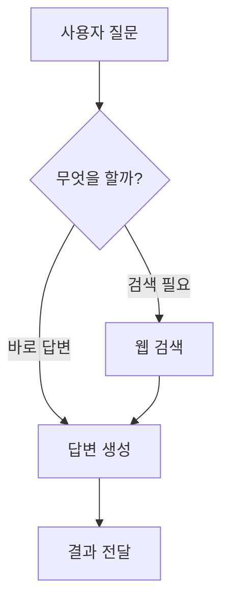

# Chapter 1: 그래프 (Graph)


안녕하세요! PocketFlow의 세계에 오신 것을 환영합니다! 🥳

우리가 함께 떠날 이 여정은 정말 재미있고 설렘 가득할 거예요! PocketFlow는 복잡해 보이는 인공지능 애플리케이션 만드는 걸 마법처럼 쉽게 만들어주는 친구랍니다. 그 마법의 시작, 바로 첫 번째 핵심 개념인 "**그래프 (Graph)**"에 대해 알아볼 거예요!

그래프... 이름만 들어도 뭔가 어렵고 복잡해 보인다고요? 걱정 마세요! 🙅‍♀️ 그래프는 PocketFlow의 가장 기본적인 생각 방식이자, 우리가 만들 프로그램의 설계도, 마치 보물지도와 같아요! 🗺️ 이 지도를 따라가기만 하면 복잡한 일도 척척 해낼 수 있답니다.

자, 그럼 PocketFlow의 심장인 그래프를 함께 알아볼까요? 가봅시다! 🔥

### 🤔 왜 그래프가 필요할까요? 문제 상황 파헤치기!

우리가 LLM(거대 언어 모델)을 사용해서 뭔가 멋진 걸 만든다고 상상해봐요! 예를 들어, 사용자가 질문하면 웹 검색해서 정보를 찾고, 찾은 정보를 바탕으로 답변을 만들어서 보여주는 똑똑한 에이전트 같은 거요!

이런 작업을 하려면 여러 단계가 필요하겠죠?
1.  **사용자 질문 받기:** "오늘 날씨 어때?" ☀️
2.  **질문 이해하고 판단하기:** "이 질문에 답하려면 웹 검색이 필요하겠네?" 아니면 "이건 바로 답할 수 있어!"
3.  **웹 검색하기 (필요하다면):** 날씨 정보를 검색!
4.  **검색 결과를 바탕으로 답변 만들기:** "오늘 서울 날씨는 맑고 25도래요!"
5.  **답변 보여주기:** 사용자에게 뿅! ✨

만약 이런 단계들을 그냥 코드 위에서 순서대로만 짜거나, 조건을 덕지덕지 붙여서 만든다면 어떻게 될까요? 코드가 길어지고, 어디서 뭐가 잘못됐는지 찾기도 어렵고, 나중에 기능을 추가하거나 바꾸기도 힘들어져요! 마치 복잡하게 얽힌 실타래처럼요! 🧶

이럴 때 필요한 게 바로 깔끔한 정리! 누가 어떤 일을 하고, 다음에 뭘 해야 하는지 한눈에 보여주는 설계도 같은 게 필요해요! 바로 그게 PocketFlow의 그래프랍니다! 🌟

### ✨ 그래프, 너는 대체 뭐니? (개념 소개!)

PocketFlow에서 **그래프**는 우리가 해야 할 작업의 흐름을 그림처럼 보여주는 방식이에요. 복잡한 과정도 그래프로 표현하면 훨씬 명확하고 이해하기 쉬워진답니다!

그래프는 두 가지 중요한 친구들로 이루어져 있어요. 바로 **점**과 **선**이랍니다!

*   **점 (Node):** 요 친구들은 우리 프로그램이 해야 할 **작업 단위**를 나타내요! 아까 날씨 에이전트 예시로 치면 '질문 이해하고 판단하기', '웹 검색하기', '답변 만들기' 같은 각각의 단계들이 '점'이 되는 거예요. 나중에 [노드 (Node)](02_노드__node__.md) 챕터에서 더 자세히 알아볼 거예요! 😉

*   **선 (Action):** 이 친구들은 점과 점 사이를 **연결**해주면서 **작업의 흐름**이나 **결과에 따른 다음 단계**를 나타내요! '질문 판단'이라는 점에서 '웹 검색'이라는 점으로 연결되는 선은 '웹 검색이 필요하다는 판단이 내려지면 다음은 웹 검색을 해!'라는 흐름을 보여주는 거죠. 선 위에 'search'처럼 이름을 붙여서 어떤 이유로 연결되는지도 표현할 수 있어요. 이건 [액션 (Action)](03_액션__action__.md) 챕터에서 만나요! 👋

**결론적으로, 그래프는 '어떤 작업을 하고(점), 그 결과에 따라 다음엔 어떤 작업을 할지(선)를 연결해 놓은 지도'예요!** 🗺️

### analogy: 요리 레시피 따라 하기 🍳

그래프 개념을 이해하기 가장 쉬운 비유는 바로 '요리 레시피'를 따라 하는 거예요!

1.  **재료 손질하기** (점 1)
2.  **양념 만들기** (점 2)
3.  **재료와 양념 섞기** (점 3)
4.  **불에 익히기** (점 4)
5.  **맛있게 플레이팅!** (점 5)

각 단계(재료 손질, 양념 만들기 등)가 바로 **노드 (Node)** 들이에요!
그리고 '재료 손질 끝나면 양념 만들러 가기', '양념 다 만들면 재료랑 섞기' 같이 단계와 단계를 잇는 과정이 **액션 (Action)** 선이 되는 거죠!

만약 레시피 중간에 '매운맛 좋아하는 사람은 고추 추가!' 같은 선택지가 있다면, '양념 만들기' 노드에서 '고추 추가'라는 **조건을 가진 액션 선**이 '재료와 양념 섞기' 노드로 연결될 수도 있겠죠?

PocketFlow의 그래프도 이처럼 우리가 하려는 '요리' (LLM 애플리케이션)의 '레시피' (작업 흐름)를 점과 선으로 보기 좋게 표현한 것이랍니다! 😊

### 🎨 그래프, 눈으로 보기! (Mermaid 다이어그램)

자, 이제 PocketFlow에서 이 그래프가 어떤 느낌으로 그려지는지 살짝 맛볼까요? `mermaid`라는 멋진 도구를 사용하면 코드로 그린 그래프를 그림으로 볼 수 있답니다!

아까 날씨 에이전트의 간단한 흐름을 그래프로 표현하면 이렇게 될 거예요! 👇



어떤가요? 🤩 점들이 화살표(선)로 연결되면서 작업 흐름이 한눈에 보이죠?
*   `사용자 질문` 노드에서 시작해서
*   `무엇을 할까?` 노드로 이동해요. 여기서 판단 결과에 따라
*   '검색 필요' 면 `웹 검색` 노드로, '바로 답변' 면 바로 `답변 생성` 노드로 갈 수 있어요!
*   `웹 검색`이 끝나면 `답변 생성` 노드로 가서 최종 답변을 만들고
*   마지막으로 `결과 전달` 노드에서 사용자에게 결과를 보여줘요.

이렇게 그래프는 우리의 복잡한 아이디어를 명확하게 구조화하고 시각화하는 데 큰 도움을 준답니다! 👍

### 🧠 PocketFlow 속 그래프는 어떻게 움직일까?

PocketFlow에서는 우리가 이렇게 점(노드)과 선(액션)으로 그린 지도를 **플로우 (Flow)** 라는 특별한 친구가 따라가면서 실제로 작업을 실행해 줘요! [플로우 (Flow)](04_플로우__flow__.md)는 이 그래프의 시작 지점부터 끝까지, 정해진 길을 따라 데이터와 함께 움직인답니다.

마치 여행자가 지도를 들고 경로를 따라 움직이듯, PocketFlow의 `Flow`는 우리가 정의한 그래프를 따라 노드들을 차례대로 또는 조건에 맞춰 실행시키는 역할을 하죠.

우리가 직접 복잡한 실행 로직을 짤 필요 없이, 그래프라는 '설계도'만 잘 그려주면 `Flow`가 알아서 멋지게 실행해 준다는 사실! 정말 편리하죠? 😊

### 👩‍💻 그래프 그리기 맛보기 코드!

실제로 PocketFlow에서 그래프를 어떻게 코드로 표현하는지 아주 간단하게 살펴볼까요? `pocketflow/__init__.py` 파일에 있는 `Node`와 `Flow` 클래스를 사용한답니다!

```python
# pocketflow/__init__.py 파일에 있는 Node와 Flow를 사용한다고 상상해봐요! ✨
from pocketflow import Node, Flow # 실제 코드는 이렇게 import 하겠죠? 😉

# 우리의 첫 번째 노드 친구를 만들어요! (아직은 어떤 작업인지 중요하지 않아요 😉)
class StartNode(Node):
    # 이 노드가 실행되면 어떤 일이 일어날지 정하는 함수예요.
    def exec(self, prep_res):
        print("👉 시작 노드 도착! 다음은 '다음 단계'로 갈게요.")
        # 이 노드가 끝난 후 어떤 '액션'으로 다음 노드와 연결될지 이름을 반환해요.
        # 여기서는 "next_step"이라는 이름을 반환해서 연결해볼 거예요.
        return "next_step"

# 두 번째 노드 친구!
class MiddleNode(Node):
    def exec(self, prep_res):
        print("🚀 중간 노드에서 신나는 작업 중! 작업 끝나면 자동으로 다음 노드로!")
        # 아무것도 반환하지 않으면 PocketFlow는 이걸 'default' 액션으로 인식해서
        # 'default'로 연결된 다음 노드로 이동해요.
        pass # pass는 아무것도 안 한다는 뜻이에요!

# 세 번째 노드 친구!
class EndNode(Node):
    def exec(self, prep_res):
        print("🎉 끝 노드 도착! 모든 작업 완료!")
        # 마지막 노드에서는 보통 아무것도 반환하지 않아요.
        pass

# 자, 이제 이 노드들을 그래프(지도)로 연결해볼까요?
# Flow 객체를 만들고 이 그래프의 '시작' 노드를 정해줘요.
my_flow = Flow().start(StartNode())

# ✨ 그래프 연결하는 마법! ✨
# 시작 노드에서 "next_step" 액션으로 중간 노드를 연결해요!
# - 액션 이름 >> 다음 노드 형태로 써줘요.
my_flow.start_node - "next_step" >> MiddleNode()

# 중간 노드에서 끝 노드를 연결해요!
# 중간 노드는 exec에서 아무것도 반환 안 하니까 'default' 액션으로 연결해야 해요.
# >> 기호는 'default' 액션으로 연결하겠다는 뜻이랍니다! 아주 편하죠?
MiddleNode() >> EndNode()


# 이 코드가 실행되면 어떤 일이 일어날까요?
# (실제로 이 그래프를 따라 노드들을 실행하는 코드는 Flow 챕터에서 만나요! 😉)
# print("\n--- 플로우 실행 (상상)! ---")
# # my_flow.run({}) # Flow를 실행시키는 마법 함수는 다음 챕터에서 자세히!
# print("--- 플로우 실행 완료 (상상)! ---")

# 🚀 예상되는 출력 결과 (my_flow.run({}) 함수를 실행했을 때):
# 👉 시작 노드 도착! 다음은 '다음 단계'로 갈게요.
# 🚀 중간 노드에서 신나는 작업 중! 작업 끝나면 자동으로 다음 노드로!
# 🎉 끝 노드 도착! 모든 작업 완료!
```
(Showcased the core syntax `Flow().start()`, `- action >>`, and `>>` for connections. Kept node logic simple placeholder print statements. Added comments explaining the syntax and linking to the Flow chapter for actual execution).

이처럼 코드로 각 노드를 정의하고 `>>`나 `- 액션이름 >>` 기호를 사용해서 노드들을 연결해주면, PocketFlow가 이 구조를 이해하고 그래프를 만들어 준답니다! 정말 직관적이고 예쁘죠? 💕

### 🗺️ PocketFlow 예제에서 그래프 찾아보기!

PocketFlow GitHub 저장소에 있는 다양한 예제 코드들을 보면, 우리가 방금 배운 이 '그래프' 개념이 어떻게 활용되는지 직접 확인할 수 있어요!

예를 들어, [Research Agent 예제](cookbook/pocketflow-agent/README.md)를 보면 LLM 에이전트가 질문을 받고, 웹 검색을 할지 바로 답변을 할지 결정하고, 검색 결과로 답변을 만드는 과정이 모두 그래프로 표현되어 있답니다! README 파일에 멋진 `mermaid` 다이어그램으로 그려져 있으니 꼭 구경해보세요! 👀

[Text-to-SQL 예제](cookbook/pocketflow-text2sql/README.md)에서는 자연어 질문을 SQL 쿼리로 바꾸고, 만약 쿼리 실행에 실패하면 다시 LLM에게 물어봐서 쿼리를 고치는 '디버깅 루프' 과정이 그래프의 '순환 구조'로 표현되어 있어요! 정말 신기하죠? 🔄

이 외에도 [RAG 예제](cookbook/pocketflow-rag/README.md), [Web Human-in-the-Loop 예제](cookbook/pocketflow-web-hitl/README.md) 등 다양한 예제들이 모두 이 '그래프'라는 강력한 아이디어 위에 세워져 있답니다! ✨

### 📝 오늘 배운 내용 요약!

짜잔! 🎉 오늘 우리는 PocketFlow의 첫 번째 핵심 개념인 **그래프 (Graph)** 에 대해 신나게 알아보았어요!

*   **그래프**는 복잡한 작업 흐름을 **점 (노드)** 과 **선 (액션)** 으로 표현한 **지도**와 같아요.
*   이 지도를 그리면 프로그램의 **설계도**가 되어 복잡한 LLM 앱도 깔끔하게 만들 수 있죠.
*   **노드**는 해야 할 **작업 단위**, **액션**은 작업과 작업 사이의 **흐름**이나 **결과에 따른 연결**을 나타내요.
*   PocketFlow의 **플로우 (Flow)** 친구가 이 그래프를 따라가며 실제 작업을 실행해 준답니다!

이제 PocketFlow의 세계로 들어가는 첫걸음을 멋지게 떼셨어요! 정말 잘하셨어요! 👍

### 💖 다음 이야기: 작업의 주인공, 노드!

그래프라는 멋진 지도를 그리는 방법을 알았으니, 이제 그 지도를 채울 '점'들, 즉 실제 **작업 단위**인 **노드 (Node)** 에 대해 자세히 알아볼 차례예요!

다음 챕터에서는 노드가 무엇이고, 어떻게 만드는지, 그리고 노드 안에서 어떤 일들이 일어나는지에 대해 깊이 파헤쳐 볼 거예요! 기대되죠? 😉

그럼 다음 챕터에서 만나요! 안녕! 👋

[노드 (Node) 알아보기!](02_노드__node__.md)

---

Generated by [AI Codebase Knowledge Builder](https://github.com/The-Pocket/Tutorial-Codebase-Knowledge)