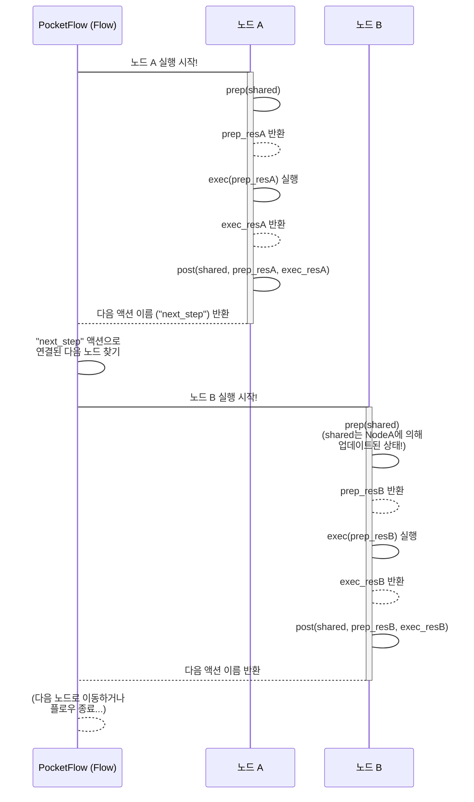

# Chapter 2: 노드 (Node)


안녕하세요! PocketFlow 친구들! 😊

지난 챕터에서는 우리 프로그램의 큰 그림이자 설계도인 [그래프 (Graph)](01_그래프__graph__.md)에 대해 신나게 알아봤죠! 그래프는 점과 선으로 이루어진 지도 같다고 했어요. 오늘은 그 지도를 구성하는 가장 중요한 '점'! 바로 "**노드 (Node)**"에 대해 파헤쳐 볼 시간이에요! 🚀

그래프가 우리의 목표 지점까지 가는 길을 보여주는 지도라면, 노드는 그 길 위에서 우리가 **실제로 해야 할 하나하나의 작업 단위**랍니다. 마치 지도 위에 표시된 '여기서는 재료를 손질하세요!', '여기서는 양념을 섞으세요!' 같은 특정 지점의 임무 같은 거죠! 😉

자, 그럼 PocketFlow의 작업 심장, 노드를 함께 자세히 알아볼까요? 출발! 🔥

### 🤔 왜 '노드'라는 작업 단위가 필요할까요?

음... 여러분, 우리가 전에 예로 들었던 복잡한 LLM 작업들 기억하나요? 사용자의 질문을 받고, 검색해서 정보를 찾고, 답변을 만들고... 이런 여러 단계를 그냥 하나의 긴 코드로 쭉 짜버리면 어떤 문제가 생길까요?

1.  **복잡해져요:** 여러 단계의 로직이 뒤죽박죽 섞여서 코드를 이해하기 어려워져요.
2.  **재사용이 힘들어요:** 어떤 특정 단계(예: 웹 검색)만 다른 곳에서 쓰고 싶은데, 다른 로직과 섞여 있어서 따로 떼어내기가 힘들어요.
3.  **문제가 생기면 찾기 어려워요:** 만약 답변을 만드는 부분에서 오류가 났다면, 긴 코드 덩어리 속에서 어디가 문제인지 찾아 헤매야 하죠. 🕵️‍♀️
4.  **수정이나 추가가 어려워요:** 중간에 새로운 단계를 넣거나, 기존 단계를 바꾸려면 전체 코드를 많이 수정해야 할 수 있어요.

마치 모든 요리 과정을 하나의 커다란 냄비에서 한 번에 하려고 하는 것처럼요! 🍲... 결과는 상상에 맡기겠습니다! 😅

이럴 때 필요한 게 바로 작업을 **작게 쪼개는 것**이에요! 각 단계를 독립적인 '작업 단위'로 만들어서, 각 단위는 자기 맡은 일만 딱! 깔끔하게 처리하게 하는 거죠. PocketFlow에서는 이 '작업 단위'를 바로 **노드**라고 부른답니다!

### ✨ 노드, 너는 어떤 일을 하니? (개념 소개!)

PocketFlow에서 **노드 (Node)**는 그래프의 가장 작은 작업 단위예요. 마치 공장에서 특정한 하나의 일만 딱! 집중해서 처리하는 똑똑한 기계와 같아요. ⚙️

노드는 보통 다음과 같은 세 가지 단계를 거치며 일을 처리해요. 이 세 단계는 노드의 핵심 메서드(`prep`, `exec`, `post`)에 해당된답니다!

1.  **준비 (prep):** 작업을 시작하기 전에 필요한 데이터를 가져오거나 준비하는 단계예요. 마치 요리하기 전에 필요한 재료를 모으고 씻고 다듬는 것처럼요! 🥦🥕
2.  **실행 (exec):** 노드의 핵심 기능이 실제로 실행되는 단계예요. LLM에게 질문을 하거나, 데이터를 변환하거나, 복잡한 계산을 하는 등 노드가 맡은 진짜 '일'을 하는 곳이죠! 🤖
3.  **마무리 및 전달 (post):** 작업이 끝난 후 결과를 정리하고 저장하거나, 다음 노드로 전달할 정보를 준비하는 단계예요. 요리로 치면 완성된 요리를 접시에 담고, 다음 사람이 먹을 준비를 하거나, 다음 요리에 필요한 재료를 다음 요리사에게 넘겨주는 과정 같아요! 🍽️

각각의 노드는 이렇게 자기만의 `prep`, `exec`, `post` 단계를 가지고 독립적으로 기능을 수행해요. 이 덕분에 노드는 **LLM 호출, 데이터 처리, 조건 판단, 결과 저장** 등 어떤 작업이든 될 수 있답니다! 👍

### 🍳 요리 비유로 보는 노드의 세 단계 (prep, exec, post)!

우리가 맛있는 샌드위치를 만드는 과정을 생각해봐요! 🥪

만약 '야채 준비' 노드가 있다면:

*   **`prep`:** 샌드위치를 만들 때 필요한 양상추, 토마토, 오이 등 야채를 **냉장고(Shared Store)** 에서 가져와요. 깨끗하게 **씻을 준비**를 하죠.
    *   (`shared`에서 필요한 데이터 가져오기)
*   **`exec`:** 준비된 야채를 **깨끗하게 씻고 다듬어요**. 양상추는 떼어내고, 토마토와 오이는 얇게 썰죠.
    *   (`prep`에서 받은 데이터로 핵심 작업 수행)
*   **`post`:** 씻고 다듬은 야채들을 **예쁜 그릇에 담아(결과 정리)**, **다음 단계(예: 샌드위치 조립 노드)에게 전달할 준비**를 해요. 그리고 다음 단계로 이동하라는 신호(예: `action="vegetables_ready"`)를 보냅니다!
    *   (`shared`에 결과 저장, 다음 노드로 갈 액션 반환)

이렇게 `prep`, `exec`, `post` 단계를 거치면서 하나의 노드는 독립적인 임무를 완수하고, 다음 노드에게 바통을 넘겨주는 거예요! 🏃‍♀️🏃‍♂️

### 🧠 PocketFlow 안에서 노드는 어떻게 움직일까?

PocketFlow의 [플로우 (Flow)](04_플로우__flow__.md)가 [그래프 (Graph)](01_그래프__graph__.md)를 따라 이동하면서 노드를 만나면, 해당 노드의 `prep`, `exec`, `post` 메서드를 순서대로 실행시켜요. 이 과정에서 데이터는 `shared` 저장소를 통해 노드들 사이에서 공유되거나, `prep_res`, `exec_res` 같은 중간 결과로 전달된답니다.

아주 간단한 데이터 흐름을 그림으로 볼까요?



보세요! 플로우(PF)가 노드 A를 실행하면, 노드 A 안에서 `prep`, `exec`, `post`가 순서대로 실행되고, `post`가 반환한 액션 이름("next_step")을 따라 플로우는 노드 B로 이동하는 거예요. 노드 B 역시 같은 과정을 거치죠! 이때 `shared` 저장소는 노드들 사이에서 데이터를 주고받는 중요한 역할을 한답니다. (자세한 이야기는 [공유 저장소 (Shared Store)](05_공유_저장소__shared_store__.md) 챕터에서 만나요! 😉)

### 👩‍💻 노드 만들기 맛보기 코드!

실제로 PocketFlow에서 노드를 어떻게 코드로 만드는지 아주 간단하게 살펴볼까요? `pocketflow` 라이브러리의 `Node` 클래스를 상속받아서 나만의 노드를 만들 수 있답니다!

```python
from pocketflow import Node

# 숫자에 10을 더하는 귀여운 노드를 만들어봐요!
class AddTenNode(Node):
    # 1. prep 단계: shared 저장소에서 필요한 데이터를 가져와 준비해요.
    def prep(self, shared):
        # shared['input_number'] 값을 가져오고, 없으면 0을 기본값으로 사용해요.
        number_to_process = shared.get("input_number", 0)
        print(f"➡️ [AddTenNode] 준비: 입력 값 {number_to_process} 준비 완료!")
        # exec 메서드로 이 값을 전달할 거예요.
        return number_to_process

    # 2. exec 단계: 실제 작업을 실행해요.
    def exec(self, prep_res):
        # prep에서 받은 값을 사용해서 10을 더하는 계산을 해요.
        calculated_result = prep_res + 10
        print(f"⚙️ [AddTenNode] 실행: {prep_res} + 10 = {calculated_result} 계산!")
        # post 메서드로 이 결과를 전달할 거예요.
        return calculated_result

    # 3. post 단계: 작업 후 처리를 하고 다음 노드에게 정보를 전달해요.
    def post(self, shared, prep_res, exec_res):
        # 계산된 최종 결과(exec_res)를 shared 저장소에 "output_number" 키로 저장해요.
        shared["output_number"] = exec_res
        print(f"✅ [AddTenNode] 완료: 결과 {shared['output_number']} shared 저장소에 저장!")
        # 이 노드가 끝난 후 어떤 액션으로 다음 노드와 연결될지 이름을 반환해요.
        # 아무것도 반환하지 않으면 'default' 액션으로 간주되어 'default'로 연결된 노드로 이동해요.
        pass # 다음 노드로 'default' 액션으로 이동!
```

**코드 설명:**

*   `class AddTenNode(Node):` PocketFlow의 `Node` 클래스를 상속받아 `AddTenNode`라는 나만의 노드를 정의해요.
*   `def prep(self, shared):` `prep` 메서드를 정의해요. 이 메서드는 항상 `shared`라는 특별한 저장소를 인자로 받아요. 여기서 `shared`에서 `input_number` 값을 가져와 `exec`로 전달할 준비를 하죠.
*   `def exec(self, prep_res):` `exec` 메서드를 정의해요. 이 메서드는 `prep` 메서드가 반환한 값(`prep_res`)을 인자로 받아요. 여기서 실제 계산(`prep_res + 10`)을 수행하고 그 결과를 반환해요.
*   `def post(self, shared, prep_res, exec_res):` `post` 메서드를 정의해요. 이 메서드는 `shared`, `prep`의 결과(`prep_res`), `exec`의 결과(`exec_res`)를 인자로 받아요. 여기서 `exec` 결과를 `shared`에 저장하고, **다음 노드로 이동할 액션 이름을 반환**해요. 아무것도 반환하지 않으면 `default` 액션으로 처리된답니다!

이렇게 Node 클래스를 정의하고 나면, [그래프 (Graph)](01_그래프__graph__.md) 챕터에서 본 것처럼 `Flow`에 연결해서 사용할 수 있어요!

```python
from pocketflow import Flow # Flow를 import 한다고 상상해봐요!
# 위에 정의한 AddTenNode 클래스가 있다고 가정해요!

# AddTenNode의 인스턴스를 만들고 Flow의 시작 노드로 설정해요.
add_ten_node_instance = AddTenNode()
my_flow = Flow().start(add_ten_node_instance)

# 만약 이 플로우를 실행한다면 (Shared 저장소에 초기값 5를 넣어준다고 상상해봐요!)
shared_data = {"input_number": 5}

# flow.run(shared_data) # 실제 실행은 Flow 챕터에서! 😉

# ✨ 예상되는 출력 결과:
# ➡️ [AddTenNode] 준비: 입력 값 5 준비 완료!
# ⚙️ [AddTenNode] 실행: 5 + 10 = 15 계산!
# ✅ [AddTenNode] 완료: 결과 15 shared 저장소에 저장!

# ✨ 실행 후 shared_data의 내용:
# print(shared_data)
# -> {'input_number': 5, 'output_number': 15}
```
(실행 코드는 Flow 챕터로 미루고, 예상 결과만 보여주며 코드 설명을 보강했습니다.)

어떤가요? 각 단계가 명확하게 나뉘어 있고, 데이터가 어떻게 흘러가는지 코드만 봐도 이해하기 쉽죠? 👍

### 🚨 문제 발생 시 노드는 어떻게 대처할까요? (에러 처리와 재시도)

똑똑한 노드도 가끔 예상치 못한 문제에 부딪힐 수 있어요. 예를 들어 LLM API를 호출했는데 네트워크 에러가 난다거나, 처리하려던 데이터 형식이 잘못됐다거나 할 수 있죠. 🥺

이럴 때 PocketFlow의 `Node`는 아주 유용하고 친절한 기능을 제공해요!

*   **재시도 (max_retries):** 작업을 실행하는 `exec` 단계에서 에러가 발생하면, 설정된 횟수만큼 자동으로 작업을 **다시 시도**해봐요. 잠시 네트워크 문제 같은 일시적인 에러는 재시도만으로 해결될 때가 많답니다! ✨
*   **대체 실행 (exec_fallback):** 만약 재시도 횟수를 모두 사용했는데도 `exec`에서 계속 에러가 난다면? 프로그램이 그냥 멈춰버리면 안 되겠죠! `exec_fallback`이라는 메서드를 정의해두면, 최종 실패 시 이 메서드가 대신 실행돼요. 여기서 사용자에게 친절한 에러 메시지를 반환하거나, 기본값을 반환하는 등 **우아하게 실패를 처리**할 수 있답니다. 😇

PocketFlow의 `Summarize` 노드 예제를 보면 이 기능이 어떻게 사용되는지 확인할 수 있어요! [`cookbook/pocketflow-node/flow.py`](cookbook/pocketflow-node/flow.py) 파일의 `Summarize` 클래스를 보면 `exec_fallback` 메서드가 정의되어 있어서, LLM 요약에 실패했을 때 미리 정해둔 에러 메시지를 반환하도록 되어있어요. 또한 `summarize_node = Summarize(max_retries=3)` 처럼 노드를 만들 때 `max_retries` 옵션을 주면 에러 시 최대 3번까지 재시도하게 할 수 있죠!

이런 기능 덕분에 우리는 각 노드 안에서 에러 처리 로직을 깔끔하게 분리해서 관리할 수 있고, 전체 플로우는 더 안정적으로 동작하게 된답니다! 멋지죠? 😎

### 🗺️ PocketFlow 예제에서 노드 찾아보기!

PocketFlow GitHub 저장소에 있는 예제들은 모두 `Node` 클래스를 활용해서 다양한 작업 단위를 구현하고 있어요!

*   **이미지 처리 예제** [`cookbook/pocketflow-batch-flow/nodes.py`](cookbook/pocketflow-batch-flow/nodes.py): 이미지를 **불러오고(`LoadImage`)**, 특정 필터를 **적용하고(`ApplyFilter`)**, 최종 이미지를 **저장하는(`SaveImage`)** 노드들이 각자 `prep`, `exec`, `post`를 구현하고 있어요. 각 노드가 딱 하나의 이미지 처리 작업에 집중하는 것을 볼 수 있죠! 🖼️
*   **텍스트 처리 예제** [`cookbook/pocketflow-communication/nodes.py`](cookbook/pocketflow-communication/nodes.py): 사용자에게 **텍스트를 입력받고(`TextInput`)**, 단어 수를 **세고(`WordCounter`)**, 현재 통계를 **보여주는(`ShowStats`)** 노드들이 `shared` 저장소를 이용해 텍스트와 통계 데이터를 주고받으며 작업을 처리해요.
*   **워크플로우 예제** [`cookbook/pocketflow-workflow/nodes.py`](cookbook/pocketflow-workflow/nodes.py): LLM을 호출해서 아티클 **개요를 만들고(`GenerateOutline`)**, 개별 **섹션 내용을 작성하고(`WriteSimpleContent`)**, 글의 **스타일을 적용하는(`ApplyStyle`)** 등 LLM과의 상호작용을 노드 단위로 분리해서 구현했어요. 각 노드가 명확한 하나의 LLM 호출/처리 작업을 담당하죠. ✍️

이 예제들을 살펴보면 여러분도 PocketFlow 노드를 활용해서 다양한 작업 단위를 어떻게 만들고 조직할 수 있는지 아이디어를 얻을 수 있을 거예요! 코드가 생각보다 훨씬 깔끔하고 이해하기 쉬울 거랍니다! 😉

### 📝 오늘 배운 내용 요약!

와~ 🎉 오늘 우리는 PocketFlow [그래프 (Graph)](01_그래프__graph__.md)의 핵심 구성 요소인 **노드 (Node)** 에 대해 깊이 있게 알아보았어요!

*   **노드**는 PocketFlow 그래프의 가장 작은 **작업 단위**예요.
*   각 노드는 독립적으로 **준비(prep)**, **실행(exec)**, **마무리 및 전달(post)**의 세 단계를 거치며 작업을 수행해요.
*   `prep`는 데이터 준비, `exec`는 핵심 작업 실행, `post`는 결과 정리 및 다음 노드로의 액션 반환을 담당해요.
*   `exec_fallback`과 `max_retries` 기능을 통해 **에러 발생 시 우아하게 대처**하고 자동으로 **재시도**할 수 있어요!
*   노드는 [공유 저장소 (Shared Store)](05_공유_저장소__shared_store__.md)를 통해 데이터를 주고받으며, `post` 단계에서 반환하는 **액션 이름**으로 다음 노드로 연결돼요.

이제 PocketFlow의 '점'들, 즉 작업 단위인 노드가 무엇인지 확실하게 알게 되었어요! 정말 잘하셨어요! 👍

### 💖 다음 이야기: 노드와 노드를 잇는 다리, 액션!

그래프라는 지도 위에서 노드라는 작업 지점들이 어떤 일을 하는지 배웠으니, 이제 그 작업 지점들을 서로 연결하는 '선'들에 대해 알아볼 차례예요!

노드에서 작업을 마친 후 다음 노드로 넘어갈 때, 어떤 '길'을 따라가야 할지 결정하는 것이 바로 **액션 (Action)** 이랍니다. `post` 메서드가 반환하는 그 '액션 이름'의 비밀이 바로 다음 챕터에 숨어있어요! 👀

다음 챕터에서는 액션이 무엇이고, 왜 필요하며, 어떻게 노드와 노드를 연결하는지 재미있게 파헤쳐 볼 거예요! 기대되죠? 😉

그럼 다음 챕터에서 만나요! 안녕! 👋

[액션 (Action) 알아보기!](03_액션__action__.md)

---

Generated by [AI Codebase Knowledge Builder](https://github.com/The-Pocket/Tutorial-Codebase-Knowledge)