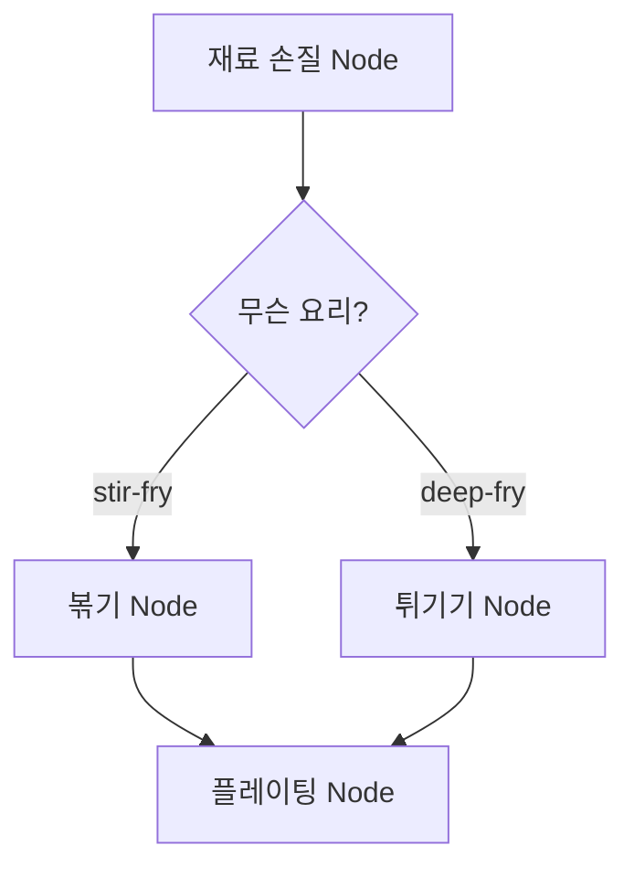
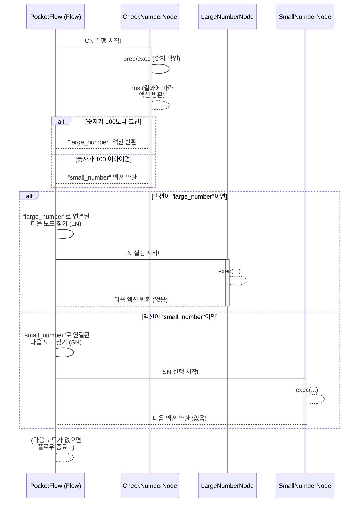

# Chapter 3: 액션 (Action)


안녕하세요! PocketFlow 친구들! 😊 지난 챕터에서는 우리 프로그램의 설계도인 [그래프 (Graph)](01_그래프__graph__.md)와 그 그래프 위에서 실제 작업을 수행하는 개별 '점'들, 즉 [노드 (Node)](02_노드__node__.md)에 대해 신나게 파헤쳐 보았죠! 이제 드디어 세 번째 핵심 친구를 만날 시간이에요! 바로 "**액션 (Action)**"이랍니다! 💖

그래프가 전체적인 길 지도라면, 노드는 지도 위에 표시된 '특정 임무 수행 지점'이었어요. 그렇다면 액션은 뭘까요? 바로 그 임무 지점과 지점 사이를 **연결하는 '길'**이자, 어떤 길로 갈지를 **결정하는 '신호'** 역할을 하는 아주 중요한 친구랍니다! 🛤️ 어떤 일을 마친 후에 다음에는 어디로 가야 할지를 알려주는 나침반 같은 거죠! 나침반이 가리키는 방향이 달라지면 도착하는 곳도 달라지겠죠? 액션도 마찬가지예요! 😉

자, 그럼 PocketFlow 그래프의 흐름을 만드는 액션의 세계로 함께 들어가 볼까요? 가봅시다! 🔥

### 🤔 왜 '액션'이라는 신호가 필요할까요? 문제 상황 파헤치기!

음... 여러분, 우리가 앞서 예로 들었던 '사용자 질문에 답변해 주는 똑똑한 에이전트'를 다시 떠올려봐요! 이 에이전트는 [노드 (Node)](02_노드__node__.md)들을 거치며 다음과 같은 일을 한다고 했죠?

1.  **질문 받기** (노드 A)
2.  **질문 판단하기** (노드 B) - 검색이 필요할까? 아니면 바로 답변할 수 있을까?
3.  **웹 검색하기** (노드 C)
4.  **답변 생성하기** (노드 D)
5.  **결과 전달하기** (노드 E)

만약 '질문 판단하기' 노드(노드 B)가 검색이 필요하다고 판단했다면 '웹 검색하기' 노드(노드 C)로 가야 하고, 바로 답변 가능하다고 판단했다면 '답변 생성하기' 노드(노드 D)로 바로 가야 해요.

이럴 때, 노드 B가 작업을 마친 후에 "아! 검색이 필요해!"라는 신호를 보내주면 그 신호를 듣고 노드 C로 이동하고, "바로 답변해도 돼!"라는 신호를 보내주면 그 신호를 듣고 노드 D로 이동해야겠죠?

만약 이런 '신호'나 '조건' 없이 노드들이 무조건 정해진 순서대로만 움직인다면 어떻게 될까요? '질문 판단하기' 노드는 항상 똑같은 다음 노드(예: 무조건 '웹 검색하기' 노드)로만 이동하게 될 거예요. 사용자 질문이 "오늘 날씨 어때?"처럼 검색이 필요한 질문이든, "네 이름이 뭐야?"처럼 바로 답변 가능한 질문이든 말이죠. 🙁 비효율적이고 똑똑하지 못한 에이전트가 되겠죠?

이럴 때 필요한 게 바로 노드가 자신의 작업 결과를 바탕으로 **다음 단계를 가리키는 '신호'**를 보내는 거예요! 이 '신호'가 바로 PocketFlow의 **액션**이랍니다! 🌟 액션을 통해 작업의 흐름을 상황에 맞게 **조건부로 분기(branching)** 시킬 수 있어요!

### ✨ 액션, 너는 대체 뭐니? (개념 소개!)

PocketFlow에서 **액션 (Action)** 은 노드가 자신의 작업을 마친 후 다음 어떤 노드로 이동할지를 결정하는 **'흐름 제어 신호'**예요. 이건 주로 **문자열(string)** 형태로 표현된답니다!

[노드 (Node)](02_노드__node__.md) 챕터에서 노드는 `prep`, `exec`, `post` 세 단계를 거친다고 배웠죠? 바로 이 세 번째 단계인 `post` 메서드에서 **액션 이름을 반환**해요!

*   **`post` 메서드의 반환 값:** 노드의 `post` 메서드가 반환하는 문자열이 바로 액션 이름이 돼요. 예를 들어 `return "success"`라고 하면 'success' 액션이 발생한 거예요.
*   **Flow의 역할:** PocketFlow의 [플로우 (Flow)](04_플로우__flow__.md)는 현재 노드의 `post` 메서드가 반환한 액션 이름을 보고, [그래프 (Graph)](01_그래프__graph__.md)에서 그 액션 이름으로 연결된 다음 노드를 찾아 이동한답니다.

마치 기차역에서 "다음 역은 어디로 갈 건가요?" 하고 물었을 때, 기차가 목적지 이름("서울역")을 말해주면, 관제탑(Flow)이 그 이름에 맞는 선로(연결된 다음 노드)를 열어주는 것과 같아요! 🚂

### 🚦 요리 비유로 보는 액션!

맛있는 요리를 만드는 도중에 중요한 결정을 내려야 하는 순간을 생각해봐요! 🍳 예를 들어 '재료 손질' 노드 다음에 '볶기' 노드로 갈지, '튀기기' 노드로 갈지 결정해야 할 때가 있다고 해봐요.

'재료 손질' 노드가 작업을 마친 후, 만약 오늘의 메뉴가 볶음 요리라면 `post` 메서드에서 `return "stir-fry"` 같은 액션 이름을 반환하는 거예요. 그러면 PocketFlow Flow는 이 'stir-fry' 액션을 보고 미리 'stir-fry' 액션으로 연결해둔 '볶기' 노드로 이동하겠죠?

반대로 오늘의 메뉴가 튀김 요리라면 `post`에서 `return "deep-fry"` 같은 액션 이름을 반환해서 '튀기기' 노드로 이동할 수 있게 하는 거죠!



이처럼 액션은 노드의 작업 결과나 특정 조건에 따라 다음에 실행될 노드를 유연하게 결정하는 마법 같은 역할을 한답니다! ✨

### 🧠 PocketFlow 안에서 액션은 어떻게 흐름을 만들까?

[플로우 (Flow)](04_플로우__flow__.md)가 [그래프 (Graph)](01_그래프__graph__.md)를 따라 노드를 실행할 때, 핵심적으로 액션을 사용하는 과정은 다음과 같아요.

1.  **노드 실행 완료:** 현재 노드의 `prep`, `exec`, `post` 메서드가 순서대로 실행돼요.
2.  **`post` 액션 반환:** `post` 메서드가 작업을 마친 후, 다음 노드로 이동하기 위한 '액션 이름'(문자열)을 반환해요. 예를 들어 `return "success"` 또는 `return "error"`처럼요. 만약 `post`가 아무것도 반환하지 않으면 PocketFlow는 이걸 특별한 기본값인 **'default' 액션**으로 간주해요.
3.  **Flow의 다음 노드 찾기:** Flow는 현재 노드가 반환한 액션 이름(`"success"`, `"error"`, `"default"` 등)을 가지고, 미리 정의된 그래프 연결 정보(`successors`라는 곳에 저장돼 있어요!)를 찾아봐요. "이 액션으로 연결된 다음 노드가 뭐지?" 하고 말이죠.
4.  **다음 노드로 이동:** 해당 액션 이름으로 연결된 노드를 찾으면, Flow는 그 노드로 이동해서 다시 1번부터 과정을 시작해요. 만약 해당하는 액션으로 연결된 노드가 없거나, Flow가 끝나는 노드라면 실행이 멈추겠죠.

이 과정은 마치 '보물 지도'를 따라가는 것과 같아요! 🗺️
*   '여기에서 삽질 완료!' (노드 작업 완료)
*   '삽질 결과: 보물 발견!' (노드 `post`가 "success" 액션 반환)
*   '지도에 "success"라고 표시된 다음 장소는 어디지?' (Flow가 'success' 액션으로 연결된 다음 노드 찾기)
*   '찾았다! 다음은 저기 언덕이야!' (Flow가 다음 노드로 이동)

이처럼 액션은 Flow가 그래프 위에서 헤매지 않고 정확한 길을 찾아 이동할 수 있도록 돕는 이정표 역할을 합니다!

### 👩‍💻 액션 사용하기 맛보기 코드!

실제로 PocketFlow에서 액션을 사용해서 조건부 분기를 만드는 코드를 아주 간단하게 살펴볼까요? [노드 (Node)](02_노드__node__.md) 챕터에서 본 `AddTenNode`와 비슷하지만, 여기서는 결과에 따라 다른 액션을 반환해볼 거예요!

```python
from pocketflow import Node, Flow

# 숫자가 특정 값보다 크면 '큰 숫자', 아니면 '작은 숫자' 액션을 반환하는 노드
class CheckNumberNode(Node):
    # prep, exec 단계는 간단히 생략하고 post에 집중해봐요!
    # 실제 노드에서는 prep/exec에서 값을 처리하겠죠? 😉

    def post(self, shared, prep_res, exec_res):
        # shared 저장소에서 처리할 숫자를 가져온다고 가정해요!
        number_to_check = shared.get("processed_number", 0) 
        print(f"➡️ [CheckNumberNode] 숫자 {number_to_check} 확인 중...")

        # 숫자가 100보다 크면 '큰 숫자' 액션을 반환해요.
        if number_to_check > 100:
            print(f"✅ [CheckNumberNode] {number_to_check}는 100보다 크네요! 'large_number' 액션 반환.")
            return "large_number" # 'large_number' 액션 반환!
        # 아니면 '작은 숫자' 액션을 반환해요.
        else:
            print(f"✅ [CheckNumberNode] {number_to_check}는 100 이하네요. 'small_number' 액션 반환.")
            return "small_number" # 'small_number' 액션 반환!

# '큰 숫자' 액션으로 연결될 노드
class LargeNumberNode(Node):
    def exec(self, prep_res):
        print("🎉 [LargeNumberNode] 우와! 큰 숫자 경로로 왔어요!")

# '작은 숫자' 액션으로 연결될 노드
class SmallNumberNode(Node):
    def exec(self, prep_res):
        print("💧 [SmallNumberNode] 작은 숫자 경로로 왔네요.")

# 자, 이제 이 노드들을 그래프(지도)로 연결해볼까요?
check_node = CheckNumberNode()
large_node = LargeNumberNode()
small_node = SmallNumberNode()

# Flow의 시작 노드를 정해요.
my_flow = Flow().start(check_node)

# ✨ 액션을 사용해서 조건부로 연결하는 마법! ✨
# CheckNumberNode에서 'large_number' 액션이 반환되면 LargeNumberNode로 이동!
check_node - "large_number" >> large_node

# CheckNumberNode에서 'small_number' 액션이 반환되면 SmallNumberNode로 이동!
check_node - "small_number" >> small_node

# 이제 이 플로우를 실행해봐요! (Shared 저장소에 값을 넣어주면서!)
print("\n--- Flow 실행 (숫자 150) ---")
shared_data_150 = {"processed_number": 150}
# my_flow.run(shared_data_150) # 실제 실행은 Flow 챕터에서! 😉
# 🚀 예상되는 출력 결과 (숫자 150일 때):
# ➡️ [CheckNumberNode] 숫자 150 확인 중...
# ✅ [CheckNumberNode] 150는 100보다 크네요! 'large_number' 액션 반환.
# 🎉 [LargeNumberNode] 우와! 큰 숫자 경로로 왔어요!

print("\n--- Flow 실행 (숫자 50) ---")
shared_data_50 = {"processed_number": 50}
# my_flow.run(shared_data_50) # 실제 실행은 Flow 챕터에서! 😉
# 🚀 예상되는 출력 결과 (숫자 50일 때):
# ➡️ [CheckNumberNode] 숫자 50 확인 중...
# ✅ [CheckNumberNode] 50는 100 이하네요. 'small_number' 액션 반환.
# 💧 [SmallNumberNode] 작은 숫자 경로로 왔네요.
```

**코드 설명:**

*   `CheckNumberNode`의 `post` 메서드는 `shared` 저장소에서 값을 가져와 100보다 크면 `"large_number"` 문자열을, 작거나 같으면 `"small_number"` 문자열을 **반환(return)** 해요. 이 반환 값이 바로 **액션**이랍니다!
*   `check_node - "large_number" >> large_node`: 이 코드는 "check\_node에서 작업이 끝났는데, 그때 `post` 메서드가 반환한 액션 이름이 'large\_number'라면, 다음에 실행할 노드는 `large_node`로 연결해 줘!" 라는 뜻이에요. `- "액션이름" >>` 이 기호가 액션 이름을 지정해서 연결하는 약속된 문법이에요.
*   `check_node - "small_number" >> small_node`: 마찬가지로 액션 이름이 'small\_number'일 때는 `small_node`로 이동하도록 연결한 거예요.

이렇게 `post` 메서드가 반환하는 액션 이름을 통해 Flow의 실행 경로를 동적으로 바꿀 수 있어요! 정말 유용하죠? 😊

### 🚦 액션의 흐름, 눈으로 보기! (Mermaid 다이어그램)

위 코드의 흐름을 간단한 그림(시퀀스 다이어그램)으로 볼까요? PocketFlow의 [플로우 (Flow)](04_플로우__flow__.md) 친구가 어떻게 액션을 따라 움직이는지 확인해봐요!



보세요! `CheckNumberNode`가 어떤 액션을 반환하느냐에 따라 Flow(PF)는 `LargeNumberNode`로 갈 수도 있고, `SmallNumberNode`로 갈 수도 있어요! 액션 덕분에 프로그램의 흐름이 똑똑하게 갈라지죠! ✨

### 🗺️ PocketFlow 예제에서 액션 찾아보기!

PocketFlow GitHub 저장소의 예제들은 이 액션을 아주 활발하게 사용하고 있답니다!

*   **Research Agent 예제** [`cookbook/pocketflow-agent/flow.py`](cookbook/pocketflow-agent/flow.py): `DecideAction` 노드가 사용자 질문을 보고 `post` 메서드에서 `"search"` 또는 `"answer"` 액션을 반환해요. 그리고 코드에서 `decide - "search" >> search` 와 `decide - "answer" >> answer` 처럼 연결해서, `DecideAction`이 어떤 액션을 반환하느냐에 따라 `SearchWeb` 노드로 가거나 `AnswerQuestion` 노드로 가게 한답니다! 바로 위에서 본 조건부 분기 예제와 똑같죠? 😉
*   **Text-to-SQL 예제** [`cookbook/pocketflow-text2sql/flow.py`](cookbook/pocketflow-text2sql/flow.py): 이 예제에는 재미있는 '디버깅 루프'가 있어요! `ExecuteSQL` 노드에서 SQL 실행에 실패하면 `post` 메서드가 `"error_retry"`라는 액션을 반환해요. 그리고 `execute_sql_node - "error_retry" >> debug_sql_node` 처럼 연결해서 `DebugSQL` 노드로 이동하게 하죠! `DebugSQL` 노드는 SQL을 고친 후에 다시 `post` 메서드에서 `return None` (즉, `"default"` 액션)을 반환해서 `debug_sql_node >> execute_sql_node` (`>>`는 'default' 액션으로 연결하는 단축 문법이에요!)로 다시 `ExecuteSQL` 노드로 돌아가 고쳐진 SQL을 재시도한답니다! 액션 덕분에 에러가 났을 때 특정 노드로 갔다가 다시 원래 노드로 돌아오는 '순환 구조(loop)'를 만들 수 있어요! 🔄

이처럼 액션은 단순히 다음 노드로 이동하는 것뿐만 아니라, 조건에 따른 분기, 특정 단계 반복(루프) 등 복잡한 작업 흐름을 만드는 데 핵심적인 역할을 합니다!

### 📝 오늘 배운 내용 요약!

와~ 🎉 오늘 우리는 PocketFlow [그래프 (Graph)](01_그래프__graph__.md)의 '선'이자 '신호'인 **액션 (Action)** 에 대해 신나게 알아보았어요!

*   **액션**은 노드의 작업이 끝난 후 **다음 어떤 노드로 이동할지를 결정**하는 **흐름 제어 신호**예요. 주로 **문자열** 형태랍니다.
*   노드의 `post` 메서드가 이 **액션 이름(문자열)**을 **반환**하면, PocketFlow의 [플로우 (Flow)](04_플로우__flow__.md)가 그 액션 이름으로 연결된 다음 노드를 찾아 이동해요.
*   `post`가 아무것도 반환하지 않으면 특별한 기본값인 **'default' 액션**으로 간주돼요.
*   `- "액션이름" >> 다음_노드` 또는 `이전_노드 >> 다음_노드` (default 액션) 문법을 사용해서 노드와 노드를 액션으로 연결해요.
*   액션을 통해 작업 흐름을 **조건에 따라 분기**시키거나 **특정 단계를 반복(루프)** 할 수 있어요.

이제 PocketFlow 그래프의 '선'들, 즉 액션이 어떻게 흐름을 만드는지 확실하게 알게 되었어요! 정말 잘하셨어요! 👍

### 💖 다음 이야기: 지도 위를 여행하는 여행자, 플로우!

그래프라는 멋진 지도를 그리고, 그 지도 위에서 일을 할 노드라는 작업 지점들을 만들고, 이제 그 지점들을 연결하는 액션이라는 길과 신호까지 알게 되었어요! 그렇다면 이 모든 것을 실제로 움직이게 하는 건 누구일까요?

바로 이 모든 것을 가지고 지도 위를 여행하며 노드를 실행시키고 액션을 따라 다음 길을 찾아가는 특별한 친구! **플로우 (Flow)** 에 대해 알아볼 차례예요! 🚀

다음 챕터에서는 Flow가 무엇이고, 어떻게 그래프의 시작부터 끝까지 움직이는지, 그리고 우리가 만든 그래프를 어떻게 실행하는지에 대해 재미있게 파헤쳐 볼 거예요! 기대되죠? 😉

그럼 다음 챕터에서 만나요! 안녕! 👋

[플로우 (Flow) 알아보기!](04_플로우__flow__.md)

---

Generated by [AI Codebase Knowledge Builder](https://github.com/The-Pocket/Tutorial-Codebase-Knowledge)