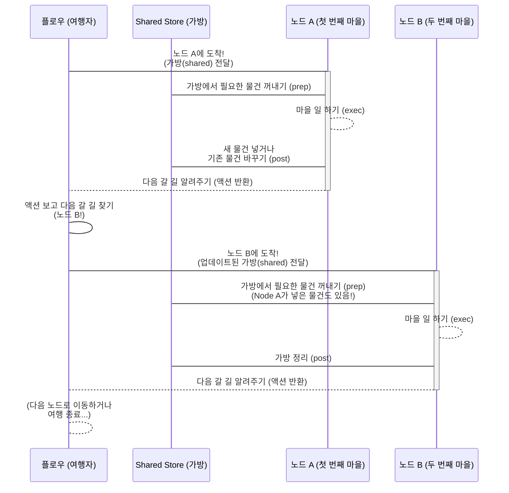

# Chapter 4: 플로우 (Flow)


안녕하세요! PocketFlow 친구들! 😊 지난 세 챕터 동안 우리는 PocketFlow의 멋진 세계를 함께 탐험했어요! 🗺️
우리 프로그램의 설계도이자 큰 그림인 [그래프 (Graph)](01_그래프__graph__.md)를 만났고, 그 지도 위에서 실제로 일을 하는 작업 단위인 [노드 (Node)](02_노드__node__.md) 친구들과 인사를 나누었죠! 그리고 노드와 노드를 연결하고 작업의 흐름을 제어하는 [액션 (Action)](03_액션__action__.md)이라는 멋진 신호 체계도 배웠어요!

그래프, 노드, 액션... 이 모든 재료가 준비되었다면, 이제 이 모든 것을 살아 움직이게 할 마법! 바로 "**플로우 (Flow)**"를 만날 시간이에요! 🎉

플로우는 마치 우리가 만든 지도(그래프)를 들고 여행을 떠나는 용감한 여행자 같아요! 🎒 지도의 시작점에서 출발해서, 각 장소(노드)에 도착하면 그곳에서 해야 할 일(노드의 작업)을 하고, 결과에 따라 다음 갈 길을 결정하는 신호(액션)를 따라 다음 장소로 이동하죠! 플로우 덕분에 우리가 멋지게 설계한 그래프가 실제로 실행되면서 원하는 작업을 척척 해낼 수 있답니다! 😊

자, 그럼 PocketFlow의 심장이자 그래프를 움직이는 주인공, 플로우를 함께 자세히 알아볼까요? 여행을 시작해봅시다! 🔥

### 🤔 왜 '플로우'라는 실행자가 필요할까요? 문제 상황 파헤치기!

음... 여러분, 우리가 그래프, 노드, 액션을 왜 쓰는지 배웠죠? 복잡한 작업을 작은 단위(노드)로 쪼개고, 그 단위들을 결과에 따라 유연하게 연결(액션)해서 전체적인 작업 흐름(그래프)을 명확하게 만드는 거였어요!

자, 이제 우리 손에 멋진 지도가 있어요! (바로 우리가 만든 PocketFlow 그래프죠! 🗺️)
지도 위에는 여러 임무 지점(노드)들이 표시되어 있고, 각 지점에서 어떤 일을 하고 나면 어떤 길(액션)을 따라 다음 지점으로 가야 하는지도 상세하게 그려져 있죠.

그런데 말이죠... 이 지도를 누가 따라가야 할까요? 🤔
지도는 그냥 종이(혹은 코드!)일 뿐, 스스로 움직이지는 못해요!
각 노드에 가서 `prep`, `exec`, `post` 메서드를 순서대로 실행시켜주고, `post` 메서드가 반환하는 액션 이름을 받아서, 그 이름에 해당하는 다음 노드를 찾아서, 그 다음 노드로 이동하는 이 모든 과정을 **누군가** 관리하고 실행해줘야 하잖아요?

만약 플로우가 없다면, 우리는 직접 코드에서 이런 로직을 다 짜야 할 거예요. "지금 노드 A를 실행하고, 노드 A의 `post` 결과가 'success'면 노드 B를 실행해! 만약 'error'면 노드 C를 실행하고! 노드 B가 끝나면 또 그 결과를 보고 다음 노드를 결정하고..." 휴... 생각만 해도 머리가 아프죠? 😵‍💫

이럴 때 필요한 게 바로 우리가 만든 그래프라는 지도를 보고, 알아서 시작점에서 출발해 길을 따라가며 각 노드의 임무를 수행하고 다음 길을 찾아 여행하는 **'실행 담당자'**예요! 그 담당자가 바로 PocketFlow의 **플로우 (Flow)** 랍니다! 🌟 플로우가 있으면 우리는 지도(그래프)만 잘 그리면 돼요. 여행은 플로우가 알아서 해줄 거예요!

### ✨ 플로우, 너는 대체 뭐니? (개념 소개!)

PocketFlow에서 **플로우 (Flow)** 는 우리가 정의한 [그래프 (Graph)](01_그래프__graph__.md)를 따라가면서 [노드 (Node)](02_노드__node__.md)들을 순서대로 **실행시키는 역할을 하는 객체**예요. 마치 프로그램의 심장이 뛰듯, 플로우는 그래프를 따라 움직이며 작업을 진행시킨답니다! 💖

플로우의 가장 중요한 역할은 다음과 같아요.

1.  **시작점 정하기:** 플로우는 그래프의 어디서부터 시작할지를 알아요. `Flow` 객체를 만들 때 '시작 노드'를 정해준답니다.
2.  **노드 실행:** 현재 위치한 노드의 `prep`, `exec`, `post` 메서드를 순서대로 실행시켜요.
3.  **액션 따라가기:** 노드의 `post` 메서드가 반환한 [액션 (Action)](03_액션__action__.md) 이름을 보고, 그 액션으로 연결된 다음 노드를 그래프 정보(`successors`에 저장된 내용)에서 찾아내요.
4.  **다음 노드로 이동:** 찾은 다음 노드로 '위치'를 옮기고, 다시 2번부터 반복해요.
5.  **종료:** 더 이상 갈 다음 노드가 없거나, 특별히 종료하도록 설정된 노드에 도착하면 플로우 실행을 멈춰요.

이렇게 플로우는 그래프라는 '정적인' 설계도를 '동적인' 실행 과정으로 바꿔주는 핵심 엔진 역할을 한답니다! 🔥

### 🎒 여행 가방 (Shared Store) 챙기기!

플로우 여행자가 그래프 지도를 따라 여행할 때 아주 중요한 물건을 하나 꼭 가지고 다녀요. 바로 **공유 저장소 (Shared Store)** 라는 특별한 가방이랍니다! 🎒

이 가방 안에는 여행 중에 얻은 정보나 다음 노드가 필요로 하는 물건(데이터)들이 들어있어요. 플로우가 어떤 노드에 도착하면, 그 노드는 이 가방(`shared`)을 열어서 필요한 것을 꺼내 쓰거나(prep 단계), 새로운 것을 넣거나(post 단계), 기존 것을 업데이트한답니다.


(Shared Store는 다음 챕터에서 더 자세히 다룰 거니까 여기서는 '가방' 비유로 가볍게만 설명할게요! 😉)

이처럼 플로우는 `shared` 저장소를 가지고 다니면서 각 노드에 전달하고, 노드는 이 `shared`를 통해 서로 데이터를 주고받으며 협력하게 된답니다!

### 🧠 PocketFlow 안에서 플로우는 어떻게 움직일까?

플로우가 그래프를 따라 노드를 실행하는 과정은 [액션 (Action)](03_액션__action__.md) 챕터에서 살짝 엿보았죠? 이걸 조금 더 자세히, 하지만 귀엽고 간단하게 알아봐요!

1.  **시작!** 플로우는 `start_node`로 지정된 노드에서 여행을 시작해요. 이때 빈 가방(또는 초기 데이터가 담긴 가방)을 들고 출발하죠!
2.  **노드 도착 & 일하기:** 현재 노드에 도착하면, 플로우는 그 노드의 `_run` 메서드를 실행시켜요.
    *   `_run`은 먼저 `prep(shared)`를 호출해서 필요한 데이터를 가방에서 꺼내 준비해요.
    *   준비된 데이터를 가지고 `exec(prep_res)`를 호출해서 노드의 핵심 작업을 실행해요.
    *   작업 결과와 준비 데이터를 가지고 `post(shared, prep_res, exec_res)`를 호출해서 결과 정리하고, 가장 중요하게 **다음 갈 액션 이름(문자열)**을 반환받아요! 이때 `shared` 가방에도 필요한 정보를 업데이트해요.
3.  **다음 길 찾기:** 플로우는 `post` 메서드가 반환한 액션 이름을 보고, 현재 노드의 '다음 노드 연결 정보' (`successors`)에서 해당 액션 이름으로 연결된 다음 노드를 찾아요. (`self.get_next_node(curr, last_action)` 이런 느낌이죠!)
4.  **이동!** 다음 노드를 찾았다면, 플로우는 그 노드로 이동(다음 루프의 `curr`이 그 노드로 변경)하고 2번 과정을 반복해요!
5.  **여행 끝!** 만약 `post`가 반환한 액션으로 연결된 다음 노드가 없다면? 플로우의 여행은 그 노드에서 끝이 난답니다! 🏁

이 모든 과정은 `Flow` 클래스의 내부 (`_orch` 같은 메서드)에서 자동으로 처리돼요! 우리는 그저 `Flow` 객체를 만들고, 시작 노드를 정하고, 노드들을 액션으로 잘 연결해주기만 하면 돼요!

### 👩‍💻 플로우 만들기 & 실행하기 맛보기 코드!

자, 이제 우리가 배운 [노드 (Node)](02_노드__node__.md)와 [액션 (Action)](03_액션__action__.md)을 플로우에 담아서 실제로 실행할 준비를 해볼까요? `pocketflow` 라이브러리에서 `Flow` 클래스를 가져와 사용해요!

```python
from pocketflow import Node, Flow

# 귀여운 첫 번째 노드
class FirstNode(Node):
    def exec(self, prep_res):
        print("👋 [FirstNode] 안녕하세요! 첫 번째 노드입니다!")
        # 'next_step' 액션으로 다음 노드에게 바통 터치!
        return "next_step"

# 귀여운 두 번째 노드
class SecondNode(Node):
    def exec(self, prep_res):
        print("✨ [SecondNode] 두 번째 노드 도착! 신나는 작업 중!")
        # 기본(default) 액션으로 다음 노드에게 바통 터치! (pass 또는 return None)
        pass 

# 귀여운 세 번째 노드 (마지막 노드)
class LastNode(Node):
    def exec(self, prep_res):
        print("🎉 [LastNode] 와~ 마지막 노드 도착! 임무 완료!")
        # 마지막 노드는 보통 아무것도 반환하지 않아요. (-> default 액션)
        pass

# 자, 이제 우리의 여행자, Flow 객체를 만들 시간!
# 그리고 여행의 시작점(start_node)을 정해줘요!
first_node_instance = FirstNode()
my_flow = Flow().start(first_node_instance) # Flow 객체 만들고 시작 노드 지정!

# ✨ 노드들을 액션으로 연결해서 그래프 완성! ✨
# FirstNode에서 'next_step' 액션으로 SecondNode 연결!
my_flow.start_node - "next_step" >> SecondNode() # my_flow.start_node는 first_node_instance와 같아요!

# SecondNode에서 기본(default) 액션으로 LastNode 연결!
# >> 기호는 'default' 액션으로 연결하는 단축 문법이에요! 아주 편하죠?
SecondNode() >> LastNode() 

# 이제 플로우 여행을 시작해볼까요?! run() 메서드를 호출해요!
# run() 메서드에 {} 빈 딕셔너리를 넘겨주면, 이게 바로 여행 가방(shared)이에요!
print("--- 플로우 실행 시작! ---")
my_flow.run({}) # 🚀 플로우 여행 시작! shared 가방은 일단 비어있어요!
print("--- 플로우 실행 완료! ---")

# ✨ 예상되는 출력 결과:
# --- 플로우 실행 시작! ---
# 👋 [FirstNode] 안녕하세요! 첫 번째 노드입니다!
# ✨ [SecondNode] 두 번째 노드 도착! 신나는 작업 중!
# 🎉 [LastNode] 와~ 마지막 노드 도착! 임무 완료!
# --- 플로우 실행 완료! ---
```

**코드 설명:**

*   `my_flow = Flow().start(first_node_instance)`: `Flow` 객체를 만들고, `start()` 메서드를 사용해서 `first_node_instance`를 이 플로우의 시작 노드로 지정해요. 이제 `my_flow`라는 여행자가 `first_node_instance` 마을에서 여행을 시작할 준비가 된 거예요!
*   `my_flow.start_node - "next_step" >> SecondNode()`: `my_flow`의 시작 노드(이 경우 `first_node_instance`)에서 `"next_step"`이라는 액션으로 `SecondNode`를 연결해요. 마치 지도에 '첫 번째 마을에서 "다음 단계"라고 쓰인 길을 따라가면 두 번째 마을이 나와!' 하고 표시하는 것 같아요.
*   `SecondNode() >> LastNode()`: `SecondNode`에서 기본 액션(`default`)으로 `LastNode`를 연결해요. `>>` 기호는 `default` 액션 연결을 뜻하는 아주 편리한 문법이랍니다! '두 번째 마을에서 아무런 특별한 신호가 없으면 기본 길을 따라 세 번째 마을로 가!' 하고 연결하는 거죠.
*   `my_flow.run({})`: 이 마법 같은 메서드가 바로 플로우 여행을 시작시키는 버튼이에요! `run()` 메서드에 넘겨주는 딕셔너리 `{}`가 바로 우리의 여행 가방, [공유 저장소 (Shared Store)](05_공유_저장소__shared_store__.md)가 된답니다! 플로우 여행자는 이 가방을 들고 `start_node`부터 그래프를 따라 여행하며 각 노드를 방문하고 실행해요.

어떤가요? `Flow` 객체를 만들고 시작 노드를 정한 다음, `- 액션이름 >>`이나 `>>` 기호를 사용해서 노드들을 연결해주기만 하면 PocketFlow가 알아서 실행해주는 거죠! 우리는 실행 로직을 직접 짤 필요 없이 '어떻게 연결될지만' 정해주면 돼요! 정말 편리하죠? 😍

### 🗺️ PocketFlow 예제에서 플로우 찾아보기!

PocketFlow GitHub 저장소에 있는 예제들은 모두 `Flow` 객체를 만들고 `run()` 메서드를 호출해서 전체 워크플로우를 실행한답니다!

*   **워크플로우 예제** [`cookbook/pocketflow-workflow/flow.py`](cookbook/pocketflow-workflow/flow.py): `create_article_flow()` 함수를 보면 `Flow(start=outline_node)` 이렇게 플로우를 만들고 `outline_node`를 시작 노드로 지정하는 것을 볼 수 있어요. 그리고 `outline_node >> write_node >> style_node` 처럼 `>>`를 사용해서 노드들을 순차적으로 연결하죠. 이 플로우를 `main.py` 같은 파일에서 가져와 `flow.run({})` 이런 식으로 실행하는 거예요! 이 예제는 가장 기본적인 순차 실행 플로우를 잘 보여준답니다.
*   **텍스트 변환 예제** [`cookbook/pocketflow-flow/flow.py`](cookbook/pocketflow-flow/flow.py)와 [`cookbook/pocketflow-flow/README.md`](cookbook/pocketflow-flow/README.md): 이 예제는 사용자 입력에 따라 텍스트를 변환하는 인터랙티브한 플로우를 만들어요. `TextInput` 노드에서 `- "transform" >> TextTransform` 처럼 액션을 지정해서 다음 노드로 연결하고, `TextTransform` 노드에서는 `- "input" >> text_input` 처럼 액션을 지정해서 이전 노드로 **다시 돌아오는 순환 구조**를 만들기도 해요! (`README.md`에 있는 멋진 `mermaid` 다이어그램을 꼭 확인해보세요!) `flow = Flow(start=text_input)`로 플로우를 만들고 `flow.run({})`으로 실행하면서 사용자의 입력에 따라 플로우가 어떻게 움직이는지 직접 볼 수 있답니다! ✨

이 외에도 `BatchFlow`, `AsyncFlow` 등 플로우를 상속받아 더 특별한 기능을 가진 플로우들도 있지만, 기본적인 아이디어는 모두 우리가 배운 이 `Flow`와 같아요!

### 📝 오늘 배운 내용 요약!

와~ 🎉 오늘 우리는 PocketFlow [그래프 (Graph)](01_그래프__graph__.md)를 살아 움직이게 하는 주인공! **플로우 (Flow)** 에 대해 신나게 알아보았어요!

*   **플로우**는 우리가 정의한 [그래프 (Graph)](01_그래프__graph__.md)를 따라가면서 [노드 (Node)](02_노드__node__.md)들을 **실제로 실행시키는 역할**을 해요.
*   `Flow().start(시작_노드)` 형태로 플로우 객체를 만들고 여행의 **시작점**을 정해요.
*   노드와 노드는 [액션 (Action)](03_액션__action__.md) 이름(`- "액션이름" >>`)이나 기본 액션(`>>`)으로 **연결**해서 플로우가 따라갈 길을 만들어요.
*   `flow.run({})` 메서드를 호출하면 플로우 여행이 시작되고, 플로우는 시작 노드부터 그래프를 따라가며 각 노드를 실행하고 액션을 통해 다음 노드를 찾아 이동해요.
*   플로우는 여행 내내 **공유 저장소 (Shared Store)** 라는 특별한 가방을 가지고 다니며 노드들에게 전달해서 데이터를 주고받게 해요. (자세한 이야기는 다음 챕터에!)

이제 PocketFlow의 실행 엔진인 플로우가 무엇인지, 그리고 어떻게 그래프를 따라 움직이는지 확실하게 알게 되었어요! 정말 잘하셨어요! 👍

### 💖 다음 이야기: 여행 가방의 비밀! 공유 저장소!

그래프라는 지도 위를 플로우라는 여행자가 노드라는 마을을 방문하며 액션이라는 길을 따라 여행하는 이야기, 정말 재밌죠? 그런데 이 여행자가 항상 가지고 다니는 마법 가방, [공유 저장소 (Shared Store)](05_공유_저장소__shared_store__.md) 속에는 어떤 비밀이 숨겨져 있을까요? 🤔

각 노드가 이 가방에서 데이터를 꺼내 쓰고, 새로운 데이터를 넣고, 가방을 업데이트하는 과정을 통해 어떻게 복잡한 작업 흐름 속에서 데이터가 공유되고 전달되는지를 다음 챕터에서 파헤쳐 볼 거예요! 노드들이 서로 대화하고 정보를 주고받는 비밀이 바로 이 가방 속에 있답니다! 🤫

다음 챕터에서는 공유 저장소가 무엇이고, 왜 필요하며, 어떻게 사용하는지에 대해 재미있게 파헤쳐 볼 거예요! 기대되죠? 😉

그럼 다음 챕터에서 만나요! 안녕! 👋

[공유 저장소 (Shared Store) 알아보기!](05_공유_저장소__shared_store__.md)

---

Generated by [AI Codebase Knowledge Builder](https://github.com/The-Pocket/Tutorial-Codebase-Knowledge)