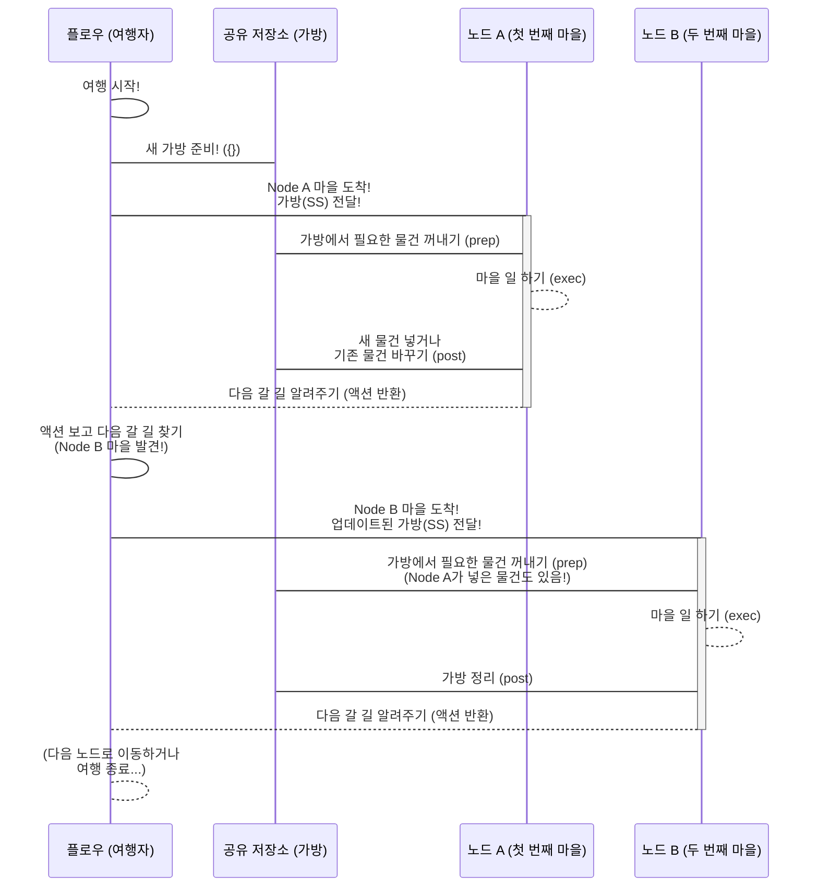

# Chapter 5: 공유 저장소 (Shared Store)

💖

안녕하세요! PocketFlow 친구들! 😊

지난 챕터에서는 우리가 만든 멋진 지도([그래프 (Graph)](01_그래프__graph__.md)) 위를 신나게 여행하며 [노드 (Node)](02_노드__node__.md)라는 마을들을 방문하고, [액션 (Action)](03_액션__action__.md)이라는 길을 따라 다음 마을로 이동하는 용감한 여행자, **[플로우 (Flow)](04_플로우__flow__.md)** 친구에 대해 자세히 알아봤어요! 🚀

플로우 여행자가 여행을 할 때, 아주 중요한 물건을 담는 마법 같은 가방을 항상 가지고 다닌다고 살짝 이야기했었죠? 바로 그 가방의 비밀을 오늘 파헤쳐 볼 거예요! 두구두구! 그 주인공은 바로 **"공유 저장소 (Shared Store)"** 랍니다! 🎉

공유 저장소는 이름처럼 '서로 공유하는 정보를 담아두는 곳'이에요. 마치 여러 사람이 함께 사용하는 화이트보드나, 여행자들이 짐을 잠시 맡겨두거나 필요한 물건을 꺼내 쓰는 '공유 보관함' 같은 곳이죠! 🗄️

자, 그럼 PocketFlow 여행의 필수템! 공유 저장소의 세계로 함께 들어가 볼까요? 가봅시다! 🔥

### 🤔 왜 '공유 저장소'가 필요할까요? 문제 상황 파헤치기!

음... 여러분, 우리가 복잡한 작업을 여러 개의 [노드 (Node)](02_노드__node__.md)로 쪼개서 [플로우 (Flow)](04_플로우__flow__.md)가 순서대로 실행한다고 했잖아요? 예를 들어 이런 과정이 있다고 상상해봐요!

1.  **사용자 질문 받기 노드:** 사용자에게 "오늘 날씨 어때?" 같은 질문을 입력받아요.
2.  **LLM 호출 노드:** 입력받은 질문을 [공유 저장소 (Shared Store)](#)에 저장하고, LLM에게 질문해서 답변을 받아와요.
3.  **답변 가공 노드:** LLM이 준 답변을 좀 더 친절하게 다듬어요.

여기서 문제가 하나 생겨요! 🤔

**'LLM 호출 노드'는 '사용자 질문 받기 노드'가 받은 질문 내용을 어떻게 알 수 있을까요?**

**'답변 가공 노드'는 'LLM 호출 노드'가 LLM에게서 받은 원본 답변을 어떻게 알 수 있을까요?**

각 노드는 독립적으로 자기 할 일만 딱! 한다고 했잖아요. 그런데 이렇게 앞선 노드의 '결과'가 다음 노드의 '입력'으로 필요할 때는 어떻게 데이터를 주고받아야 할까요?

마치 요리사 A가 양파를 다듬고 요리사 B에게 넘겨줘야 하고, 요리사 B는 요리사 A가 다듬은 양파와 요리사 C가 준비한 고기를 받아서 볶아야 하는 상황 같은 거죠! 🧅🥩 서로 필요한 재료를 어떻게 주고받아야 할까요?

이럴 때 필요한 것이 바로 모든 노드가 접근해서 데이터를 **주고받을 수 있는 '공용 공간'**이에요! PocketFlow에서는 이 공용 공간을 바로 **공유 저장소 (Shared Store)** 라고 부른답니다! 🌟

### ✨ 공유 저장소, 너는 대체 뭐니? (개념 소개!)

PocketFlow에서 **공유 저장소 (Shared Store)** 는 [플로우 (Flow)](04_플로우__flow__.md)의 실행 과정 전체에 걸쳐 **모든 [노드 (Node)](02_노드__node__.md)가 접근할 수 있는 하나의 거대한 딕셔너리(dictionary)** 공간이에요. Python의 `dict`처럼 `{"키": 값}` 형태로 데이터를 저장하고 관리할 수 있답니다!

*   **하나의 큰 딕셔너리:** 공유 저장소는 단순히 데이터를 넘겨주는 통로가 아니라, 플로우가 시작될 때 만들어져서 플로우가 끝날 때까지 유지되는 **살아있는 딕셔너리**예요. 모든 노드는 이 딕셔너리에 `shared`라는 이름으로 접근할 수 있죠.
*   **모든 노드의 공용 공간:** 어떤 노드에서 `shared["사용자_질문"] = "..."` 처럼 데이터를 저장하면, 그다음 실행되는 다른 노드에서 `사용자_질문 = shared["사용자_질문"]` 처럼 저장된 데이터를 바로 꺼내 사용할 수 있어요.
*   **데이터 공유의 핵심:** 노드와 노드 사이에서 데이터나 중간 결과를 주고받는 가장 기본적인 방법이 바로 이 공유 저장소를 이용하는 것이랍니다!

마치 학교 게시판 같아요! 칠판(공유 저장소)에 누가 오늘 할 일이나 중요한 정보를 적어두면(데이터 저장), 다른 친구들이 와서 그 내용을 보고(데이터 읽기), 또 다른 친구가 새로운 내용을 덧붙이거나 기존 내용을 수정하는(데이터 업데이트) 거죠! 칠판만 보면 누가 어떤 정보를 공유했고, 내가 어떤 정보를 얻을 수 있는지 알 수 있어요! 칠판에 쓰인 정보는 다른 누군가가 지우기 전까지 계속 남아있답니다! 칠판을 통해 모든 친구들이 서로 소통하는 거예요! 칠판이 바로 우리의 공유 저장소! 칠판 앞에 있는 친구들이 노드! 👩‍🏫🧑‍🎓

### 🎒 플로우의 여행 가방 (Shared Store)!

[플로우 (Flow)](04_플로우__flow__.md) 챕터에서 플로우 여행자가 여행 가방을 가지고 다닌다고 했죠? 그 가방이 바로 이 **공유 저장소**랍니다!



위 그림처럼, [플로우 (Flow)](04_플로우__flow__.md)가 한 노드에 도착하면, 항상 현재의 **공유 저장소**를 그 노드에게 전달해줘요. [노드 (Node)](02_노드__node__.md)의 `prep`와 `post` 메서드가 항상 `shared`라는 인자를 받는 이유가 바로 이것 때문이에요!

*   **`prep(self, shared)`:** 노드가 실행되기 전에 `prep` 메서드는 이 `shared` 가방에서 자기 작업에 필요한 데이터('재료')를 꺼내옵니다.
*   **`post(self, shared, prep_res, exec_res)`:** 노드의 작업(exec)이 끝난 후, `post` 메서드는 작업 결과(`exec_res`)나 중간 상태를 이 `shared` 가방에 다시 저장해요. 이렇게 저장된 데이터는 플로우가 다음 노드로 이동할 때 그대로 전달된답니다.

공유 저장소 덕분에 각 노드는 이전 노드의 결과에 접근하거나, 자신의 결과를 다음 노드가 사용할 수 있도록 쉽게 전달할 수 있어요! 마치 요리사들이 공동 냉장고(공유 저장소)에 재료를 넣어두고 필요한 만큼 꺼내 쓰는 것처럼요! 🍽️

### 👩‍💻 공유 저장소 사용하기 맛보기 코드!

실제로 PocketFlow [노드 (Node)](02_노드__node__.md) 안에서 공유 저장소(`shared`)를 어떻게 사용하는지 간단하게 살펴볼까요?

```python
from pocketflow import Node, Flow

# 공유 저장소에 사용자 질문을 저장하는 노드
class GetQuestionNode(Node):
    def exec(self, prep_res):
        # 사용자 입력을 받는다고 상상해요!
        user_input = input("🙋 질문을 입력하세요: ")
        print(f"➡️ [GetQuestionNode] 질문 '{user_input}' 받음.")
        return user_input # exec의 결과로 사용자 질문을 반환

    def post(self, shared, prep_res, exec_res):
        # exec의 결과(사용자 질문)를 shared 저장소에 'user_question' 키로 저장!
        shared['user_question'] = exec_res 
        print(f"✅ [GetQuestionNode] 질문 '{exec_res}' shared['user_question']에 저장!")
        return "process_question" # 다음 노드로 갈 액션 반환

# 공유 저장소에서 질문을 읽어 처리하는 노드 (예: LLM에 전달)
class ProcessQuestionNode(Node):
    def prep(self, shared):
        # shared 저장소에서 'user_question' 키에 저장된 값을 읽어옴!
        question_to_process = shared.get('user_question', '기본 질문') 
        print(f"➡️ [ProcessQuestionNode] shared에서 질문 '{question_to_process}' 읽음.")
        return question_to_process # 읽어온 질문을 exec로 전달

    def exec(self, prep_res):
        # prep에서 받은 질문으로 LLM을 호출한다고 상상해요! (실제 LLM 호출 코드는 생략!)
        print(f"⚙️ [ProcessQuestionNode] LLM에게 질문 '{prep_res}' 전달 중...")
        # LLM이 '답변 결과'를 반환했다고 상상해요!
        llm_response = f"'{prep_res}'에 대한 LLM의 멋진 답변!"
        print(f"⚙️ [ProcessQuestionNode] LLM 답변 '{llm_response}' 받음.")
        return llm_response # exec의 결과로 LLM 답변 반환

    def post(self, shared, prep_res, exec_res):
        # exec의 결과(LLM 답변)를 shared 저장소에 'llm_response' 키로 저장!
        shared['llm_response'] = exec_res
        print(f"✅ [ProcessQuestionNode] LLM 답변 '{exec_res}' shared['llm_response']에 저장!")
        # 다음 노드로 기본(default) 액션으로 이동!
        pass 

# 이제 이 노드들을 Flow로 연결해서 실행해봐요!
get_node = GetQuestionNode()
process_node = ProcessQuestionNode()

my_flow = Flow().start(get_node) # GetQuestionNode를 시작 노드로!

# GetQuestionNode에서 'process_question' 액션으로 ProcessQuestionNode 연결
get_node - "process_question" >> process_node

# 이제 플로우 여행을 시작해볼까요?! run() 메서드를 호출해요!
# run()에 전달하는 딕셔너리가 바로 공유 저장소(shared)의 초기값이에요!
print("\n--- 플로우 실행 시작! ---")
initial_shared_state = {} # 초기 공유 저장소는 비어있어요!
my_flow.run(initial_shared_state) 
print("--- 플로우 실행 완료! ---")

# ✨ 실행 후 initial_shared_state의 내용:
# print("\n--- 실행 후 공유 저장소 내용 ---")
# print(initial_shared_state)
# 🚀 예상되는 출력 결과:
# --- 플로우 실행 시작! ---
# 🙋 질문을 입력하세요: 오늘 날씨 어때?
# ➡️ [GetQuestionNode] 질문 '오늘 날씨 어때?' 받음.
# ✅ [GetQuestionNode] 질문 '오늘 날씨 어때?' shared['user_question']에 저장!
# ➡️ [ProcessQuestionNode] shared에서 질문 '오늘 날씨 어때?' 읽음.
# ⚙️ [ProcessQuestionNode] LLM에게 질문 '오늘 날씨 어때?' 전달 중...
# ⚙️ [ProcessQuestionNode] LLM 답변 ''오늘 날씨 어때?'에 대한 LLM의 멋진 답변!' 받음.
# ✅ [ProcessQuestionNode] LLM 답변 ''오늘 날씨 어때?'에 대한 LLM의 멋진 답변!' shared['llm_response']에 저장!
# --- 플로우 실행 완료! ---
# --- 실행 후 공유 저장소 내용 ---
# {'user_question': '오늘 날씨 어때?', 'llm_response': ''오늘 날씨 어때?'에 대한 LLM의 멋진 답변!'}
```

**코드 설명:**

*   `GetQuestionNode`의 `post` 메서드에서 `shared['user_question'] = exec_res` 와 같이 `shared` 딕셔너리에 `exec` 메서드의 결과(`exec_res`, 즉 사용자 질문)를 `user_question`이라는 키로 저장하고 있어요.
*   `ProcessQuestionNode`의 `prep` 메서드에서는 `question_to_process = shared.get('user_question', '기본 질문')` 와 같이 `shared` 딕셔너리에서 `user_question` 키의 값을 읽어와 사용하고 있어요.
*   마지막으로 `ProcessQuestionNode`의 `post` 메서드에서는 `shared['llm_response'] = exec_res` 와 같이 `exec` 결과(LLM 답변)를 `llm_response` 키로 다시 `shared`에 저장하죠.
*   `my_flow.run(initial_shared_state)`: `run` 메서드를 호출할 때 전달하는 딕셔너리가 바로 이 플로우의 **초기 공유 저장소**가 된답니다! 플로우는 이 딕셔너리를 가지고 다니면서 각 노드에게 전달하고, 노드들은 이 딕셔너리를 읽고 쓰며 데이터를 공유하는 거예요. 실행이 끝난 후 `initial_shared_state` 딕셔너리를 확인해보면, 각 노드가 저장한 데이터가 그대로 남아있는 것을 볼 수 있어요!

이렇게 공유 저장소를 사용하면, 마치 공용 게시판에 메모를 남기고 다음 사람이 그 메모를 보고 작업을 이어가듯, 노드들이 서로 필요한 데이터를 효율적으로 주고받을 수 있답니다! 정말 편리하죠? 😊

### 🗺️ PocketFlow 예제에서 공유 저장소 찾아보기!

PocketFlow GitHub 저장소의 예제들은 공유 저장소([Shared Store](#))를 정말 다양하고 멋지게 활용하고 있답니다!

*   **Communication 예제** [`cookbook/pocketflow-communication/nodes.py`](cookbook/pocketflow-communication/nodes.py): 이 예제는 공유 저장소를 사용해서 여러 노드에 걸쳐 **상태(state)**를 유지하는 것을 보여줘요.
    *   `TextInput` 노드는 사용자가 입력한 텍스트를 `shared["text"]`에 저장하고, 전체 입력 횟수를 `shared["stats"]["total_texts"]`에 더해요. 만약 `shared["stats"]`가 없다면 처음 만들어주죠.
    *   `WordCounter` 노드는 `shared["text"]`에서 텍스트를 읽어와 단어 수를 세고, 그 결과를 `shared["stats"]["total_words"]`에 더해요.
    *   `ShowStats` 노드는 `shared["stats"]`에 저장된 통계 정보(총 텍스트 수, 총 단어 수)를 읽어와 화면에 보여준답니다.
    *   이 예제를 실행하면서 텍스트를 여러 번 입력해보면, `shared["stats"]` 딕셔너리에 계속 누적된 통계가 저장되어 다음 실행에도 유지되는 것을 볼 수 있어요! 마치 공유 보관함에 물건을 계속 쌓아두는 것처럼요! 📈
*   **Structured Output 예제** [`cookbook/pocketflow-structured-output/main.py`](cookbook/pocketflow-structured-output/main.py): `ResumeParserNode`는 `main.py` 파일에서 `flow.run(shared)`를 호출할 때 전달받은 `shared` 딕셔너리에서 `shared["resume_text"]` (이력서 내용)와 `shared["target_skills"]` (찾을 기술 목록)를 읽어와요. LLM 호출([노드 (Node)](02_노드__node__.md)의 `exec` 단계)을 통해 이력서 내용을 분석한 후, 분석된 결과 (`structured_data`)를 `shared["structured_data"]`에 저장해서 다음 노드(만약 연결되어 있다면!)나 플로우 실행 이후에 사용할 수 있도록 한답니다. 데이터를 읽고 결과를 저장하는 전형적인 공유 저장소 사용 패턴이에요! 💾
*   **Chat Memory 예제** [`cookbook/pocketflow-chat-memory/nodes.py`](cookbook/pocketflow-chat-memory/nodes.py): 이 예제는 공유 저장소를 정말 활발하게 사용하는 복잡한 예시예요!
    *   `GetUserQuestionNode`는 `shared["messages"]`에 대화 기록을 저장하기 시작해요.
    *   `AnswerNode`는 `shared["messages"]`에서 최근 대화 기록을 가져와 LLM에게 전달하고, LLM 응답을 다시 `shared["messages"]`에 추가해요. 또한, `shared["retrieved_conversation"]`에 저장된 과거 대화 기록(다음 RetrieveNode에서 저장해요!)을 가져와 컨텍스트로 활용한답니다.
    *   `EmbedNode`는 `shared["messages"]`에서 오래된 대화 기록을 가져와 벡터로 만든 후, `shared["vector_index"]`와 `shared["vector_items"]`에 저장해요.
    *   `RetrieveNode`는 `shared["messages"]`에서 최신 질문을 가져와 `shared["vector_index"]`에서 비슷한 과거 대화를 찾고, 그 결과를 `shared["retrieved_conversation"]`에 저장해요.
    *   이 예제처럼 공유 저장소를 잘 활용하면 대화 기록, 벡터 인덱스 등 복잡한 상태를 여러 노드에 걸쳐 유지하고 공유하면서 정교한 워크플로우를 만들 수 있답니다! 😲

이 예제들을 살펴보면 여러분도 PocketFlow 공유 저장소를 활용해서 노드들 사이에 데이터를 전달하고, 플로우 전체에 걸쳐 필요한 상태를 유지하는 방법을 확실하게 익힐 수 있을 거예요!

### 📝 오늘 배운 내용 요약!

짜잔! 🎉 오늘 우리는 PocketFlow 여행의 필수템! 노드들이 데이터를 주고받는 공용 공간! **공유 저장소 (Shared Store)** 에 대해 신나게 알아보았어요!

*   **공유 저장소**는 [플로우 (Flow)](04_플로우__flow__.md) 실행 내내 유지되는 **하나의 큰 딕셔너리** 공간이에요.
*   모든 [노드 (Node)](02_노드__node__.md)는 이 `shared` 딕셔너리에 접근해서 **데이터를 읽거나 저장**할 수 있어요.
*   노드의 `prep(self, shared)` 메서드는 `shared`에서 필요한 **입력 데이터**를 읽어오고, `post(self, shared, ...)` 메서드는 `shared`에 **결과 데이터나 상태**를 저장해요.
*   `flow.run(초기_shared_딕셔너리)` 형태로 플로우를 실행할 때 공유 저장소의 **초기값**을 설정할 수 있어요.
*   공유 저장소를 통해 노드들 사이에 데이터를 쉽게 전달하고, 플로우 전체에 걸쳐 필요한 **상태(state)**를 유지할 수 있답니다!

이제 PocketFlow 노드들이 어떻게 서로 대화하고 정보를 주고받는지 확실하게 알게 되었어요! 정말 잘하셨어요! 👍

### 💖 다음 이야기: 한 번에 여러 개 처리하기! 배치 처리!

그래프, 노드, 액션, 플로우, 공유 저장소까지! PocketFlow의 기본적인 마법 도구들을 모두 익혔어요! ✨ 이제 이 도구들을 사용해서 더 멋지고 강력한 일들을 해볼 시간이에요!

우리가 지금까지는 한 번에 하나씩 작업을 처리하는 방식을 주로 생각했지만, 실제로는 이미지 수십 장을 처리하거나, 문서 수백 개를 요약하는 것처럼 **똑같은 작업을 여러 데이터에 대해 반복해서 처리**해야 할 때가 많겠죠?

다음 챕터에서는 이렇게 **여러 개의 작업을 한 번에 묶어서 효율적으로 처리**하는 마법! 바로 **배치 처리 (Batch Processing)** 에 대해 파헤쳐 볼 거예요! 묶어서 처리하면 얼마나 빨라지고 편리해질까요? 기대되죠? 😉

그럼 다음 챕터에서 만나요! 안녕! 👋

[배치 처리 (Batch Processing) 알아보기!](06_배치_처리__batch_processing__.md)

---

Generated by [AI Codebase Knowledge Builder](https://github.com/The-Pocket/Tutorial-Codebase-Knowledge)