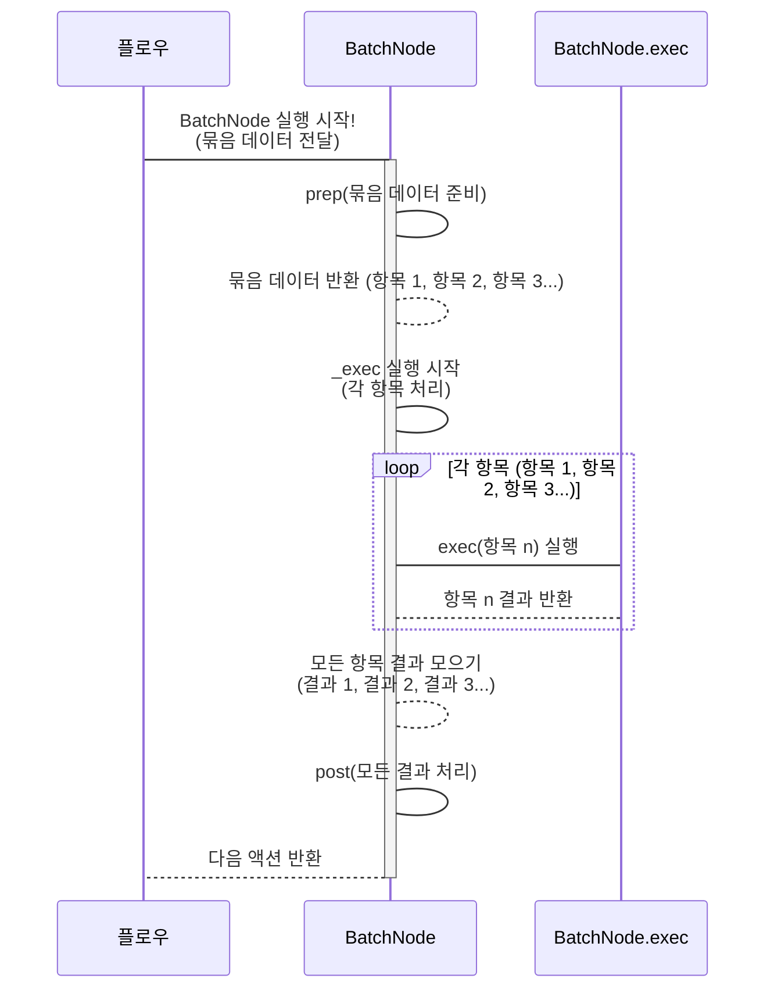
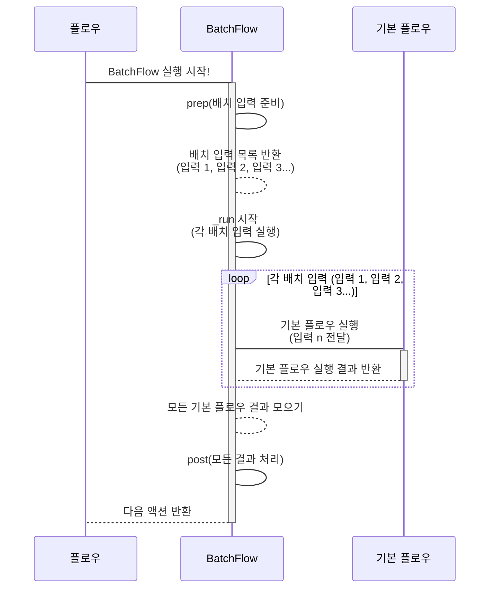

# Chapter 6: 배치 처리 (Batch Processing)

💖 한 번에 묶어서 효율적으로!

안녕하세요! PocketFlow 친구들! 😊

우리는 지금까지 PocketFlow의 세계를 여행하면서 정말 중요한 마법 도구들을 배웠어요! 🗺️ 우리 프로그램의 설계도인 [그래프 (Graph)](01_그래프__graph__.md), 그 지도 위에서 일하는 [노드 (Node)](02_노드__node__.md)들, 노드와 노드를 잇는 [액션 (Action)](03_액션__action__.md), 그리고 이 모든 것을 움직이는 용감한 여행자 [플로우 (Flow)](04_플로우__flow__.md)! 마지막으로 노드들이 데이터를 주고받는 마법 가방 [공유 저장소 (Shared Store)](05_공유_저장소__shared_store__.md)까지! ✨

이제 이 강력한 도구들을 가지고 좀 더 복잡하고 멋진 일들을 해볼 시간이에요! 지금까지는 데이터를 하나씩 처리하는 것을 주로 생각했지만, 실제 우리 주변에는 처리해야 할 데이터가 하나가 아니라 **여러 개! 그것도 아주 많이!** 있는 경우가 대부분이랍니다. 예를 들어, 이미지 수십 장을 동시에 필터링하거나, 수백 개의 문서를 한 번에 요약하거나, 여러 언어로 번역하는 작업 같은 거죠!

이런 작업들을 하나씩 따로따로 처리하면 너무 오래 걸리고 비효율적이겠죠? 🐌 그래서 필요한 마법이 바로! **"배치 처리 (Batch Processing)"** 랍니다! 🎉 배치 처리는 여러 개의 유사한 작업들을 **한 번에 묶어서** 처리해서 효율을 극대화하는 마법이에요! 마치 여러 개의 편지나 소포를 모아 한 번에 우체국에 가져가서 배송하는 것처럼요! 📮

자, 그럼 PocketFlow에서 여러 작업을 한 번에 묶어서 처리하는 배치 처리의 세계로 함께 들어가 볼까요? 묶음 배송 출발! 🔥

### 🤔 왜 '배치 처리'라는 묶음 배송이 필요할까요? 문제 상황 파헤치기!

음... 여러분, 우리가 멋진 LLM 애플리케이션을 만든다고 상상해봐요! 만약 사용자에게 이미지 파일을 100개 받아서 각각에 대해 '이미지 내용 설명'을 LLM에게 부탁해야 한다면 어떻게 해야 할까요?

지금까지 배운 대로라면 아마 이런 느낌일 거예요:

1.  첫 번째 이미지를 [공유 저장소 (Shared Store)](05_공유_저장소__shared_store__.md)에 넣고
2.  '이미지 내용 설명' [노드 (Node)](02_노드__node__.md)를 실행하고
3.  결과를 [공유 저장소 (Shared Store)](05_공유_저장소__shared_store__.md)에 저장하고
4.  두 번째 이미지를 [공유 저장소 (Shared Store)](05_공유_저장소__shared_store__.md)에 넣고
5.  '이미지 내용 설명' [노드 (Node)](02_노드__node__.md)를 실행하고
6.  결과를 [공유 저장소 (Shared Store)](05_공유_저장소__shared_store__.md)에 저장하고
7.  ... 이걸 100번 반복! 😵‍💫

와... 생각만 해도 힘 빠지죠? 😫 똑같은 작업을 100번이나 반복해야 한다니! 만약 처리할 이미지가 1000개, 10000개라면요? 이건 정말 비효율적이고, 무엇보다... 지루해요! 😩

특히 LLM API 호출 같은 작업은 한 번 호출할 때마다 시간이 좀 걸릴 수 있어요. 이걸 하나씩 순서대로 100번 호출한다면 전체 작업 시간이 너무 오래 걸릴 거예요. 마치 100개의 소포를 하나씩 들고 우체국에 100번 왕복하는 것처럼요!

이럴 때 필요한 게 바로 **여러 개의 소포를 한 번에 모아서 우체국에 가는 것**! 즉, 여러 데이터를 **한 묶음(batch)**으로 만들어서 똑같은 작업을 **한 번에 처리**하는 마법이에요! PocketFlow에서는 이 마법을 **배치 처리**라고 부르고, 이 일을 도와주는 특별한 친구들, 바로 **`BatchNode`**와 **`BatchFlow`**가 있답니다! 🌟

### ✨ 배치 처리, 너는 어떤 마법을 부리니? (개념 소개!)

PocketFlow에서 **배치 처리 (Batch Processing)** 는 여러 개의 개별 데이터 항목에 대해 **동일한 [노드 (Node)](02_노드__node__.md) 또는 [플로우 (Flow)](04_플로우__flow__.md)를 반복적으로 실행**하여 **효율성을 높이는 기능**이에요.

배치 처리는 크게 두 가지 방법으로 나눌 수 있어요! PocketFlow에서는 이 두 가지 방법을 위한 특별한 클래스를 제공한답니다.

1.  **`BatchNode`:** 이건 하나의 [노드 (Node)](02_노드__node__.md) 안에서 **여러 데이터 항목을 처리**할 때 사용해요. 마치 하나의 컨베이어 벨트 위에 여러 물건을 올려놓고 한 번에 같은 작업을 착착! 처리하는 똑똑한 기계 같은 거죠. ⚙️ `BatchNode`는 `Node` 클래스를 상속받아 만들어져서 기본적인 `prep`, `exec`, `post` 구조는 같지만, `_exec` 메서드가 여러 항목에 대해 `exec`를 반복 실행하고 `post`가 그 모든 결과를 한꺼번에 받는다는 특징이 있어요!
2.  **`BatchFlow`:** 이건 전체 [플로우 (Flow)](04_플로우__flow__.md) **전체를 여러 번 반복 실행**할 때 사용해요. 각 반복 실행은 하나의 '배치 항목'을 처리하죠. 마치 여러 대의 트럭에 각각의 짐(데이터 묶음)을 싣고, 각 트럭이 목적지까지 똑같은 배송 경로(플로우)를 따라가는 것 같아요. 🚚 `BatchFlow`는 `Flow` 클래스를 상속받아 만들어져서 기본적인 `start_node`나 연결 방식은 같지만, `_run` 메서드가 `prep`에서 얻은 여러 '배치 입력' 각각에 대해 내부 [플로우 (Flow)](04_플로우__flow__.md) (`_orch`)를 반복해서 실행시킨답니다!

두 친구 모두 **여러 항목을 효율적으로 처리**한다는 공통점이 있지만, `BatchNode`는 **'하나의 노드 안에서'** 처리하고, `BatchFlow`는 **'전체 또는 일부 플로우를 반복해서'** 실행시킨다는 차이가 있어요. 상황에 맞게 적절한 친구를 선택하면 된답니다! 😉

### 🍪 쿠키 생산 라인 (BatchNode) vs. 여러 대의 쿠키 공장 (BatchFlow) 비유!

배치 처리를 쿠키 만드는 것에 비유해 볼까요? 🍪

**`BatchNode` (쿠키 생산 라인):**
*   **컨베이어 벨트 위에 여러 개의 쿠키 반죽을 올려놔요.** (`prep`에서 여러 데이터 항목(쿠키 반죽) 목록을 준비)
*   **자동 설탕 뿌리는 기계가 쿠키 하나하나에 착착 설탕을 뿌려요.** (`_exec`가 각 항목에 대해 `exec` 메서드를 반복 실행)
*   **모든 쿠키에 설탕 뿌리기가 끝나면, 완성된 쿠키들이 한 번에 모여요.** (`post`가 모든 `exec` 결과(설탕 뿌려진 쿠키)를 한꺼번에 받아서 정리)
*   이건 하나의 노드(설탕 뿌리는 기계) 안에서 여러 쿠키(데이터 항목)를 처리하는 방식이에요!



**`BatchFlow` (여러 대의 쿠키 공장):**
*   **우리가 쿠키 레시피(기본 [플로우 (Flow)](04_플로우__flow__.md))를 하나 가지고 있어요.** (이미지 처리 플로우처럼)
*   **이번에는 쿠키를 여러 맛으로, 각 맛별로 대량 생산해야 해요! (예: 초코맛 100개, 바닐라맛 100개)** (`prep`에서 초코맛 레시피, 바닐라맛 레시피 등 여러 배치 입력(데이터 묶음) 목록을 준비)
*   **우리가 가진 쿠키 레시피(기본 플로우)를 초코맛 공장에도 주고, 바닐라맛 공장에도 줘요. 각 공장은 자기에게 주어진 레시피대로 쿠키를 생산해요.** (`BatchFlow`가 각 배치 입력에 대해 기본 [플로우 (Flow)](04_플로우__flow__.md)를 반복 실행)
*   **모든 공장에서 생산이 끝나면, 모든 쿠키가 한 곳에 모여서 포장돼요.** (`post`에서 모든 [플로우 (Flow)](04_플로우__flow__.md) 실행 결과를 모아서 최종 처리)
*   이건 여러 개의 독립적인 처리 과정(각 공장의 쿠키 생산)을 묶어서 실행하는 방식이에요!



어떤가요? `BatchNode`는 한 곳에서 여러 개를 처리하고, `BatchFlow`는 여러 개의 전체 처리 과정을 반복하는 느낌이죠? 😊

### 👩‍💻 `BatchNode` 맛보기 코드! (CSV 파일 덩어리 처리!)

`BatchNode`는 하나의 노드에서 큰 데이터 묶음(예: 거대한 CSV 파일)을 작은 덩어리(chunk)로 나눠서 효율적으로 처리할 때 유용해요. [`cookbook/pocketflow-batch-node/nodes.py`](cookbook/pocketflow-batch-node/nodes.py) 파일에 있는 `CSVProcessor` 예제를 간단하게 살펴볼까요? 이 노드는 거대한 CSV 파일을 일정 크기(chunk_size)로 잘라서(prep), 각 덩어리별로 필요한 계산(exec)을 한 후, 모든 덩어리의 계산 결과를 합쳐서(post) 최종 통계를 낸답니다!

```python
import pandas as pd
from pocketflow import BatchNode

class CSVProcessor(BatchNode):
    # 노드 초기화 (chunk_size 설정)
    def __init__(self, chunk_size=1000):
        super().__init__()
        self.chunk_size = chunk_size
        print(f"⚙️ [CSVProcessor] chunk_size {self.chunk_size}로 설정됨.") # 추가 출력

    # 1. prep 단계: shared 저장소에서 파일 경로를 읽어와서 CSV 파일을 chunk로 나누고 iterator 반환
    # BatchNode에서는 prep의 결과가 _exec 메서드로 전달되고, _exec는 이 iterator의 각 항목에 대해 exec를 실행해요!
    def prep(self, shared):
        file_path = shared.get("input_file")
        if not file_path: raise ValueError("input_file must be provided in shared store")
        print(f"➡️ [CSVProcessor] 파일 '{file_path}' 읽어서 chunk로 나눌 준비.")
        
        # pandas의 read_csv 기능을 사용해서 파일을 chunk_size만큼 나눠서 읽는 iterator를 만들어요.
        # 이 iterator의 각 chunk(DataFrame)가 BatchNode의 _exec로 전달되고, 
        # _exec는 각 chunk에 대해 아래 exec 메서드를 호출해요!
        chunks_iterator = pd.read_csv(file_path, chunksize=self.chunk_size)
        return chunks_iterator # iterator를 반환! BatchNode의 _exec가 이걸 받아요!

    # 2. exec 단계: BatchNode의 _exec에 의해 호출되며, '하나의 chunk'를 받아서 처리
    # BatchNode의 _exec는 prep가 반환한 iterator의 각 항목(여기서는 chunk)을
    # 하나씩 꺼내서 이 exec 메서드에 전달해요!
    def exec(self, chunk):
        # chunk는 pandas DataFrame 객체예요. 여기서는 각 chunk의 총 매출과 거래 수를 계산해요.
        total_sales_in_chunk = chunk["amount"].sum()
        num_transactions_in_chunk = len(chunk)
        print(f"⚙️ [CSVProcessor.exec] chunk 처리: {num_transactions_in_chunk}건, 합계 {total_sales_in_chunk}")
        
        # 이 exec의 결과는 BatchNode의 _exec에 의해 리스트로 모아져서 post 메서드로 전달돼요!
        return {"total_sales": total_sales_in_chunk, "num_transactions": num_transactions_in_chunk}

    # 3. post 단계: BatchNode의 _exec가 모든 exec 호출 결과를 모아놓은 리스트를 받아서 처리
    # post 메서드의 세 번째 인자 exec_res_list는 모든 exec 호출 결과의 리스트예요!
    def post(self, shared, prep_res, exec_res_list):
        print(f"✅ [CSVProcessor] 모든 chunk 처리 완료. 결과 {len(exec_res_list)}개 모음.")
        # exec_res_list는 [{... chunk1 결과 ...}, {... chunk2 결과 ...}, ...] 형태예요.
        # 여기서 모든 chunk의 결과를 합쳐서 최종 통계를 계산해요.
        total_sales_all = sum(res["total_sales"] for res in exec_res_list)
        total_transactions_all = sum(res["num_transactions"] for res in exec_res_list)
        
        # 최종 결과를 shared 저장소에 저장해요.
        shared["statistics"] = {
            "total_sales": total_sales_all,
            "total_transactions": total_transactions_all
            # 평균 매출 같은 다른 통계도 계산해서 저장할 수 있겠죠?
        }
        print(f"✅ [CSVProcessor] 최종 통계 shared['statistics']에 저장됨: {shared['statistics']}")
        
        # 다음 노드로 갈 액션을 반환해요.
        return "show_stats" # 예를 들어 '통계 보여주기' 노드로 연결될 수 있어요.

# 이 노드를 Flow에 연결하고 shared에 input_file 경로를 넣어서 run()하면 작동해요!
# (Flow 연결 및 실행 코드는 간결하게 생략합니다 😉)
# Example:
# csv_node = CSVProcessor(chunk_size=500) # 500줄씩 처리!
# flow = Flow().start(csv_node)
# flow.run({"input_file": "large_sales_data.csv"}) # shared에 파일 경로 전달!
```

**코드 설명:**

*   `class CSVProcessor(BatchNode):`: `BatchNode`를 상속받아 배치 처리가 가능한 노드를 만들어요.
*   `def prep(self, shared):`: 여기서는 `pd.read_csv(..., chunksize=self.chunk_size)`를 사용해서 CSV 파일을 `chunk_size` 만큼 덩어리로 나눠서 읽는 **이터레이터(iterator)**를 반환해요. 이 이터레이터가 `BatchNode`의 특별한 `_exec` 메서드에게 전달된답니다.
*   `def exec(self, chunk):`: 이 메서드는 `BatchNode`의 `_exec`에 의해 **이터레이터에서 넘어오는 '하나의 덩어리(chunk)'**를 인자로 받아서 처리해요. 여기서 각 덩어리별 계산을 수행하고 결과를 반환하죠. 중요한 건 `exec`는 한 번에 **하나의 항목**만 처리한다는 거예요!
*   `BatchNode`의 **숨겨진 마법 (`_exec`)**: 우리가 직접 보지는 않지만, `BatchNode` 내부의 `_exec` 메서드는 `prep`가 반환한 이터레이터를 돌면서 각 항목(chunk)을 꺼내 `exec` 메서드를 반복 호출해줘요! 그리고 각 `exec` 호출이 반환하는 결과들을 **리스트(list)**로 모아놓는답니다!
*   `def post(self, shared, prep_res, exec_res_list):`: 여기서는 `BatchNode`의 `_exec`가 모아놓은 **모든 `exec` 결과의 리스트(`exec_res_list`)**를 받아요. 이제 이 리스트를 돌면서 최종 결과를 계산하고 [공유 저장소 (Shared Store)](05_공유_저장소__shared_store__.md)에 저장하거나 다음 노드로 전달할 수 있죠.

`BatchNode` 덕분에 우리는 큰 파일을 직접 다루지 않고도, `prep`에서 덩어리로 나누고, `exec`에서 '하나의 덩어리'만 처리하는 로직을 짜고, `post`에서 '모든 덩어리의 결과'를 모으는 방식으로 아주 깔끔하게 배치 처리를 구현할 수 있어요!

### 👩‍💻 `BatchFlow` 맛보기 코드! (여러 이미지에 여러 필터 적용!)

`BatchFlow`는 이미 만들어진 [플로우 (Flow)](04_플로우__flow__.md) (또는 노드 하나)를 여러 개의 다른 입력으로 **여러 번 반복 실행**할 때 유용해요. [`cookbook/pocketflow-batch-flow/flow.py`](cookbook/pocketflow-batch-flow/flow.py) 예제를 간단하게 살펴볼까요? 이 예제는 이미지를 불러오고(LoadImage), 필터를 적용하고(ApplyFilter), 저장하는(SaveImage) 기본 [플로우 (Flow)](04_플로우__flow__.md)를 만들고, 이 기본 플로우를 여러 개의 이미지 파일과 여러 개의 필터 조합 각각에 대해 반복해서 실행한답니다!

```python
from pocketflow import Flow, BatchFlow
# LoadImage, ApplyFilter, SaveImage 노드가 정의되어 있다고 상상해요!
# from nodes import LoadImage, ApplyFilter, SaveImage

# 단일 이미지 처리를 위한 기본 플로우를 만드는 함수
def create_base_flow():
    # 이미지를 불러오는 노드, 필터를 적용하는 노드, 이미지를 저장하는 노드
    load_node = LoadImage()
    filter_node = ApplyFilter()
    save_node = SaveImage()
    
    # 노드들을 액션으로 연결해요.
    # LoadImage 노드가 끝나고 'apply_filter' 액션으로 ApplyFilter 노드로 이동
    load_node - "apply_filter" >> filter_node
    # ApplyFilter 노드가 끝나고 'save' 액션으로 SaveImage 노드로 이동
    filter_node - "save" >> save_node
    
    # LoadImage 노드를 시작 노드로 하는 기본 플로우를 반환해요.
    return Flow(start=load_node) # 단일 이미지 처리를 위한 기본 Flow 객체!

# 여러 이미지와 여러 필터 조합을 배치 처리하는 BatchFlow
class ImageBatchFlow(BatchFlow):
    # BatchFlow의 prep 단계: 어떤 배치 입력들로 기본 플로우를 반복 실행할지 목록을 반환해요.
    def prep(self, shared):
        print("➡️ [ImageBatchFlow] 배치 입력 준비 중...")
        # 처리할 이미지 파일 목록
        images = shared.get("images", ["cat.jpg", "dog.jpg"]) # shared에서 이미지 목록 가져옴
        # 적용할 필터 목록
        filters = shared.get("filters", ["grayscale", "blur"]) # shared에서 필터 목록 가져옴
        
        # 모든 이미지와 필터 조합을 만듭니다. 각 조합이 기본 플로우의 '하나의 배치 입력'이 될 거예요.
        # 각 조합은 딕셔너리 형태로, 이 딕셔너리가 기본 플로우 실행 시 shared에 합쳐지거나 params로 전달됩니다.
        params_list = []
        for img in images:
            for f in filters:
                params_list.append({
                    "input_image_name": img, # 기본 플로우의 LoadImage 노드가 이 키를 사용해서 이미지 파일을 찾을 거예요.
                    "filter_type": f         # 기본 플로우의 ApplyFilter 노드가 이 키를 사용해서 필터 종류를 알 거예요.
                })
                print(f"   - 조합 추가: 이미지 '{img}', 필터 '{f}'")
                
        print(f"✅ [ImageBatchFlow] 총 {len(params_list)}개의 배치 입력 준비 완료.")
        # prep가 반환한 이 params_list의 각 항목에 대해 BatchFlow는 start=로 설정된 기본 플로우를 실행해요!
        return params_list # 배치 입력 목록 반환!

    # post 단계: 모든 기본 플로우 실행이 끝난 후에 최종 처리를 해요.
    # BatchFlow에서는 post의 세 번째 인자 exec_res는 보통 None이에요.
    # 각 기본 플로우 실행 결과는 shared에 쌓이도록 기본 플로우 노드들이 구현되어 있어야 해요!
    def post(self, shared, prep_res, exec_res):
        print("🎉 [ImageBatchFlow] 모든 이미지/필터 조합 처리 완료!")
        # 예를 들어, shared에 저장된 결과 목록을 정리하거나 최종 메시지를 출력할 수 있어요.
        processed_count = len(prep_res) # prep_res는 BatchFlow의 prep이 반환한 params_list와 같아요!
        print(f"📊 [ImageBatchFlow] 총 {processed_count}개의 작업이 실행되었습니다.")
        # shared 저장소에는 각 기본 플로우 실행이 저장한 최종 이미지 파일 이름 같은 정보가 쌓여 있을 거예요.
        # print(f" 최종 결과들이 shared에 저장되었을 것입니다: {shared.keys()}") # 실제 shared 내용 출력 가능
        
        return "finished_batch_processing" # 다음 노드로 갈 액션 반환

# 전체 배치 처리 플로우를 만드는 함수
def create_flow():
    # 먼저 단일 이미지 처리 기본 플로우를 만듭니다.
    base_flow_instance = create_base_flow()
    
    # 이 기본 플로우를 start=로 설정하여 BatchFlow로 감쌉니다!
    # BatchFlow의 _run 메서드는 이 base_flow_instance를 prep에서 반환한 배치 입력 각각에 대해 실행해요!
    batch_flow_instance = ImageBatchFlow(start=base_flow_instance)
    
    return batch_flow_instance

# 이 BatchFlow를 Flow에 연결하고 shared에 images, filters 목록을 넣어서 run()하면 작동해요!
# (Flow 연결 및 실행 코드는 간결하게 생략합니다 😉)
# Example:
# my_batch_flow = create_flow()
# initial_shared = {"images": ["photo1.jpg", "photo2.png"], "filters": ["sepia", "invert"]}
# my_batch_flow.run(initial_shared) # shared에 처리할 목록 전달!
```

**코드 설명:**

*   `def create_base_flow():`: 이 함수는 **단일 이미지**에 대해 '불러오기 -> 필터 적용 -> 저장' 작업을 수행하는 기본적인 [플로우 (Flow)](04_플로우__flow__.md)를 만들어요. 이 플로우는 마치 쿠키 레시피 같아요!
*   `class ImageBatchFlow(BatchFlow):`: `BatchFlow`를 상속받아 여러 이미지와 필터를 처리할 배치 플로우를 만들어요.
*   `def prep(self, shared):`: 여기서는 `shared` 저장소에서 처리할 이미지 목록과 필터 목록을 가져와서, 이 두 목록의 **모든 조합**을 만들어요. 각 조합(딕셔너리)이 `BatchFlow`가 반복 실행할 때 사용할 **'하나의 배치 입력'**이 된답니다! 이 '배치 입력' 목록을 반환해요.
*   `BatchFlow(start=base_flow_instance)`: `BatchFlow` 객체를 만들 때 `start` 인자로 **방금 만든 단일 처리 기본 [플로우 (Flow)](04_플로우__flow__.md)**를 넘겨줘요. 이것이 `BatchFlow`가 반복해서 실행할 대상이에요!
*   `BatchFlow`의 **숨겨진 마법 (`_run`)**: 우리가 직접 보지는 않지만, `BatchFlow` 내부의 `_run` 메서드는 `prep`가 반환한 **배치 입력 목록**을 돌면서 각 배치 입력 딕셔너리를 가지고 `start`로 지정된 기본 [플로우 (Flow)](04_플로우__flow__.md)의 `_orch` 메서드를 **반복 호출**해줘요! 각 반복 실행 시에는 해당 배치 입력 딕셔너리의 내용이 기본 플로우의 `shared` 저장소에 합쳐지거나 노드의 `params`로 전달되어 사용될 수 있도록 한답니다.
*   `def post(self, shared, prep_res, exec_res):`: 이 메서드는 `BatchFlow`가 **모든 기본 [플로우 (Flow)](04_플로우__flow__.md) 반복 실행을 마친 후**에 호출돼요. 여기서 모든 반복 실행을 통해 [공유 저장소 (Shared Store)](05_공유_저장소__shared_store__.md)에 쌓인 결과들을 최종적으로 정리하거나 확인하는 작업을 할 수 있어요.

`BatchFlow` 덕분에 우리는 복잡한 '여러 이미지 x 여러 필터 조합' 처리를 직접 반복문으로 짜지 않고도, 기본 '이미지 하나 처리' [플로우 (Flow)](04_플로우__flow__.md)만 잘 만들고, `BatchFlow`의 `prep`에서 '어떤 조합으로 반복할지' 목록만 잘 넘겨주면 PocketFlow가 알아서 반복 실행해주는 거죠! 정말 편리하죠? 😍

### 🗺️ PocketFlow 예제에서 배치 처리 찾아보기!

PocketFlow GitHub 저장소의 예제들은 `BatchNode`와 `BatchFlow`를 활용해서 다양한 배치 처리를 보여준답니다!

*   **Batch 예제** [`cookbook/pocketflow-batch/main.py`](cookbook/pocketflow-batch/main.py): 이 예제는 `TranslateTextNode`라는 **`BatchNode`**를 사용해요. 이 노드는 `prep`에서 하나의 원본 텍스트를 여러 개의 다른 언어와 조합한 **배치 입력 목록** (예: `[(텍스트, 한국어), (텍스트, 스페인어), (텍스트, 일본어), ... ]`)을 만들고, `exec`는 이 **하나의 조합** (예: `(텍스트, 한국어)`)을 받아서 해당 언어로 **번역하는 LLM 호출**을 수행해요. 그리고 `post`에서는 **모든 번역 결과**를 받아서 각 언어별 파일로 저장하죠! 하나의 노드 안에서 여러 번역 작업을 효율적으로 처리하는 `BatchNode`의 좋은 예시입니다. 👍
*   **Batch Flow 예제** [`cookbook/pocketflow-batch-flow/flow.py`](cookbook/pocketflow-batch-flow/flow.py): 위에서 살펴본 이미지 처리 예제가 바로 이 파일에 있답니다! `create_base_flow()`로 단일 이미지 처리 [플로우 (Flow)](04_플로우__flow__.md)를 정의하고, `ImageBatchFlow(start=base_flow)` 형태로 `BatchFlow`를 만들어서 여러 이미지-필터 조합에 대해 이 기본 플로우를 반복 실행하죠. 여러 데이터 항목에 대해 **전체 플로우를 반복 실행**하는 `BatchFlow`의 전형적인 예시입니다. 🖼️
*   **Map Reduce 예제** [`cookbook/pocketflow-map-reduce/nodes.py`](cookbook/pocketflow-map-reduce/nodes.py): 이 예제는 **`BatchNode`**를 사용해서 여러 개의 이력서 파일을 효율적으로 평가하는 방법을 보여줘요. `ReadResumesNode`가 모든 이력서 파일을 읽어와서 [공유 저장소 (Shared Store)](05_공유_저장소__shared_store__.md)에 저장하면, `EvaluateResumesNode`라는 **`BatchNode`**가 `prep`에서 이 이력서 목록을 가져와 **배치 입력** (각 이력서 파일 내용)으로 만들어요. `exec`는 이력서 **하나**를 받아서 자격 요건을 평가하는 LLM 호출을 수행하고, `post`는 **모든 이력서의 평가 결과**를 모아서 다시 [공유 저장소 (Shared Store)](05_공유_저장소__shared_store__.md)에 저장한답니다. 마지막 `ReduceResultsNode`가 이 결과를 읽어서 최종 통계를 내죠. 여기서 `EvaluateResumesNode`가 여러 개의 이력서 평가라는 유사 작업을 한 번에 묶어 처리하는 `BatchNode` 역할을 아주 잘 보여주고 있어요! 📁

이 예제들을 살펴보면 여러분도 PocketFlow의 `BatchNode`와 `BatchFlow`를 활용해서 대량의 데이터를 효율적으로 처리하는 방법을 익힐 수 있을 거예요!

### 📝 오늘 배운 내용 요약!

와~ 🎉 오늘 우리는 여러 개의 유사한 작업을 한 번에 묶어서 효율을 높이는 마법! **배치 처리 (Batch Processing)** 와 PocketFlow의 특별한 친구들, **`BatchNode`**와 **`BatchFlow`**에 대해 신나게 알아보았어요!

*   **배치 처리**는 여러 데이터 항목에 대해 **동일한 [노드 (Node)](02_노드__node__.md) 또는 [플로우 (Flow)](04_플로우__flow__.md)를 반복 실행**해서 작업을 효율적으로 만드는 기능이에요.
*   **`BatchNode`**는 **하나의 노드 안에서** 여러 데이터 항목을 처리해요. `prep`에서 처리할 항목 목록/이터레이터를 반환하고, `exec`는 **하나의 항목**을 처리하며, `post`는 **모든 `exec` 결과 리스트**를 받아서 최종 처리해요.
*   **`BatchFlow`**는 **전체 또는 일부 [플로우 (Flow)](04_플로우__flow__.md)를 여러 번 반복 실행**해요. `prep`에서 반복 실행할 때 사용할 **배치 입력 목록**을 반환하고, `BatchFlow`는 이 목록의 각 항목에 대해 `start`로 지정된 기본 [플로우 (Flow)](04_FLow__flow__.md)를 실행해요. `post`는 모든 반복 실행이 끝난 후에 호출됩니다.
*   `BatchNode`와 `BatchFlow` 모두 대량의 데이터를 효율적으로 처리할 때 아주 유용하답니다! 👍

이제 PocketFlow의 배치 처리 마법을 사용해서 여러 작업을 한 번에 묶어 효율적으로 처리하는 방법을 확실하게 알게 되었어요! 정말 잘하셨어요! 👍

### 💖 다음 이야기: 기다리지 않고 동시에! 비동기 처리!

배치 처리를 통해 여러 작업을 묶어서 처리하는 방법을 배웠어요! 그런데 만약 묶어서 처리하는 작업들이 서로 기다릴 필요가 없다면 어떨까요? 예를 들어 100개의 이미지를 번역하는데, 첫 번째 이미지가 번역될 때까지 두 번째 이미지는 그냥 기다리고만 있는 게 아니라, 첫 번째 이미지 번역과 **동시에** 번역을 시작할 수 있다면 훨씬 더 빠르지 않을까요? 💨

다음 챕터에서는 이렇게 여러 작업을 **동시에 시작해서 먼저 끝나는 것부터 결과를 처리**하는 마법! 바로 **비동기 처리 (Async Processing)** 에 대해 파헤쳐 볼 거예요! 기다림 없이 여러 일을 동시에 처리하면 얼마나 강력해질까요? 기대되죠? 😉

그럼 다음 챕터에서 만나요! 안녕! 👋

[비동기 처리 (Async Processing) 알아보기!](07_비동기_처리__async_processing__.md)

---

Generated by [AI Codebase Knowledge Builder](https://github.com/The-Pocket/Tutorial-Codebase-Knowledge)