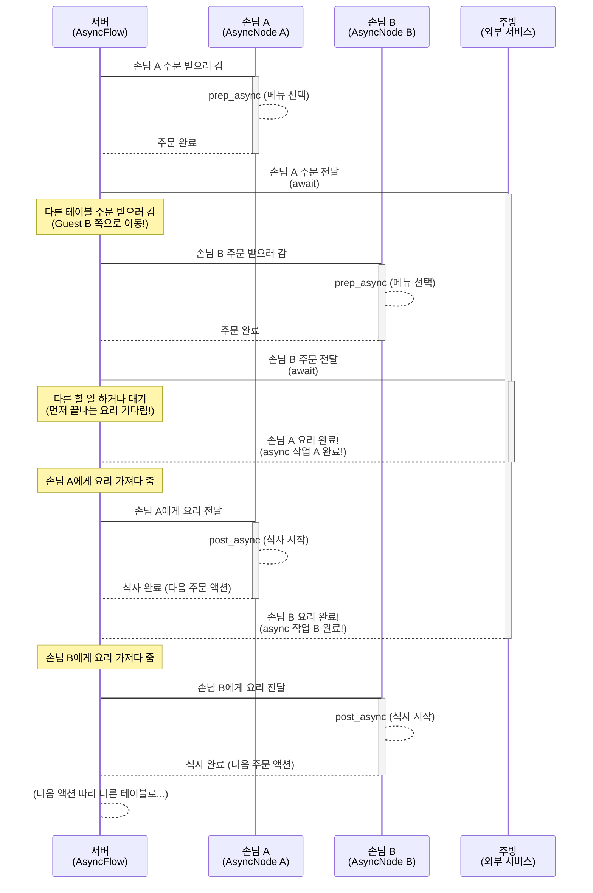
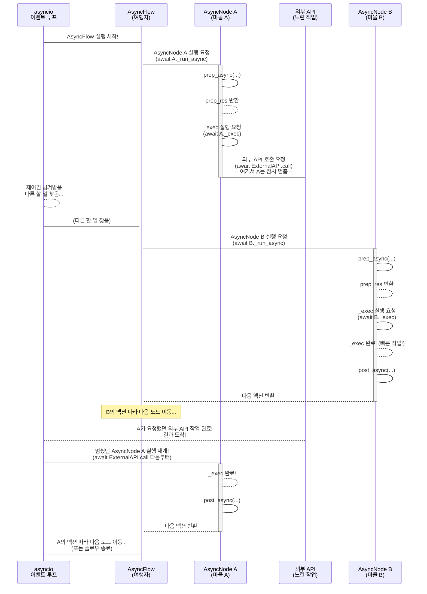

# Chapter 7: 비동기 처리 (Async Processing)


💖 기다리지 않고 동시에!

안녕하세요! PocketFlow 친구들! 😊

우리는 지난 챕터에서 여러 개의 똑같은 작업을 한 번에 묶어서 효율적으로 처리하는 마법, [배치 처리 (Batch Processing)](06_배치_처리__batch_processing__.md)에 대해 신나게 배웠어요! 수십, 수백 개의 데이터를 처리할 때 정말 유용한 기술이었죠? 🎉

그런데 말이에요, 우리가 처리하는 작업들 중에는 시간이 오래 걸리는 것들이 꽤 많아요. 특히 인터넷 너머에 있는 친구들(예: LLM API 서버, 웹사이트)에게 뭔가를 물어보고 답변을 기다리는 작업(우리가 '입출력 작업' 또는 'I/O 바운드 작업'이라고 불러요!)은 우리 프로그램이 그 응답을 받을 때까지 멍하니 기다려야만 할 때가 많답니다. 🐌

만약 처리해야 할 작업이 10개인데, 각 작업마다 LLM API를 호출해야 하고 그 응답을 기다리는 데 1초씩 걸린다면, 이 10개의 작업을 순서대로 처리하면 최소 10초라는 시간이 걸릴 거예요. 첫 번째 작업의 LLM 응답을 기다리는 동안, 두 번째 작업은 시작조차 못 하고 기다리고만 있는 거죠. 너무 비효율적이지 않나요? 😥

이럴 때 필요한 마법이 바로 오늘 우리가 배울 **"비동기 처리 (Async Processing)"** 랍니다! ✨ 비동기 처리는 시간이 오래 걸리는 작업을 시켜놓고 그게 끝날 때까지 **기다리지 않고** 다른 일을 먼저 하러 가는 방식이에요! 마치 여러 개의 주문을 받은 레스토랑 서버가 첫 번째 테이블 음식이 나올 때까지 주방 앞에서 기다리지 않고, 다른 테이블 주문도 받고, 물도 가져다주는 것처럼요! 🏃‍♀️🏃‍♂️

자, 그럼 PocketFlow에서 기다림 없이 여러 일을 동시에 처리하는 비동기 처리의 세계로 함께 들어가 볼까요? 신나게 출발! 🔥

### 🤔 왜 '기다리지 않는 마법'이 필요할까요? 문제 상황 파헤치기!

우리가 만들고 싶은 멋진 LLM 애플리케이션 중에 이런 게 있다고 상상해봐요!

사용자가 질문을 입력하면,
1.  질문 내용을 바탕으로 웹 검색을 해서 최신 정보를 찾아보고,
2.  찾은 정보를 LLM에게 주면서 질문에 대한 답변을 만들어 달라고 부탁하고,
3.  마지막으로 사용자에게 멋진 답변을 보여주는 에이전트! 🤖

이 과정에는 시간이 오래 걸릴 수 있는 작업이 두 가지나 있어요!

*   **웹 검색:** 인터넷 너머의 웹사이트에 요청을 보내고 결과를 받을 때까지 시간이 걸려요. (네트워크 통신)
*   **LLM API 호출:** LLM 서버에 질문을 보내고 답변을 받을 때까지 시간이 걸려요. (네트워크 통신)

만약 이런 작업들을 우리가 지금까지 배운 기본적인 방식([노드 (Node)](02_노드__node__.md)의 `exec` 메서드 안에서 코드를 순서대로 실행하고, 그 코드가 끝날 때까지 다음 줄로 넘어가지 않는 방식)으로 처리한다면 어떻게 될까요?

1.  **웹 검색 시작!** 코드가 웹사이트에 요청을 보냅니다.
2.  **기다림... 🐌** 웹사이트에서 결과가 올 때까지 프로그램은 아무것도 하지 않고 그냥 기다립니다. 코드가 여기서 멈춰 있어요!
3.  **웹 검색 결과 도착!** 드디어 결과가 왔으니 다음 코드로 넘어갑니다.
4.  **LLM API 호출 시작!** 코드가 LLM 서버에 요청을 보냅니다.
5.  **또 기다림... 🐢** LLM 서버에서 답변이 올 때까지 프로그램은 또 아무것도 하지 않고 기다립니다. 코드가 여기서 또 멈춰 있어요!
6.  **LLM 답변 도착!** 드디어 답변이 왔으니 다음 코드로 넘어갑니다.
7.  **답변 가공 및 출력!**

보세요! 웹 검색을 기다리고, LLM 답변을 기다리는 동안 프로그램은 아무런 유용한 일을 하지 못하고 멍하니 시간만 보내고 있죠? 낭비되는 시간이 너무 많아요! 특히 여러 사용자 요청을 동시에 처리해야 하거나, 하나의 작업 안에서 여러 LLM 호출이나 웹 검색을 병렬로 수행해야 할 때는 이 기다림 때문에 전체 성능이 크게 저하될 거예요! 📉

이럴 때 필요한 게 바로 **시간이 오래 걸리는 작업을 시켜놓고, 그게 끝날 때까지 기다리는 대신 다른 유용한 일을 먼저 하러 가는 마법**! 바로 **비동기 처리**랍니다! ✨

### ✨ 비동기 처리, 너는 어떤 마법을 부리니? (개념 소개!)

PocketFlow에서 **비동기 처리 (Async Processing)** 는 프로그램이 입출력(I/O) 작업처럼 시간이 오래 걸리는 작업을 만났을 때, 해당 작업이 완료될 때까지 **기다리는 대신 다른 작업을 수행**할 수 있도록 해주는 방식이에요.

이 마법을 가능하게 하는 파이썬의 특별한 친구들이 있어요. 바로 `asyncio` 라이브러리와 `async def`, `await` 키워드랍니다!

*   **`async def`:** '나는 비동기적으로 실행될 수 있는 함수입니다!' 라고 선언하는 마법의 주문이에요. 이런 함수 안에서는 중간에 잠깐 멈춰서 다른 함수가 실행될 수 있도록 양보하는 `await`를 사용할 수 있답니다. 일반 `def` 함수는 시작하면 끝날 때까지 멈추지 않아요!
*   **`await`:** '자, 이 작업(`await` 뒤에 오는 것)은 시간이 좀 걸릴 수 있으니, 일단 여기서 잠시 **멈춰서 다른 함수들이 먼저 실행되도록 양보**할게. 그러다 내가 기다리던 작업이 끝나면 그때 다시 돌아와서 다음 줄을 실행할게!' 라고 알려주는 마법의 키워드예요. 주로 네트워크 통신, 파일 읽기/쓰기 등 오래 걸리는 입출력 작업 앞에 붙여서 사용해요. `await`는 반드시 `async def` 함수 안에서만 사용할 수 있답니다!

PocketFlow에서는 이 비동기 처리를 위해 특별한 친구들을 제공해요.

1.  **`AsyncNode`:** 이건 비동기 작업 처리를 위해 만들어진 [노드 (Node)](02_노드__node__.md)의 특별 버전이에요! 일반 `Node`의 `prep`, `exec`, `post` 메서드 대신 `prep_async`, `exec_async`, `post_async`라는 **`async def`로 정의된 메서드**들을 사용해요. 이 메서드들 안에서 `await`를 사용해서 시간이 오래 걸리는 비동기 작업을 호출할 수 있답니다! 🤖 (예: `await call_llm_async(...)`)
2.  **`AsyncFlow`:** 이건 `AsyncNode`들을 실행시키기 위한 특별한 [플로우 (Flow)](04_플로우__flow__.md)예요! 일반 `Flow`는 순차적으로 노드를 실행하지만, `AsyncFlow`는 `asyncio`의 힘을 빌려 `AsyncNode`들의 비동기 메서드들을 실행하고, `await` 지점에서 멈춰서 다른 `AsyncNode`가 실행되도록 관리해줘요. `AsyncFlow` 자체도 비동기적으로 실행되기 때문에 `await flow.run_async(...)`처럼 `await`와 함께 호출해야 한답니다! 🚀

비동기 처리를 사용하면, 웹 검색 요청을 보내고 응답을 기다리는 동안 LLM 호출 요청을 보내고, 둘 다 시켜놓은 상태로 또 다른 작업을 할 수 있어요. 먼저 응답이 오는 것부터 처리하면 된답니다! 마치 레스토랑 서버가 여러 테이블 주문을 동시에 주방에 전달하고, 주방에서는 여러 음식을 동시에 요리해서 먼저 완성된 음식부터 서버에게 주는 것처럼요! 🍽️

### 🚦 레스토랑 서버 비유로 보는 비동기 처리!

레스토랑 서버가 손님들의 주문을 처리하는 과정을 비동기 처리에 비유해볼까요? 🧑‍💼

*   **서버 (AsyncFlow):** 여러 테이블을 돌아다니며 주문을 받고, 주방에 전달하고, 완성된 음식을 가져다주는 역할을 해요. 서버는 한 테이블 손님이 음식을 다 먹을 때까지 옆 테이블에 가지 않고 기다리지 않아요!
*   **테이블 손님 (AsyncNode):** 주문하고(prep_async), 요리를 기다리고(await exec_async), 음식을 먹고(post_async) 다음 주문을 하는 개별적인 작업 단위예요. 손님(AsyncNode)은 주문한 음식이 나오기를 기다리는 동안(await) 다른 손님들이 주문하거나 음식을 먹는 것에 영향을 주지 않아요.
*   **주방 (외부 시스템, 예: LLM API, 웹 검색):** 주문받은 요리를 실제로 하는 곳이에요. 여러 요리를 동시에 할 수 있어요. (병렬성은 아니지만, 서버 입장에서는 동시에 여러 요리가 진행되는 것처럼 느껴져요!)
*   **요리 시간 (시간이 오래 걸리는 작업):** 주방에서 요리하는 시간. 서버는 이 시간이 걸리는 동안 다른 테이블 일을 봐요.



보세요! 서버(AsyncFlow)는 손님 A의 요리가 끝날 때까지 기다리지 않고 손님 B의 주문을 받았어요! 그리고 두 요리 모두 시켜놓은 상태에서 먼저 끝나는 요리(손님 A)를 가져다주는 일을 먼저 처리했죠. 비동기 처리가 바로 이런 느낌이랍니다! 👍

### 🧠 PocketFlow 안에서 비동기 처리는 어떻게 움직일까?

`AsyncNode`와 `AsyncFlow`가 비동기적으로 움직이는 과정은 일반 [노드 (Node)](02_노드__node__.md)와 [플로우 (Flow)](04_플로우__flow__.md)의 움직임과 비슷하지만, '기다리는 대신 다른 일을 하는' 부분이 추가돼요!

1.  **`AsyncFlow` 시작!** `AsyncFlow`는 `await flow.run_async(shared)`처럼 비동기 컨텍스트 안에서 실행돼요.
2.  **`AsyncNode` 도착!** `AsyncFlow`가 `AsyncNode`를 만나면, 일반 노드처럼 그 노드의 `_run_async` 메서드를 호출해요. (`await curr._run_async(shared)`) 왜 `await`가 붙었을까요? `_run_async`가 `async def` 함수이기 때문이에요!
3.  **`AsyncNode` 작업 중 & `await` 만남!** `_run_async`는 `prep_async`, `_exec` (이것도 비동기!), `post_async`를 순서대로 `await` 하며 호출해요.
    *   `prep_async(shared)`: 필요한 데이터 준비 (비동기적으로 가능)
    *   `_exec(prep_res)`: 핵심 작업 실행. 이 안에서 시간이 오래 걸리는 외부 비동기 작업(`await call_llm_async(...)`)을 만날 수 있어요!
        *   **`await` 발동!** 만약 `exec_async` 메서드 안에서 `await` 키워드를 만나면, 현재 노드(와 플로우)는 잠시 실행을 **멈추고** 파이썬의 `asyncio` 이벤트 루프에게 제어권을 넘겨줘요. "나 잠시 기다릴게. 그동안 다른 할 일 있으면 해!" 하고 말이죠.
        *   **다른 작업 실행!** `asyncio`는 이때 다른 `AsyncNode`나 다른 비동기 작업이 할 일이 있는지 살펴보고, 있다면 그 작업을 실행시켜요.
        *   **작업 완료 & 돌아오기!** 기다리던 비동기 작업(LLM 응답 같은)이 끝나면, `asyncio`는 다시 멈췄던 원래 `AsyncNode`로 돌아와서 `await` 다음 줄부터 실행을 재개해요.
    *   `post_async(shared, prep_res, exec_res)`: 결과 정리 및 다음 액션 반환 (비동기적으로 가능)
4.  **다음 `AsyncNode`로 이동!** `post_async`가 반환한 액션 이름을 보고 `AsyncFlow`는 다음 `AsyncNode`를 찾아 `await`와 함께 호출하며 이동해요.

이 모든 과정은 `AsyncFlow`와 `asyncio`가 관리해주기 때문에 우리는 `AsyncNode`의 `prep_async`, `exec_async`, `post_async` 메서드 안에서 필요한 곳에 `await`만 잘 붙여주면 된답니다!



복잡해 보이지만 핵심은 이거예요: `AsyncNode A`가 외부 API 호출처럼 시간이 오래 걸리는 `await` 작업을 만나면, 잠시 멈춰서(deactivate AsyncNodeA) 제어권을 `asyncio` 이벤트 루프에게 넘겨줘요. `asyncio`는 그동안 놀고 있지 않고 `AsyncNode B` 같은 다른 할 일을 찾아서 실행하죠! 그러다 A가 기다리던 외부 API 작업이 끝나면, `asyncio`가 다시 A를 활성화시켜서 멈췄던 곳부터 마무리를 짓게 해준답니다! 💨

### 👩‍💻 비동기 노드 (`AsyncNode`) 맛보기 코드! (LLM 호출 기다리기!)

시간이 오래 걸리는 LLM API 호출을 기다리는 `AsyncNode` 예제를 간단하게 살펴볼까요? [`cookbook/pocketflow-async-basic/nodes.py`](cookbook/pocketflow-async-basic/nodes.py) 파일에 있는 `SuggestRecipe` 노드와 비슷하지만, 핵심만 뽑아왔어요!

```python
from pocketflow import AsyncNode
import asyncio # 비동기 작업을 위해 필요해요!
# 외부에서 LLM API를 비동기적으로 호출하는 함수가 있다고 상상해요!
# async def call_llm_async(prompt): ... # 이 함수는 await 가능해요!

class AsyncLLMCallNode(AsyncNode):
    # 1. prep_async 단계: shared 저장소에서 필요한 데이터 준비 (비동기 가능)
    async def prep_async(self, shared):
        user_prompt = shared.get("user_prompt", "레시피 추천해줘.")
        print(f"➡️ [AsyncLLMCallNode] 비동기 준비: 프롬프트 '{user_prompt}' 준비 완료.")
        # 여기서는 간단히 shared에서 읽어오지만, 비동기 파일 읽기 등도 여기서 await 가능해요!
        return user_prompt # exec_async로 전달

    # 2. exec_async 단계: 실제 LLM 호출 (비동기)
    async def exec_async(self, prompt_to_send):
        print(f"⚙️ [AsyncLLMCallNode] 비동기 실행: LLM에게 프롬프트 '{prompt_to_send}' 전달 중... (기다림!)")
        
        # === ✨ 여기서 비동기 마법이 발동! ✨ ===
        # LLM API 호출처럼 시간이 오래 걸리는 비동기 작업을 await 해요!
        # PocketFlow 예제 utils.py에는 이런 비동기 호출 함수가 있어요.
        # 실제 코드에서는 await external_llm_library.call_api_async(prompt_to_send) 같은 형태겠죠?
        
        # 실제 비동기 LLM 호출 대신 asyncio.sleep으로 '기다리는 시간'을 흉내 내볼게요!
        await asyncio.sleep(2) # 2초 동안 기다립니다. 이 시간 동안 asyncio는 다른 일을 할 수 있어요!
        print("⚙️ [AsyncLLMCallNode] 비동기 실행: LLM 응답 도착!")
        
        llm_response = f"'{prompt_to_send}'에 대한 비동기 LLM 답변!"
        return llm_response # post_async로 전달

    # 3. post_async 단계: 결과 정리 및 다음 액션 반환 (비동기 가능)
    async def post_async(self, shared, prep_res, exec_res):
        # exec_async의 결과(LLM 답변)를 shared 저장소에 저장
        shared["llm_answer"] = exec_res
        print(f"✅ [AsyncLLMCallNode] 비동기 완료: LLM 답변 shared['llm_answer']에 저장!")
        # 다음 노드로 갈 액션을 반환
        return "display_answer" # 예를 들어 '답변 보여주기' 노드로 연결될 수 있어요.

# 이 AsyncNode를 AsyncFlow에 연결하고 비동기적으로 run_async() 해야 작동해요!
# (AsyncFlow 연결 및 실행 코드는 간결하게 생략합니다 😉)
# Example:
# llm_node = AsyncLLMCallNode()
# flow = AsyncFlow(start=llm_node)
# shared_data = {"user_prompt": "인공지능에 대해 알려줘."}
# import asyncio
# asyncio.run(flow.run_async(shared_data)) # 비동기 flow는 이렇게 실행!
```

**코드 설명:**

*   `class AsyncLLMCallNode(AsyncNode):`: `AsyncNode`를 상속받아 비동기 처리가 가능한 노드를 만들어요.
*   `async def prep_async(self, shared):`: `async def`로 정의된 `prep_async` 메서드예요. 이 안에서도 필요하다면 `await`를 사용할 수 있어요.
*   `async def exec_async(self, prompt_to_send):`: 핵심인 `exec_async` 메서드예요. 여기서 `await asyncio.sleep(2)`처럼 시간이 걸리는 비동기 작업을 `await` 하고 있어요! 바로 이 `await` 지점에서 현재 노드의 실행이 **일시 중지**되고 `asyncio` 이벤트 루프에게 제어권이 넘어가서 다른 비동기 작업이 실행될 수 있게 돼요!
*   `async def post_async(self, shared, prep_res, exec_res):`: `async def`로 정의된 `post_async` 메서드예요. 비동기 작업 결과를 받아서 처리해요.

### 👩‍💻 비동기 플로우 (`AsyncFlow`) 실행하기 맛보기 코드!

비동기 노드(`AsyncNode`)는 일반 [플로우 (Flow)](04_플로우__flow__.md)로는 실행할 수 없어요! 반드시 `AsyncFlow`를 사용해야 한답니다. 그리고 `AsyncFlow` 자체도 비동기 함수이기 때문에 `asyncio.run()` 같은 비동기 진입점 안에서 `await`와 함께 호출해야 해요.

여러 개의 `AsyncNode`나 `AsyncFlow`를 **동시에** 실행하고 싶다면 `asyncio.gather()` 같은 함수를 사용할 수 있어요! [`cookbook/pocketflow-multi-agent/main.py`](cookbook/pocketflow-multi-agent/main.py) 예제에서 두 개의 다른 `AsyncFlow` (hinter_flow, guesser_flow)를 `await asyncio.gather(hinter_flow.run_async(shared), guesser_flow.run_async(shared))` 처럼 동시에 실행하는 것을 볼 수 있죠!

간단하게 `AsyncFlow`를 만들고 실행하는 코드를 살펴볼까요?

```python
from pocketflow import AsyncFlow, AsyncNode
import asyncio

# 위에서 정의한 AsyncLLMCallNode 클래스가 있다고 가정해요!

# 또 다른 비동기 노드 - 답변을 보여주는 노드
class DisplayAnswerNode(AsyncNode):
    async def prep_async(self, shared):
        answer = shared.get("llm_answer", "답변 없음.")
        return answer

    async def exec_async(self, answer_to_display):
        print("\n--- 최종 답변 ---")
        print(answer_to_display)
        print("-----------------")
        # 이 노드는 오래 걸리는 작업이 없으니 await를 사용하지 않아도 괜찮아요.
        pass

    async def post_async(self, shared, prep_res, exec_res):
        # 마지막 노드이니 아무것도 반환하지 않아요.
        pass

# AsyncNode들을 연결해서 AsyncFlow를 만듭니다.
llm_node = AsyncLLMCallNode()
display_node = DisplayAnswerNode()

# AsyncFlow 객체를 만들고 시작 노드를 지정해요.
my_async_flow = AsyncFlow(start=llm_node) 

# 노드들을 연결해요. AsyncLLMCallNode에서 'display_answer' 액션으로 DisplayAnswerNode 연결.
llm_node - "display_answer" >> display_node

# 비동기 플로우를 실행하는 비동기 메인 함수를 정의해요.
async def main_async():
    print("--- 비동기 플로우 실행 시작! ---")
    shared_data = {"user_prompt": "오늘 점심 뭐 먹을까?"}
    
    # === ✨ 여기서 비동기 Flow 실행! ✨ ===
    # AsyncFlow의 run_async 메서드는 async def 함수이므로 await가 필요해요!
    await my_async_flow.run_async(shared_data) 
    
    print("--- 비동기 플로우 실행 완료! ---")

# 파이썬 프로그램의 비동기 진입점에서 main_async 함수를 실행해요.
# asyncio.run() 함수가 비동기 이벤트 루프를 만들고 awaitable 객체(여기서는 main_async())를 실행시켜줘요.
if __name__ == "__main__":
    asyncio.run(main_async())

# 🚀 예상되는 출력 결과 (AsyncLLMCallNode에서 2초 기다림 포함):
# --- 비동기 플로우 실행 시작! ---
# ➡️ [AsyncLLMCallNode] 비동기 준비: 프롬프트 '오늘 점심 뭐 먹을까?' 준비 완료.
# ⚙️ [AsyncLLMCallNode] 비동기 실행: LLM에게 프롬프트 '오늘 점심 뭐 먹을까?' 전달 중... (기다림!)
# ⚙️ [AsyncLLMCallNode] 비동기 실행: LLM 응답 도착! ( <-- 이 메시지는 2초 후에 나옴)
# ✅ [AsyncLLMCallNode] 비동기 완료: LLM 답변 shared['llm_answer']에 저장!
# --- 최종 답변 ---
# '오늘 점심 뭐 먹을까?'에 대한 비동기 LLM 답변!
# -----------------
# --- 비동기 플로우 실행 완료! ---
```

**코드 설명:**

*   `AsyncFlow(start=llm_node)`: `AsyncFlow` 객체를 만들어요. 일반 `Flow`처럼 `start` 인자로 시작 노드를 지정해요.
*   `llm_node - "display_answer" >> display_node`: `AsyncNode`들도 일반 [노드 (Node)](02_노드__node__.md)처럼 [액션 (Action)](03_액션__action__.md) 이름이나 `>>` 기호로 연결해요! PocketFlow의 연결 문법은 비동기 노드에서도 똑같이 사용할 수 있답니다.
*   `async def main_async():`: `await`를 사용하려면 그 함수 자체가 `async def`로 정의되어야 해요. 프로그램을 실행시키는 메인 부분도 비동기적으로 만들어주는 게 일반적이에요.
*   `await my_async_flow.run_async(shared_data)`: `AsyncFlow` 객체의 `run_async` 메서드를 호출해서 비동기 플로우를 실행시켜요. 이 메서드도 `async def`로 정의되어 있으므로 `await`가 필요해요! `shared_data` 딕셔너리는 일반 [플로우 (Flow)](04_플로우__flow__.md)처럼 [공유 저장소 (Shared Store)](05_공유_저장소__shared_store__.md)의 초기값이 된답니다.
*   `asyncio.run(main_async())`: 파이썬 3.7 이상에서는 `asyncio.run()` 함수를 사용해서 비동기 진입점을 만들고 그 안에서 `await` 가능한 객체(여기서는 `main_async()` 함수 호출)를 실행할 수 있어요. 이 함수가 내부적으로 `asyncio` 이벤트 루프를 관리해준답니다!

이렇게 `AsyncFlow`를 사용하면, 비동기 `AsyncNode`들이 `await`로 잠시 멈췄을 때, `AsyncFlow`와 `asyncio`가 그 멈춰있는 시간을 활용해서 다른 비동기 작업을 처리하도록 orchestrate(조율)해준답니다! 덕분에 시간이 오래 걸리는 작업 중에도 프로그램이 멈추지 않고 효율적으로 작동할 수 있어요! 👍

### 🗺️ PocketFlow 예제에서 비동기 처리 찾아보기!

PocketFlow GitHub 저장소에는 `AsyncNode`와 `AsyncFlow`를 사용한 멋진 비동기 처리 예제들이 많이 있답니다!

*   **Async Basic 예제** [`cookbook/pocketflow-async-basic/flow.py`](cookbook/pocketflow-async-basic/flow.py) 와 [`cookbook/pocketflow-async-basic/nodes.py`](cookbook/pocketflow-async-basic/nodes.py): 이 예제는 사용자 입력 받기, 레시피 제안 (LLM 호출), 사용자 승인 받기 등의 과정을 비동기적으로 처리하는 방법을 보여줘요. [`nodes.py`](cookbook/pocketflow-async-basic/nodes.py) 파일에서 `FetchRecipes`, `SuggestRecipe`, `GetApproval` 같은 노드들이 모두 `AsyncNode`를 상속받고, `prep_async`, `exec_async`, `post_async` 메서드 안에서 `await` 키워드를 사용하는 것을 볼 수 있어요! 특히 `fetch_recipes` (웹 통신 흉내), `call_llm_async` (LLM 호출 흉내), `get_user_input` (사용자 입력 대기) 같은 함수들 앞에 `await`가 붙어서 이 작업들이 비동기적으로 처리됨을 나타내죠. [`flow.py`](cookbook/pocketflow-async-basic/flow.py)에서는 `AsyncFlow` 객체를 만들고 노드들을 연결해서 이 비동기 플로우를 구성한답니다. 🏃‍♀️💨
*   **Multi Agent 예제** [`cookbook/pocketflow-multi-agent/main.py`](cookbook/pocketflow-multi-agent/main.py): 이 예제는 LLM을 사용하는 두 개의 에이전트(힌트를 주는 Hinter와 단어를 맞추는 Guesser)가 서로 메시지를 주고받으며 게임을 진행하는 복잡한 비동기 예제예요! [`main.py`](cookbook/pocketflow-multi-agent/main.py) 파일에서 `AsyncHinter`와 `AsyncGuesser`가 모두 `AsyncNode`를 사용하고, 각자의 `prep_async`와 `post_async` 메서드에서 `asyncio.Queue`를 통해 비동기적으로 메시지를 주고받는 (`await shared["..._queue"].get()` 또는 `await shared["..._queue"].put(...)`) 것을 볼 수 있어요. 그리고 `main_async` 함수에서는 `AsyncFlow(start=hinter)`와 `AsyncFlow(start=guesser)` 두 개의 `AsyncFlow` 객체를 만들어서 `await asyncio.gather(...)` 함수로 **두 비동기 플로우를 동시에** 실행시킨답니다! 두 에이전트가 서로의 작업을 기다리지 않고 비동기적으로 상호작용하는 멋진 예시예요! 😲
*   **Web Human-in-the-Loop 예제** [`cookbook/pocketflow-web-hitl/nodes.py`](cookbook/pocketflow-web-hitl/nodes.py): 이 예제에서는 `ReviewNode`가 `AsyncNode`로 구현되어 사용자의 승인이나 피드백을 **기다리는** 역할을 해요! `exec_async` 메서드 안에서 `await review_event.wait()` 처럼 `asyncio.Event`를 비동기적으로 기다리는데, 이는 사용자가 웹 인터페이스에서 '승인' 버튼을 누르는 이벤트를 기다리는 상황을 흉내 내는 거예요. 이 노드가 사용자 입력을 기다리는 동안에도 다른 비동기 작업들은 계속 실행될 수 있도록 비동기 처리가 사용되었답니다! ⏳

이 예제들을 살펴보면 여러분도 PocketFlow의 `AsyncNode`와 `AsyncFlow`를 활용해서 시간이 오래 걸리는 LLM 호출, 웹 통신, 사용자 입력 대기 같은 작업들을 효율적으로 처리하고, 여러 작업을 기다림 없이 동시에 실행하는 방법을 확실하게 익힐 수 있을 거예요!

### 📝 오늘 배운 내용 요약!

와~ 🎉 오늘 우리는 기다림 없이 여러 작업을 동시에 처리하는 마법! **비동기 처리 (Async Processing)** 와 PocketFlow의 특별한 친구들, **`AsyncNode`**와 **`AsyncFlow`**에 대해 신나게 알아보았어요!

*   **비동기 처리**는 입출력처럼 시간이 오래 걸리는 작업을 만났을 때 **기다리지 않고 다른 작업을 할 수 있게 해주는 방식**이에요. `asyncio` 라이브러리, `async def`, `await` 키워드를 사용한답니다.
*   **`AsyncNode`**는 비동기 작업을 위해 만들어진 [노드 (Node)](02_노드__node__.md)로, `prep_async`, `exec_async`, `post_async` 메서드를 가져요. 이 메서드들 안에서 `await`를 사용해서 비동기 작업을 호출할 수 있어요. `await` 지점에서 노드 실행이 일시 중지되고 다른 비동기 작업이 실행된답니다!
*   **`AsyncFlow`**는 `AsyncNode`들을 실행시키기 위한 특별한 [플로우 (Flow)](04_플로우__flow__.md)로, `asyncio`의 힘을 빌려 `AsyncNode`들의 비동기 메서드를 관리하고 `await` 지점에서 제어권을 넘겨받아 다른 작업을 처리하게 해줘요. `await flow.run_async(...)`처럼 비동기적으로 실행해야 해요.
*   `asyncio.run()` 함수는 비동기 프로그램을 실행시키는 진입점 역할을 하고, `asyncio.gather()` 같은 함수로 여러 비동기 작업을 **동시에** 실행할 수 있어요!
*   비동기 처리는 LLM API 호출, 웹 통신, 사용자 입력 대기 등 **I/O 바운드 작업**이 많을 때 프로그램의 효율성과 반응성을 크게 높여준답니다! 👍

이제 PocketFlow의 비동기 처리 마법을 사용해서 기다림 없이 여러 작업을 효율적으로 처리하는 방법을 확실하게 알게 되었어요! 정말 잘하셨어요! 👍

### 💖 다음 이야기: 비동기 처리와 배치 처리가 만나면? 병렬 배치 처리!

비동기 처리를 통해 여러 작업을 기다림 없이 동시에 처리하는 방법을 배웠어요! 그리고 [배치 처리 (Batch Processing)](06_배치_처리__batch_processing__.md)를 통해 여러 개의 똑같은 작업을 묶어서 처리하는 방법도 배웠죠!

만약 이 두 마법을 합친다면 어떻게 될까요? 🤔 네! 바로 **여러 개의 똑같은 작업을 묶어서, 그 작업들을 기다림 없이 동시에 시작해서 처리하는** 강력한 마법이 탄생한답니다!

다음 챕터에서는 비동기 처리와 배치 처리가 만나 탄생한 시너지! **병렬 배치 처리 (Parallel Batch Processing)** 에 대해 파헤쳐 볼 거예요! 수많은 데이터를 가장 효율적으로 처리하는 궁극의 기술이 바로 여러분을 기다리고 있답니다! 기대되죠? 😉

그럼 다음 챕터에서 만나요! 안녕! 👋

[병렬 배치 처리 (Parallel Batch Processing) 알아보기!](08_병렬_배치_처리__parallel_batch_processing__.md)

---

Generated by [AI Codebase Knowledge Builder](https://github.com/The-Pocket/Tutorial-Codebase-Knowledge)