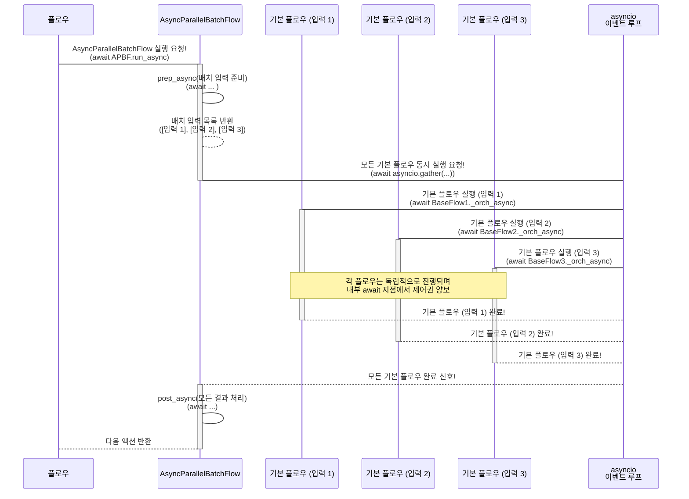

# Chapter 8: 병렬 배치 처리 (Parallel Batch Processing)

💖 가장 빠르게, 동시에 여러 개를!

안녕하세요! PocketFlow 친구들! 😊 와아~ 벌써 여덟 번째 챕터까지 신나게 달려왔네요! 🚀 우리는 지금까지 PocketFlow의 멋진 세계를 탐험하면서 정말 많은 마법 도구들을 익혔어요! 우리 프로그램의 설계도인 [그래프 (Graph)](01_그래프__graph__.md), 그 지도 위에서 일하는 [노드 (Node)](02_노드__node__.md)들, 노드와 노드를 잇는 [액션 (Action)](03_액션__action__.md), 이 모든 것을 움직이는 용감한 여행자 [플로우 (Flow)](04_플로우__flow__.md), 노드들이 데이터를 주고받는 마법 가방 [공유 저장소 (Shared Store)](05_공유_저장소__shared_store__.md)까지! ✨

그리고 지난 두 챕터에서는 데이터를 효율적으로 처리하는 특별한 마법들을 배웠죠? 여러 개의 똑같은 작업을 한 번에 묶어서 처리하는 [배치 처리 (Batch Processing)](06_배치_처리__batch_processing__.md)와, 시간이 오래 걸리는 작업을 기다리지 않고 다른 일을 먼저 하는 [비동기 처리 (Async Processing)](07_비동기_처리__async_processing__.md)!

이 두 마법, **배치 처리**와 **비동기 처리**가 만나면 어떤 일이 일어날까요? 🤔 상상만 해도 강력할 것 같죠? 네! 바로 오늘 우리가 배울 **"병렬 배치 처리 (Parallel Batch Processing)"** 라는 궁극의 마법이 탄생한답니다! 🎉

병렬 배치 처리는 **여러 개의 똑같은 작업을 묶어서 (배치 처리)**, 그 작업들을 기다림 없이 **동시에 시작해서 처리하는 (비동기 처리)** 가장 빠르고 효율적인 방식이에요! 마치 여러 대의 트럭이 각각 여러 소포를 싣고 동시에 다른 목적지로 출발하는 것처럼요! 🚚💨

자, 그럼 PocketFlow에서 데이터 처리의 속도를 최대로 끌어올리는 병렬 배치 처리의 세계로 함께 들어가 볼까요? 고속 질주 출발! 🔥

### 🤔 왜 '병렬 배치 처리'라는 고속 질주가 필요할까요? 문제 상황 파헤치기!

음... 여러분, 우리가 전에 예로 들었던 '수십 장의 이미지에 대해 각각 LLM에게 내용 설명을 부탁하는 작업'을 다시 떠올려봐요! 이번에는 이미지가 100장 있다고 가정하고, 각 이미지 설명에 LLM 호출 시간이 1초씩 걸린다고 해볼게요. 🖼️🤖

1.  **하나씩 순서대로 처리:** 이미지 1장 설명 -> 1초 기다림 -> 이미지 2장 설명 -> 1초 기다림 -> ... -> 이미지 100장 설명 -> 1초 기다림. **총 100초** 정도 걸리겠죠? 🐌 너무 느려요!
2.  **[배치 처리 (Batch Processing)](06_배치_처리__batch_processing__.md)만 사용:** 100장의 이미지를 하나의 묶음(Batch)으로 만들어서 '이미지 설명' [노드 (Node)](02_노드__node__.md) (BatchNode)에게 전달해요. BatchNode는 이 묶음을 받아서 내부적으로 이미지 1장씩 꺼내 '이미지 설명' 작업을 100번 **순서대로** 실행하겠죠? (BatchNode의 기본 동작은 순차적이에요!) 결국 100초 정도 걸릴 거예요. 🐢 역시 느립니다!
3.  **[비동기 처리 (Async Processing)](07_비동기_처리__async_processing__.md)만 사용 (단일 작업):** 이미지 100장을 따로따로 떼어내서 각 이미지마다 비동기 '이미지 설명' 노드(AsyncNode)를 만들어서 순차적인 [비동기 플로우 (AsyncFlow)](07_비동기_처리__async_processing__.md)에 넣고 실행해요. 각 AsyncNode는 LLM 호출 부분에서 `await` 하며 잠시 멈출 수 있지만, 기본적으로 [AsyncFlow](07_비동기_처리__async_processing__.md)는 노드를 하나씩 순서대로 실행하기 때문에, 결국 LLM 호출 100번을 순서대로 `await` 하게 돼요. 여전히 **최소 100초** 가까이 걸릴 수 있어요. 🚶‍♀️💨 (하나의 흐름 안에서는 다음 노드로 넘어가기 전까지 기다림)

이런 상황에서 진짜 필요한 건 뭘까요? 네! 바로 **100장의 이미지를 한 묶음으로 만들어서, 그 묶음 안의 100개 이미지 설명을 시키는 작업을 동시에 시작**하는 거예요! LLM 호출 100개를 거의 동시에 `await` 상태로 만들어 놓고, 먼저 응답이 오는 것부터 받아와서 처리하는 거죠. 마치 100개의 LLM 호출 기계를 동시에 돌리는 것처럼요! 😲

이럴 때 필요한 게 바로 **배치 처리**와 **비동기 처리**를 결합한 **병렬 배치 처리**랍니다! 🌟 이 마법을 사용하면 100개의 LLM 호출이 거의 동시에 시작되므로, 전체 작업 완료 시간이 **100초가 아니라 1초 + @** (약간의 관리 시간)로 획기적으로 줄어들 수 있어요! ⚡

### ✨ 병렬 배치 처리, 너는 어떤 마법을 부리니? (개념 소개!)

PocketFlow에서 **병렬 배치 처리 (Parallel Batch Processing)** 는 여러 개의 개별 데이터 항목에 대해 **동일한 [노드 (Node)](02_노드__node__.md) 또는 [플로우 (Flow)](04_플로우__flow__.md)를 비동기적으로, 그리고 동시에 실행**하여 **처리 시간을 극적으로 단축**하는 기능이에요.

이 마법을 사용하려면 [비동기 처리 (Async Processing)](07_비동기_처리__async_processing__.md)의 기본인 `asyncio` 라이브러리와 `async def`, `await`는 필수랍니다! 병렬 배치 처리에서는 특히 `asyncio`의 강력한 기능 중 하나인 `asyncio.gather()` 함수가 핵심 역할을 해요!

*   **`asyncio.gather(*aws)`:** 여러 개의 비동기 작업(`awaitable` 객체들)을 동시에 시작하고, 이 작업들이 모두 완료될 때까지 기다리는 함수예요. 모든 작업이 성공하면 그 결과들을 리스트로 반환하고, 만약 하나라도 실패하면 바로 예외를 발생시킨답니다. 마치 여러 명의 일꾼에게 동시에 여러 개의 일을 시켜놓고, 그 일들이 모두 끝날 때까지 기다렸다가 '자, 모두 끝났습니다!' 하고 보고를 받는 것 같아요! 🧑‍🔧🧑‍🏭🧑‍🌾

PocketFlow에서는 이 병렬 배치 처리를 위해 두 가지 특별한 친구를 제공해요! 이 친구들은 이름만 봐도 어떤 기능을 합쳤는지 알 수 있죠? 😉

1.  **`AsyncParallelBatchNode`:** 이건 [AsyncNode](07_비동기_처리__async_processing__.md)와 [BatchNode](06_배치_처리__batch_processing__.md)의 기능을 합친 노드예요! [BatchNode](06_배치_처리__batch_processing__.md)처럼 `prep_async` 메서드가 처리할 항목 목록이나 이터레이터를 반환하고, `exec_async` 메서드는 **하나의 항목**을 처리하는 로직을 담지만, `AsyncParallelBatchNode`는 이 `exec_async` 호출을 **여러 항목에 대해 동시에** 실행시킨답니다! 내부적으로 `asyncio.gather()`를 사용해서요! 마치 여러 개의 컨베이어 벨트 위에서 여러 물건에 대해 동시에 같은 작업을 처리하는 병렬 생산 라인 같아요! ⚙️⚙️⚙️
2.  **`AsyncParallelBatchFlow`:** 이건 [AsyncFlow](07_비동기_처리__async_processing__.md)와 [BatchFlow](06_배치_처리__batch_processing__.md)의 기능을 합친 [플로우 (Flow)](04_플로우__flow__.md)예요! [BatchFlow](06_배치_처리__batch_processing__.md)처럼 `prep_async` 메서드가 배치 입력 목록을 반환하고, `start`로 지정된 기본 [플로우 (Flow)](04_플로우__flow__.md) (또는 [노드 (Node)](02_노드__node__.md))를 반복 실행하지만, `AsyncParallelBatchFlow`는 이 기본 [플로우 (Flow)](04_플로우__flow__.md) 반복 실행들을 **동시에** 시작해서 처리해요! 역시 내부적으로 `asyncio.gather()`를 사용해서요! 마치 여러 대의 트럭이 각각 다른 짐(배치 입력)을 싣고, 같은 배송 경로([플로우 (Flow)](04_플로우__flow__.md))를 **동시에** 따라 출발하는 것 같아요! 🚚🚚🚚

두 친구 모두 **여러 항목을 비동기적으로 동시에 처리**해서 시간을 절약한다는 공통점이 있지만, `AsyncParallelBatchNode`는 **'하나의 비동기 노드 안에서'** 여러 항목을 병렬 처리하고, `AsyncParallelBatchFlow`는 **'전체 또는 일부 비동기 플로우를 여러 입력으로 동시에 반복 실행'**시킨다는 차이가 있어요. 시간이 오래 걸리는 I/O 작업이 `exec_async` 메서드 **안에** 있다면 `AsyncParallelBatchNode`를, 전체 [플로우 (Flow)](04_플로우__flow__.md) **안의 여러 노드들**에서 I/O 작업이 발생하며 그 전체 [플로우 (Flow)](04_플로우__flow__.md)를 여러 입력으로 반복해야 한다면 `AsyncParallelBatchFlow`를 선택할 수 있답니다! 😉

### 🚚💨 여러 대의 트럭이 동시에! (AsyncParallelBatchFlow 비유)

우리가 여러 종류의 쿠키를 대량 생산해서 여러 곳에 배달해야 하는 상황을 다시 생각해볼게요! 🍪📦

*   **기본 쿠키 레시피 (기본 [플로우 (Flow)](04_플로우__flow__.md) 또는 [노드 (Node)](02_노드__node__.md)):** 밀가루 계량 -> 반죽 -> 굽기 -> 포장. 이 과정에 '굽기'처럼 시간이 걸리는 작업(LLM 호출 같은)이 포함되어 있다고 상상해요! ⏳
*   **주문 목록 (배치 입력 목록):** 초코칩 쿠키 100개, 땅콩 쿠키 100개, 오트밀 쿠키 100개... 총 300개! 이걸 배치 입력 목록으로 만들어요. `[{"맛":"초코칩", "수량":100}, {"맛":"땅콩", "수량":100}, {"맛":"오트밀", "수량":100}]`
*   **생산 및 배달 관리자 (AsyncParallelBatchFlow):** 이 관리자는 주문 목록을 받아서, 각 주문([{"맛":"초코칩", ...}], [{"맛":"땅콩", ...}], ...)별로 '기본 쿠키 레시피' 생산 라인을 **동시에** 돌리기 시작해요!
*   **각 생산 라인 (기본 [플로우 (Flow)](04_플로우__flow__.md) 실행):** 각 생산 라인은 자기에게 주어진 주문(예: 초코칩 쿠키)대로 쿠키를 만들기 시작하고, '굽기' 단계에서 시간이 걸리지만, 다른 생산 라인을 기다리지 않고 자기 작업만 계속 진행해요!
*   **동시 완료:** 세 종류의 쿠키 생산 라인이 거의 동시에 돌아가므로, 전체 300개 쿠키 생산이 순차적으로 300번 하는 것보다 훨씬 빨리 끝나요! ⚡



보세요! `AsyncParallelBatchFlow`는 `prep_async`에서 배치 입력 목록을 만들고, 그 목록의 각 항목에 대해 `start`로 지정된 기본 [플로우 (Flow)](04_플로우__flow__.md) 실행을 **동시에** (`asyncio.gather`) 시켜요! 각 기본 플로우는 내부적으로 비동기 작업을 기다리면서도 다른 기본 플로우의 진행을 막지 않는답니다.

### 👩‍💻 병렬 배치 노드 (`AsyncParallelBatchNode`) 맛보기 코드! (LLM 요약 동시에!)

시간이 오래 걸리는 LLM 호출을 여러 파일 내용에 대해 **동시에** 수행하는 `AsyncParallelBatchNode` 예제를 살펴볼까요? [`cookbook/pocketflow-parallel-batch/main.py`](cookbook/pocketflow-parallel-batch/main.py) 파일에서 `SummariesAsyncParallelNode` 클래스를 보면 됩니다! 비교를 위해 순차적으로 처리하는 `AsyncBatchNode`인 `SummariesAsyncNode`도 함께 보여드릴게요.

```python
import asyncio
import time
from pocketflow import AsyncBatchNode, AsyncParallelBatchNode, AsyncFlow

# 1초 걸리는 가상 LLM 요약 함수 (비동기)
async def dummy_llm_summarize(text):
    """Simulates an async LLM call that takes 1 second."""
    print(f"  - [LLM] 요약 시작 ({len(text)}자)...") # 시작 알림
    await asyncio.sleep(1) # 1초 기다림
    print(f"  - [LLM] 요약 완료 ({len(text)}자)!") # 완료 알림
    return f"Summarized({len(text)} chars)"

# 1) 순차 비동기 배치 노드 (AsyncBatchNode)
class SummariesAsyncNode(AsyncBatchNode):
    async def prep_async(self, shared):
        # shared에서 데이터 (파일 이름: 내용) 딕셔너리 가져오기
        return list(shared["data"].items()) # 처리할 항목 목록 반환 ([(이름1, 내용1), (이름2, 내용2), ...])

    async def exec_async(self, item):
        # 하나의 항목 (파일 이름, 내용) 처리
        filename, content = item
        print(f"[순차] '{filename}' 요약 중...")
        summary = await dummy_llm_summarize(content) # 1초 기다림
        return (filename, summary) # 결과 반환

    async def post_async(self, shared, prep_res, exec_res_list):
        # 모든 exec_async 결과 리스트를 받아서 shared에 저장
        shared["sequential_summaries"] = dict(exec_res_list)

# 2) 병렬 비동기 배치 노드 (AsyncParallelBatchNode)
class SummariesAsyncParallelNode(AsyncParallelBatchNode):
    async def prep_async(self, shared):
        return list(shared["data"].items()) # AsyncBatchNode와 동일

    async def exec_async(self, item):
        # 하나의 항목 (파일 이름, 내용) 처리
        filename, content = item
        print(f"[병렬] '{filename}' 요약 중...")
        summary = await dummy_llm_summarize(content) # 1초 기다림 (하지만 다른 exec_async와 동시에 기다림!)
        return (filename, summary) # 결과 반환

    async def post_async(self, shared, prep_res, exec_res_list):
        # 모든 exec_async 결과 리스트를 받아서 shared에 저장
        shared["parallel_summaries"] = dict(exec_res_list)

# 두 노드를 비교 실행하는 비동기 메인 함수
async def main():
    # 처리할 데이터 (3개 파일의 짧은 내용)
    shared_data = {
        "data": {
            "file1.txt": "첫 번째 파일 내용입니다.",
            "file2.txt": "두 번째 파일 내용이에요.",
            "file3.txt": "세 번째 파일이 왔어요!"
        }
    }

    # 1) 순차 비동기 배치 노드 실행
    seq_node = SummariesAsyncNode()
    seq_flow = AsyncFlow(start=seq_node) # AsyncBatchNode는 AsyncFlow로 실행

    print("\n=== 순차 실행 (AsyncBatchNode) ===")
    t0 = time.time()
    await seq_flow.run_async(shared_data) # 비동기 Flow 실행
    t1 = time.time()

    # 2) 병렬 비동기 배치 노드 실행
    par_node = SummariesAsyncParallelNode()
    par_flow = AsyncFlow(start=par_node) # AsyncParallelBatchNode도 AsyncFlow로 실행

    print("\n=== 병렬 실행 (AsyncParallelBatchNode) ===")
    t2 = time.time()
    await par_flow.run_async(shared_data) # 비동기 Flow 실행
    t3 = time.time()

    # 결과 및 시간 출력
    print("\n--- 결과 ---")
    print(f"순차 요약 결과: {shared_data.get('sequential_summaries')}")
    print(f"병렬 요약 결과: {shared_data.get('parallel_summaries')}")

    print(f"순차 실행 시간: {t1 - t0:.2f} 초")
    print(f"병렬 실행 시간: {t3 - t2:.2f} 초")

if __name__ == "__main__":
    asyncio.run(main()) # 비동기 프로그램 시작점
```

**코드 설명:**

*   `dummy_llm_summarize`: 1초 걸리는 비동기 LLM 호출을 흉내내는 함수예요. 중요한 건 이 함수 앞에 `await`를 붙여야 잠시 멈췄다가 다른 비동기 작업이 실행될 수 있다는 점!
*   `SummariesAsyncNode` (순차): `AsyncBatchNode`를 상속받고 `exec_async`에서 `await dummy_llm_summarize(content)`를 호출해요. `AsyncBatchNode`의 내부 `_exec`는 `prep_async`가 반환한 항목 목록을 돌면서 **각 항목에 대해 순차적으로** `exec_async`를 호출하고 **각 호출이 끝날 때까지 기다려요**. 그래서 `await dummy_llm_summarize`가 끝나야 다음 항목의 `exec_async`가 시작된답니다. (3개 항목 각각 1초씩 기다리니 총 3초 가까이 걸려요)
*   `SummariesAsyncParallelNode` (병렬): `AsyncParallelBatchNode`를 상속받고 `exec_async`에서 역시 `await dummy_llm_summarize(content)`를 호출해요. 하지만 `AsyncParallelBatchNode`의 내부 `_exec`는 `prep_async`가 반환한 항목 목록을 돌면서 **각 항목에 대한 `exec_async` 호출을 모두 모아서** `asyncio.gather()` 함수에게 **동시에 실행**시키도록 넘겨요! `asyncio.gather()`는 이 모든 호출이 완료될 때까지 기다리지만, 각 호출 자체는 기다림(`await asyncio.sleep(1)`)이 발생하면 제어권을 넘겨 다른 병렬 작업이 진행되도록 하므로, 3개의 1초짜리 작업이 거의 동시에 시작되어 **전체 완료 시간은 1초 + @** (약간의 오버헤드)로 줄어든답니다!
*   `main` 함수: 두 노드를 각각 [AsyncFlow](07_비동기_처리__async_processing__.md)에 담아 실행하고 시간을 측정해서 비교해요.

이 코드를 실행하면 순차 실행은 약 3초, 병렬 실행은 약 1초 정도 걸리는 것을 직접 확인할 수 있답니다! 🎉 `AsyncParallelBatchNode`가 I/O 바운드 작업을 얼마나 효율적으로 처리하는지 보여주는 멋진 예시죠!

### 👩‍💻 병렬 배치 플로우 (`AsyncParallelBatchFlow`) 맛보기 코드! (여러 이미지에 여러 필터 동시 적용!)

여러 이미지와 여러 필터 조합 각각에 대해 **전체 이미지 처리 [플로우 (Flow)](04_플로우__flow__.md)를 동시에 반복 실행**하는 `AsyncParallelBatchFlow` 예제를 살펴볼까요? [`cookbook/pocketflow-parallel-batch-flow/flow.py`](cookbook/pocketflow-parallel-batch-flow/flow.py) 파일에 있는 `ImageParallelBatchFlow` 클래스를 보면 됩니다!

```python
from pocketflow import AsyncFlow, AsyncParallelBatchFlow, AsyncNode
import asyncio

# 가상 이미지 처리 노드들 (비동기) - 실제 파일 입출력이나 이미지 처리는 await를 사용한다고 가정
class LoadImage(AsyncNode):
    async def exec_async(self, prep_res):
        image_path = self.params.get("image_path") # BatchFlow/ParallelBatchFlow에서 params로 전달
        print(f"  - [LoadImage] '{image_path}' 불러오는 중... (기다림)")
        await asyncio.sleep(0.5) # 파일 읽기 시간 흉내
        print(f"  - [LoadImage] '{image_path}' 불러오기 완료!")
        # 불러온 이미지 객체 같은 것을 반환한다고 상상
        return f"image_data_from_{image_path}"
    async def post_async(self, shared, prep_res, exec_res):
        shared["image_data"] = exec_res # shared에 이미지 데이터 저장
        return "apply_filter" # 다음 노드 액션

class ApplyFilter(AsyncNode):
    async def prep_async(self, shared):
        # shared에서 이미지 데이터와 params에서 필터 종류 가져오기
        image_data = shared.get("image_data")
        filter_type = self.params.get("filter") # BatchFlow/ParallelBatchFlow에서 params로 전달
        return image_data, filter_type # exec_async로 전달

    async def exec_async(self, prep_res):
        image_data, filter_type = prep_res
        print(f"  - [ApplyFilter] 필터 '{filter_type}' 적용 중... (기다림)")
        await asyncio.sleep(1) # 필터 적용 시간 흉내
        print(f"  - [ApplyFilter] 필터 '{filter_type}' 적용 완료!")
        # 필터 적용된 이미지 데이터 반환
        return f"{image_data}_filtered_with_{filter_type}"

    async def post_async(self, shared, prep_res, exec_res):
        shared["filtered_image_data"] = exec_res # shared에 결과 저장
        return "save" # 다음 노드 액션

class SaveImage(AsyncNode):
    async def prep_async(self, shared):
        # shared에서 필터 적용된 이미지 데이터 가져오기
        return shared.get("filtered_image_data")

    async def exec_async(self, filtered_image_data):
        # 파일 이름은 params나 shared에서 가져와서 조합한다고 상상
        output_path = "output_" + filtered_image_data.replace("image_data_from_", "").replace("_filtered_with_", "_") + ".jpg"
        print(f"  - [SaveImage] '{output_path}' 저장 중... (기다림)")
        await asyncio.sleep(0.7) # 파일 저장 시간 흉내
        print(f"  - [SaveImage] '{output_path}' 저장 완료!")
        return output_path # 저장된 파일 경로 반환

    async def post_async(self, shared, prep_res, exec_res):
        # 저장된 파일 경로 목록을 shared에 누적 (Batch/ParallelBatchFlow 실행 시 중요)
        if "saved_files" not in shared: shared["saved_files"] = []
        shared["saved_files"].append(exec_res)
        # 마지막 노드이니 아무것도 반환하지 않음 (-> default 액션, 또는 플로우 종료)
        pass

# 단일 이미지 처리를 위한 기본 AsyncFlow 정의 함수
def create_base_async_flow():
    load_node = LoadImage()
    apply_filter_node = ApplyFilter()
    save_node = SaveImage()
    
    # 노드 연결
    load_node - "apply_filter" >> apply_filter_node
    apply_filter_node - "save" >> save_node
    
    # AsyncFlow 객체 만들고 시작 노드 지정 후 반환
    return AsyncFlow(start=load_node) 

# 병렬 비동기 배치 플로우 (AsyncParallelBatchFlow)
class ImageParallelBatchFlow(AsyncParallelBatchFlow):
    async def prep_async(self, shared):
        print("➡️ [ImageParallelBatchFlow] 배치 입력 준비 중...")
        # 처리할 이미지 파일 목록과 필터 목록을 shared에서 가져옴
        images = shared.get("images", ["img_a.jpg", "img_b.png"])
        filters = shared.get("filters", ["sepia", "blur"])
        
        # 모든 이미지-필터 조합을 배치 입력으로 만듦
        params_list = []
        for img in images:
            for f in filters:
                params_list.append({
                    # 이 딕셔너리가 각 기본 플로우 실행 시 shared에 합쳐지거나 params로 전달됨
                    "image_path": img, # LoadImage 노드가 사용할 값
                    "filter": f         # ApplyFilter 노드가 사용할 값
                })
                
        print(f"✅ [ImageParallelBatchFlow] 총 {len(params_list)}개의 배치 입력 준비 완료.")
        # prep_async가 반환한 params_list의 각 항목에 대해 AsyncParallelBatchFlow는
        # start=로 설정된 기본 AsyncFlow를 병렬로 실행해요!
        return params_list

    async def post_async(self, shared, prep_res, exec_res):
        print("🎉 [ImageParallelBatchFlow] 모든 이미지/필터 조합 처리 완료!")
        # shared에 누적된 결과 목록 확인
        print(f"📊 [ImageParallelBatchFlow] 저장된 파일 목록: {shared.get('saved_files', [])}")
        # 이 플로우 다음으로 갈 액션 반환
        return "batch_done" 

# BatchFlow와 AsyncBatchFlow도 거의 동일한 구조이지만 내부 실행 방식만 달라요!
# AsyncBatchFlow는 prep이 반환한 각 항목에 대해 기본 플로우를 순차적으로 await 실행합니다.
# class ImageBatchFlow(AsyncBatchFlow): # 순차 실행 AsyncBatchFlow 예시
#     async def prep_async(self, shared):
#         # ImageParallelBatchFlow와 동일하게 배치 입력 준비
#         # ... (prep_async 내용 동일) ...
#         pass
#     async def post_async(self, shared, prep_res, exec_res):
#         # ImageParallelBatchFlow와 동일하게 post 처리
#         # ... (post_async 내용 동일) ...
#         pass


# 병렬 배치 플로우를 실행하는 비동기 메인 함수
async def main():
    # 단일 이미지 처리 기본 AsyncFlow 생성
    base_async_flow_instance = create_base_async_flow()
    
    # 이 기본 AsyncFlow를 start=로 설정하여 AsyncParallelBatchFlow로 감쌉니다!
    parallel_batch_flow_instance = ImageParallelBatchFlow(start=base_async_flow_instance)
    
    # 실행할 이미지 목록과 필터 목록
    shared_data = {
        "images": ["cat.jpg", "dog.jpg", "bird.jpg"], # 이미지 3개
        "filters": ["grayscale", "sepia"]            # 필터 2개
        # 총 3 * 2 = 6가지 조합이 배치 입력으로 만들어짐!
    }

    print("--- 병렬 배치 플로우 실행 시작! (이미지 3개 x 필터 2개 = 총 6개 작업) ---")
    t0 = time.time()
    # AsyncParallelBatchFlow의 run_async 메서드를 await 호출
    await parallel_batch_flow_instance.run_async(shared_data)
    t1 = time.time()
    
    print("--- 병렬 배치 플로우 실행 완료! ---")
    print(f"총 실행 시간: {t1 - t0:.2f} 초")

if __name__ == "__main__":
    asyncio.run(main()) # 비동기 프로그램 시작점
```

**코드 설명:**

*   `LoadImage`, `ApplyFilter`, `SaveImage`: 비동기 I/O 작업을 포함하는 가상의 [AsyncNode](07_비동기_처리__async_processing__.md)들이에요. 각 노드는 `exec_async` 안에서 `await asyncio.sleep(...)`를 통해 시간이 걸리는 작업을 흉내내고 [공유 저장소 (Shared Store)](05_공유_저장소__shared_store__.md)를 통해 데이터를 주고받아요.
*   `create_base_async_flow()`: 이 함수는 이 세 개의 [AsyncNode](07_비동기_처리__async_processing__.md)를 연결해서 **단일 이미지에 대해 하나의 필터를 적용하는 기본적인 비동기 [플로우 (Flow)](04_플로우__flow__.md)**를 만들어요.
*   `ImageParallelBatchFlow(AsyncParallelBatchFlow)`: 우리의 주인공 `AsyncParallelBatchFlow`를 상속받는 클래스예요.
*   `prep_async(self, shared)`: 이 메서드에서 `shared`에서 이미지 목록과 필터 목록을 가져와서 모든 **이미지-필터 조합 딕셔너리 목록**을 만들어요. 이 목록이 `AsyncParallelBatchFlow`의 **배치 입력**이 된답니다. 총 `len(images) * len(filters)` 개의 항목이 만들어져요.
*   `AsyncParallelBatchFlow(start=base_async_flow_instance)`: `AsyncParallelBatchFlow` 객체를 만들 때 `start` 인자로 **위에서 만든 기본 비동기 [플로우 (Flow)](04_플로우__flow__.md)**를 넘겨줘요. `AsyncParallelBatchFlow`는 `prep_async`에서 반환된 각 배치 입력 딕셔너리 항목에 대해 이 기본 비동기 [플로우 (Flow)](04_플로우__flow__.md)를 **동시에** 실행시켜요! 내부적으로 `asyncio.gather()`를 사용해서요.
*   `main` 함수: `AsyncParallelBatchFlow`를 만들고 실행에 필요한 `images`와 `filters` 목록을 담은 `shared_data` 딕셔너리를 넘겨주며 `await run_async(shared_data)`를 호출해요. `asyncio.run(main())`으로 비동기 메인 함수를 실행합니다.

이 코드를 실행하면 6개의 (3 이미지 x 2 필터) 이미지 처리 작업이 거의 동시에 시작되면서 각 `AsyncNode`의 `exec_async`에 있는 `await asyncio.sleep`들이 서로를 기다리지 않고 동시에 진행될 거예요! 만약 이걸 `AsyncBatchFlow`로 실행했다면 6개의 기본 [플로우 (Flow)](04_플로우__flow__.md)가 순차적으로 실행되어 훨씬 오래 걸렸겠죠? 병렬 배치 처리의 힘! 💪

### 🗺️ PocketFlow 예제에서 병렬 배치 처리 찾아보기!

PocketFlow GitHub 저장소에는 `AsyncParallelBatchNode`와 `AsyncParallelBatchFlow`를 사용해서 대규모 비동기 병렬 처리를 하는 예제들이 있답니다!

*   **Parallel Batch 예제** [`cookbook/pocketflow-parallel-batch/main.py`](cookbook/pocketflow-parallel-batch/main.py): 위에서 살펴본 `AsyncParallelBatchNode`를 사용해서 여러 텍스트 파일 내용을 LLM에게 **동시에** 요약시키는 예제예요. 순차 비동기(`AsyncBatchNode`) 버전과 병렬 비동기(`AsyncParallelBatchNode`) 버전을 직접 실행해서 시간을 비교해 볼 수 있습니다. 이 예제는 `AsyncParallelBatchNode`가 I/O 바운드 배치 작업에 얼마나 효과적인지 잘 보여줘요! ⚡
*   **Parallel Batch Flow 예제** [`cookbook/pocketflow-parallel-batch-flow/flow.py`](cookbook/pocketflow-parallel-batch-flow/flow.py): 위에서 살펴본 `AsyncParallelBatchFlow`를 사용해서 여러 이미지에 여러 필터를 적용하는 전체 [플로우 (Flow)](04_플로우__flow__.md)를 여러 조합에 대해 **동시에** 실행시키는 예제예요. 이 예제는 `AsyncParallelBatchFlow`가 복잡한 파이프라인 전체를 여러 입력으로 동시에 처리하는 시나리오에 적합함을 보여준답니다. 🖼️

이 예제들을 살펴보면 여러분도 PocketFlow의 `AsyncParallelBatchNode`와 `AsyncParallelBatchFlow`를 활용해서 대량의 데이터를 가장 빠르고 효율적으로 처리하는 방법을 마스터할 수 있을 거예요! PocketFlow와 함께라면 복잡한 대규모 LLM 애플리케이션도 척척 만들 수 있겠죠? 😊

### 📝 오늘 배운 내용 요약!

와~ 🎉 오늘 우리는 PocketFlow의 가장 빠르고 강력한 마법 중 하나! **병렬 배치 처리 (Parallel Batch Processing)** 와 특별한 친구들 **`AsyncParallelBatchNode`**, **`AsyncParallelBatchFlow`**에 대해 신나게 알아보았어요!

*   **병렬 배치 처리**는 **[배치 처리 (Batch Processing)](06_배치_처리__batch_processing__.md)** 와 **[비동기 처리 (Async Processing)](07_비동기_처리__async_processing__.md)** 를 결합하여, 여러 개의 유사한 작업을 묶어서 **비동기적으로 동시에** 처리하는 방식이에요.
*   `asyncio.gather()` 함수를 사용해서 여러 비동기 작업을 **동시에 시작**하고 모든 결과가 나올 때까지 기다려요.
*   **`AsyncParallelBatchNode`**는 **하나의 비동기 노드 안에서** `prep_async`가 반환한 여러 항목에 대한 `exec_async` 호출을 **동시에** 실행시켜요. LLM API 호출 같은 I/O 바운드 작업이 `exec_async` 안에 있을 때 유용해요.
*   **`AsyncParallelBatchFlow`**는 `prep_async`가 반환한 배치 입력 목록의 각 항목에 대해 `start`로 지정된 **기본 비동기 [플로우 (Flow)](04_플로우__flow__.md) 전체를 동시에** 실행시켜요. 전체 파이프라인을 여러 입력으로 반복 처리해야 할 때 유용해요.
*   병렬 배치 처리는 대량의 데이터를 처리할 때, 특히 LLM 호출이나 웹 통신처럼 시간이 오래 걸리는 I/O 바운드 작업이 많을 때 프로그램의 **실행 시간을 획기적으로 단축**시켜준답니다! 👍

자, 이렇게 해서 PocketFlow의 가장 강력한 마법 중 하나인 병렬 배치 처리까지 마스터하셨어요! 정말 정말 잘하셨어요! 🎉 PocketFlow의 핵심 개념들을 모두 익히셨답니다!

### 💖 다음 이야기: PocketFlow와의 즐거운 여정, 마무리!

그래프, 노드, 액션, 플로우, 공유 저장소, 배치 처리, 비동기 처리, 그리고 병렬 배치 처리까지! PocketFlow의 거의 모든 핵심 개념을 함께 탐험했어요! ✨

이 여정은 어떠셨나요? 처음에는 조금 낯설었을지도 모르지만, 귀엽고 친절한 PocketFlow 친구들과 함께 배우다 보니 어느새 복잡한 LLM 애플리케이션의 작업 흐름을 설계하고, 효율적으로 실행하는 마법을 익히게 되었죠? 😍

이 챕터가 튜토리얼의 마지막 이야기랍니다. 하지만 PocketFlow와의 인연은 이제부터 시작이에요! 오늘 배운 개념들을 바탕으로 PocketFlow GitHub 저장소의 다양한 예제들을 직접 실행해보고 코드를 수정해보면서 여러분만의 멋진 LLM 애플리케이션을 만들어 보세요!

궁금한 점이 생기거나 더 알고 싶은 내용이 있다면 언제든지 PocketFlow 커뮤니티에 질문하거나 공식 문서를 찾아보세요. PocketFlow는 여러분의 멋진 아이디어를 현실로 만드는 데 언제나 함께할 준비가 되어 있답니다! 😊

지금까지 PocketFlow 튜토리얼을 함께 해주셔서 진심으로 감사드립니다! 여러분의 앞날에 즐겁고 멋진 코딩 경험이 가득하기를 응원할게요!

안녕! 또 만나요! 👋👩‍💻👨‍💻

---

Generated by [AI Codebase Knowledge Builder](https://github.com/The-Pocket/Tutorial-Codebase-Knowledge)