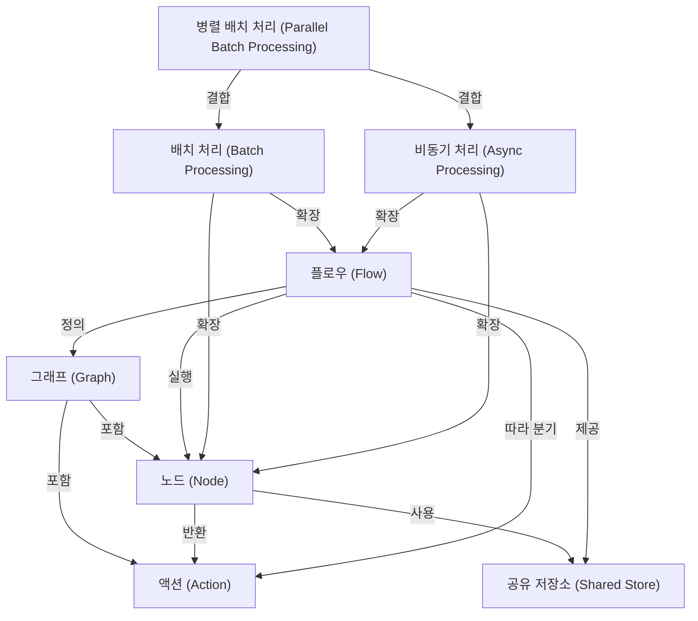

# Tutorial: PocketFlow

PocketFlow는 최소한의 코드로 LLM 애플리케이션을 구축할 수 있는 프레임워크입니다.
핵심 아이디어는 작업을 **그래프** 구조로 표현하는 것입니다.
개별 작업 단위인 **노드**들은 **액션**이라는 연결고리를 통해
순서대로 또는 조건에 따라 실행되는 **플로우**를 구성합니다.
작업 흐름 전체에서 데이터를 공유하기 위해 **공유 저장소**가 사용됩니다.
*배치 처리*, *비동기 처리*, *병렬 배치 처리* 기능은
노드와 플로우를 확장하여 효율성을 극대화합니다.

**Source Repository:** [None](None)

## Chapters

1. [그래프 (Graph)
](01_그래프__graph__.md)
2. [노드 (Node)
](02_노드__node__.md)
3. [액션 (Action)
](03_액션__action__.md)
4. [플로우 (Flow)
](04_플로우__flow__.md)
5. [공유 저장소 (Shared Store)
](05_공유_저장소__shared_store__.md)
6. [배치 처리 (Batch Processing)
](06_배치_처리__batch_processing__.md)
7. [비동기 처리 (Async Processing)
](07_비동기_처리__async_processing__.md)
8. [병렬 배치 처리 (Parallel Batch Processing)
](08_병렬_배치_처리__parallel_batch_processing__.md)

---

Generated by [AI Codebase Knowledge Builder](https://github.com/The-Pocket/Tutorial-Codebase-Knowledge)